<!-- dw2md v0.2.0 | learning-at-home/hivemind | 2026-02-21T08:16:45Z | 32 pages -->

# learning-at-home/hivemind — DeepWiki

> Compiled from https://deepwiki.com/learning-at-home/hivemind
> Generated: 2026-02-21T08:16:45Z | Pages: 32

## Structure

├── 1 Overview
│   ├── 1.1 Architecture
│   └── 1.2 Getting Started
├── 2 Core Components
│   ├── 2.1 Distributed Hash Table (DHT)
│   │   ├── 2.1.1 DHT Interface
│   │   ├── 2.1.2 DHT Node Implementation
│   │   └── 2.1.3 DHT Routing
│   ├── 2.2 Peer-to-Peer Communication (P2P)
│   ├── 2.3 Mixture of Experts (MoE)
│   │   ├── 2.3.1 RemoteMixtureOfExperts
│   │   ├── 2.3.2 MoE Server
│   │   └── 2.3.3 TaskPool and Runtime
│   ├── 2.4 Decentralized Averaging
│   │   ├── 2.4.1 DecentralizedAverager
│   │   ├── 2.4.2 Matchmaking
│   │   └── 2.4.3 AllReduce Implementation
│   └── 2.5 Optimizer
│       ├── 2.5.1 Collaborative Optimizer
│       └── 2.5.2 GradScaler
├── 3 Utilities
│   ├── 3.1 MPFuture and Async Utilities
│   ├── 3.2 Tensor Compression
│   └── 3.3 Tensor Descriptors
├── 4 Command-line Tools
│   ├── 4.1 MoE Server
│   └── 4.2 DHT Node
├── 5 Examples
│   └── 5.1 ALBERT Training
└── 6 Development
    ├── 6.1 Build System
    └── 6.2 Testing

## Contents

<<< SECTION: 1 Overview [1-overview] >>>

# Overview

<details>
<summary>Relevant source files</summary>

The following files were used as context for generating this wiki page:

- [README.md](README.md)
- [docs/conf.py](docs/conf.py)
- [docs/index.rst](docs/index.rst)
- [docs/user/quickstart.md](docs/user/quickstart.md)
- [hivemind/__init__.py](hivemind/__init__.py)
- [requirements.txt](requirements.txt)

</details>


This page provides a high-level overview of Hivemind, a PyTorch library designed for decentralized deep learning across the internet. It introduces the core architecture, components, and design principles that enable collaborative training of large models across multiple machines.

Hivemind allows training neural networks in a decentralized manner, leveraging compute resources from various participants without requiring central coordination. For detailed information about specific components, please refer to their respective pages in this wiki, such as [Distributed Hash Table (DHT)](#2.1) or [Mixture of Experts (MoE)](#2.3).

Sources: [README.md:1-27](), [docs/index.rst:7-10]()

## Purpose and Use Cases

Hivemind's primary purpose is to enable collaborative training of large neural networks across potentially heterogeneous and unreliable hardware. The library is designed for scenarios where:

- You want to train one large model using computers from different organizations or volunteers
- You need to distribute parts of neural network layers across multiple participants
- Your training environment involves unreliable nodes that may disconnect or slow down
- You want to perform decentralized parameter averaging without central coordination

Notable projects built with Hivemind include:
- Petals: A platform for inference and fine-tuning of 100B+ language models
- Training Transformers Together: A collaborative text-to-image model training demonstration
- CALM: A masked language model for Arabic
- sahajBERT: A collaboratively pretrained ALBERT-xlarge for Bengali

Sources: [README.md:10-39]()

## High-Level Architecture

Hivemind is composed of several core components that work together to enable decentralized training:

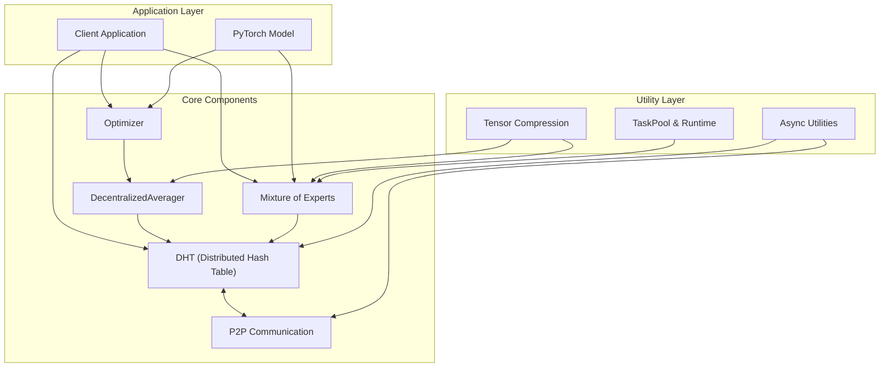
```mermaid
flowchart TD
    subgraph "Core Components"
        DHT["DHT (Distributed Hash Table)"]
        P2P["P2P Communication"]
        MoE["Mixture of Experts"]
        DecAvg["DecentralizedAverager"]
        Opt["Optimizer"]
    end
    
    subgraph "Application Layer"
        Model["PyTorch Model"]
        Client["Client Application"]
    end
    
    subgraph "Utility Layer"
        Compress["Tensor Compression"]
        Async["Async Utilities"]
        TaskPool["TaskPool & Runtime"]
    end
    
    Client --> DHT
    Client --> Opt
    Client --> MoE
    
    Model --> Opt
    Model --> MoE
    
    DHT <--> P2P
    DecAvg --> DHT
    Opt --> DecAvg
    MoE --> DHT
    
    Compress --> DecAvg
    Compress --> MoE
    Async --> DHT
    Async --> P2P
    TaskPool --> MoE
```

The key components include:

1. **Distributed Hash Table (DHT)**: Serves as the backbone for peer discovery and metadata sharing
2. **P2P Communication**: Enables direct communication between peers without central servers
3. **Mixture of Experts (MoE)**: Allows distributing parts of model computation across peers
4. **DecentralizedAverager**: Facilitates parameter averaging between peers
5. **Optimizer**: Coordinates training across peers, handling gradient and parameter synchronization

Sources: [hivemind/__init__.py:1-14](), [README.md:15-25]()

## System Operation

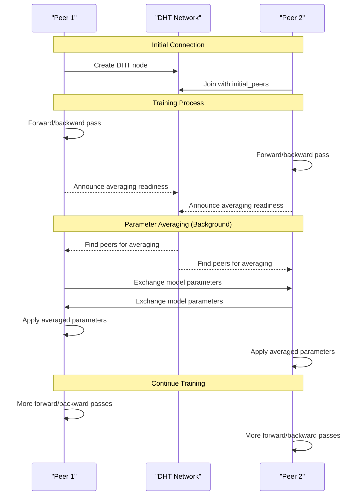
```mermaid
sequenceDiagram
    participant Peer1 as "Peer 1"
    participant DHT as "DHT Network"
    participant Peer2 as "Peer 2"
    
    Note over Peer1,Peer2: Initial Connection
    Peer1->>DHT: Create DHT node
    Peer2->>DHT: Join with initial_peers
    
    Note over Peer1,Peer2: Training Process
    Peer1->>Peer1: Forward/backward pass
    Peer2->>Peer2: Forward/backward pass
    
    Peer1-->>DHT: Announce averaging readiness
    Peer2-->>DHT: Announce averaging readiness
    
    Note over Peer1,Peer2: Parameter Averaging (Background)
    DHT-->>Peer1: Find peers for averaging
    DHT-->>Peer2: Find peers for averaging
    
    Peer1->>Peer2: Exchange model parameters
    Peer2->>Peer1: Exchange model parameters
    
    Peer1->>Peer1: Apply averaged parameters
    Peer2->>Peer2: Apply averaged parameters
    
    Note over Peer1,Peer2: Continue Training
    Peer1->>Peer1: More forward/backward passes
    Peer2->>Peer2: More forward/backward passes
```

During training, Hivemind operates as follows:

1. Peers connect through the DHT, with at least one peer sharing its address for others to join
2. Each peer performs regular PyTorch training (forward/backward passes) locally
3. The `hivemind.Optimizer` tracks training progress and initiates parameter averaging
4. When sufficient samples have been processed collectively, peers form groups to average parameters
5. Parameter averaging occurs asynchronously in the background while training continues
6. Averaged parameters are applied during subsequent training steps

New peers can join at any time and will automatically download the latest model state from existing peers.

Sources: [docs/user/quickstart.md:30-182]()

## Data Flow in Collaborative Training

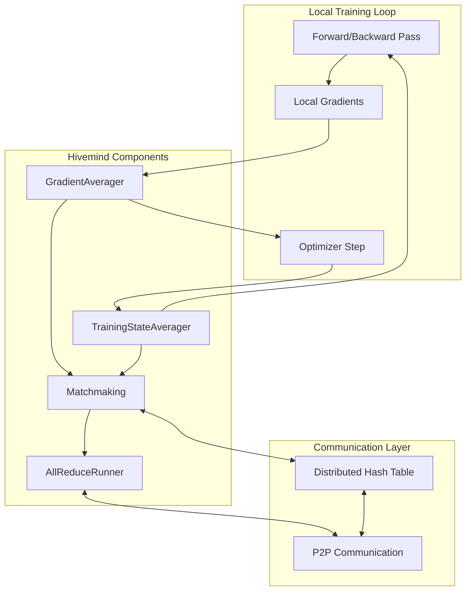
```mermaid
flowchart TD
    subgraph "Local Training Loop"
        FwdBwd["Forward/Backward Pass"]
        LocalGrad["Local Gradients"]
        OptStep["Optimizer Step"]
    end
    
    subgraph "Hivemind Components"
        GradAvg["GradientAverager"]
        ParamAvg["TrainingStateAverager"]
        MatchMk["Matchmaking"]
        AllReduce["AllReduceRunner"]
    end
    
    subgraph "Communication Layer"
        DHT["Distributed Hash Table"]
        P2P["P2P Communication"]
    end
    
    FwdBwd --> LocalGrad
    LocalGrad --> GradAvg
    GradAvg --> OptStep
    OptStep --> ParamAvg
    ParamAvg --> FwdBwd
    
    GradAvg --> MatchMk
    ParamAvg --> MatchMk
    MatchMk --> AllReduce
    AllReduce <--> P2P
    MatchMk <--> DHT
    DHT <--> P2P
```

The data flow diagram shows how training data moves through the system:

1. Each peer performs local forward and backward passes to compute gradients
2. Local gradients may be averaged across peers (optional, depends on configuration)
3. Optimizer steps are applied locally using the gradients
4. Parameter states are averaged periodically in the background
5. The DHT is used for matchmaking (finding peers for averaging)
6. Parameter exchange occurs directly between peers via P2P communication

This design allows training to continue even when some peers are unavailable or slow.

Sources: [README.md:17-22]()

## Code Organization

The primary components of Hivemind are exposed in the top-level API:

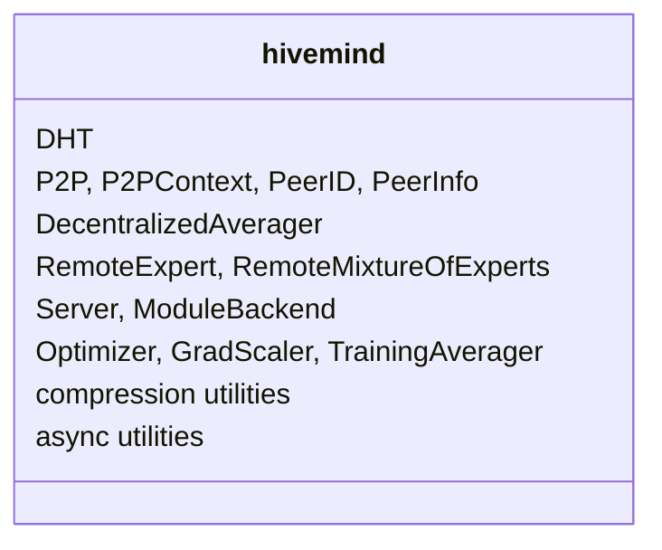
```mermaid
classDiagram
    class hivemind {
        DHT
        P2P, P2PContext, PeerID, PeerInfo
        DecentralizedAverager
        RemoteExpert, RemoteMixtureOfExperts
        Server, ModuleBackend
        Optimizer, GradScaler, TrainingAverager
        compression utilities
        async utilities
    }
```

Key imports and their purposes:

| Component | Purpose |
|-----------|---------|
| `DHT` | Distributed Hash Table for peer discovery and metadata sharing |
| `P2P` and related classes | Low-level peer-to-peer communication |
| `DecentralizedAverager` | Parameter averaging between peers |
| `RemoteMixtureOfExperts`, `RemoteExpert` | Client-side access to distributed experts |
| `Server`, `ModuleBackend` | Server-side hosting of experts |
| `Optimizer`, `GradScaler` | Collaborative optimization and training |
| Compression utilities | Efficient network transfer of tensors |
| Async utilities | Non-blocking operations and background tasks |

Sources: [hivemind/__init__.py:1-14]()

## System Requirements

Hivemind has the following system requirements:

- **Python**: 3.8 or newer
- **PyTorch**: 1.9.0 or newer
- **Operating Systems**:
  - Linux (recommended, Ubuntu 18.04+ 64-bit)
  - macOS (partially supported)
  - Windows 10+ with WSL (experimental)
- **Dependencies**: Various Python packages for networking, serialization, and cryptography

Hivemind uses a pre-compiled binary of go-libp2p-daemon for P2P communication, but it can be recompiled if needed (requires Go 1.15 or 1.16).

Sources: [README.md:41-90](), [requirements.txt:1-21]()

## Installation

Hivemind can be installed using pip:

```
pip install hivemind
```

For optional features like 8-bit compression, you can install with:

```
pip install hivemind[bitsandbytes]
```

To install from source:

```
git clone https://github.com/learning-at-home/hivemind.git
cd hivemind
pip install .
```

Sources: [README.md:41-76]()

---

<<< SECTION: 1.1 Architecture [1-1-architecture] >>>

# Architecture

<details>
<summary>Relevant source files</summary>

The following files were used as context for generating this wiki page:

- [README.md](README.md)
- [docs/conf.py](docs/conf.py)
- [docs/index.rst](docs/index.rst)
- [docs/user/quickstart.md](docs/user/quickstart.md)
- [hivemind/__init__.py](hivemind/__init__.py)
- [requirements.txt](requirements.txt)
- [tests/test_moe.py](tests/test_moe.py)
- [tests/test_training.py](tests/test_training.py)

</details>


This document provides an overview of the Hivemind architecture, describing the major components and how they interact to enable decentralized deep learning. For information about installation and basic usage, see [Getting Started](#1.2).

## System Overview

Hivemind is designed as a decentralized deep learning framework built on PyTorch. Its architecture enables training large neural networks across multiple machines without requiring a centralized server for coordination.

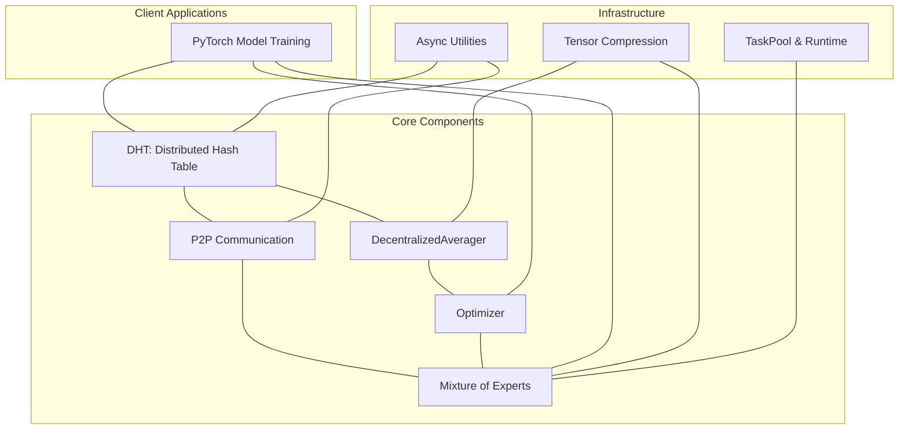
```mermaid
graph TD
    subgraph "Core Components"
        DHT["DHT: Distributed Hash Table"] --- P2P["P2P Communication"]
        DHT --- DecAvg["DecentralizedAverager"]
        P2P --- MoE["Mixture of Experts"]
        DecAvg --- Opt["Optimizer"]
        Opt --- MoE
    end
    
    subgraph "Client Applications"
        Client["PyTorch Model Training"] --- DHT
        Client --- Opt
        Client --- MoE
    end
    
    subgraph "Infrastructure"
        Async["Async Utilities"] --- DHT
        Async --- P2P
        Compress["Tensor Compression"] --- DecAvg
        Compress --- MoE
        TaskPool["TaskPool & Runtime"] --- MoE
    end
```

Sources: [hivemind/__init__.py:1-14](), [README.md:10-25]()

The architecture consists of five primary components that work together to enable decentralized training:

1. **Distributed Hash Table (DHT)**: The backbone for peer discovery and metadata sharing
2. **Peer-to-Peer (P2P) Communication**: Handles networking between peers
3. **Decentralized Averager**: Enables parameter and gradient averaging across peers
4. **Optimizer**: Coordinates collaborative optimization
5. **Mixture of Experts (MoE)**: Distributes neural network components across peers

## Component Relationships

The following diagram shows how these components are implemented in code and how they relate to each other:

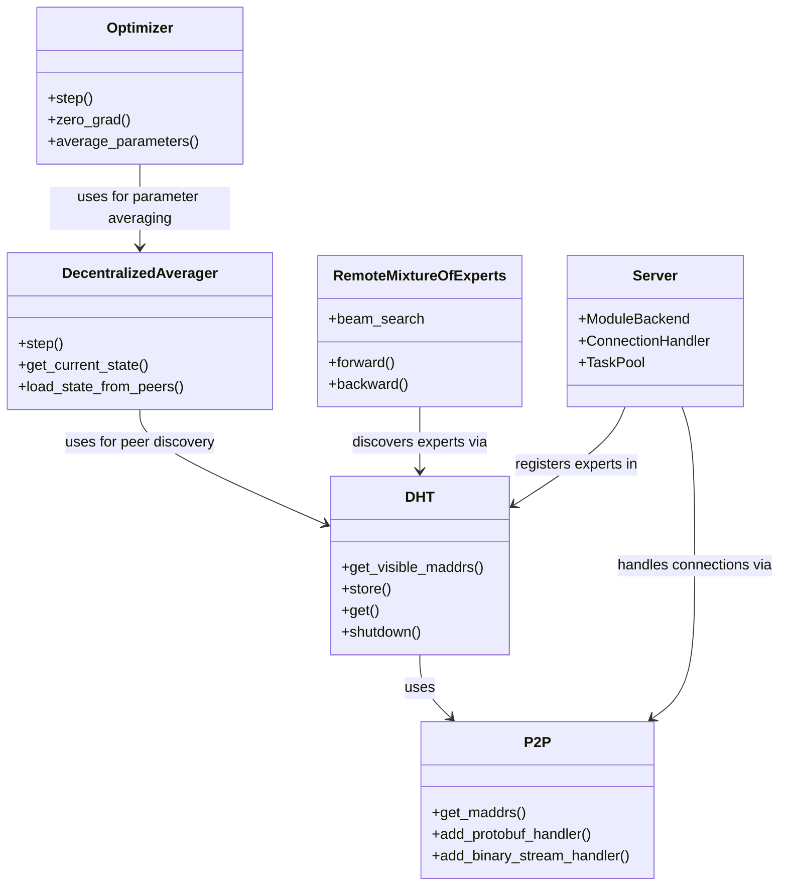
```mermaid
classDiagram
    direction TB
    
    class DHT {
        +get_visible_maddrs()
        +store()
        +get()
        +shutdown()
    }
    
    class P2P {
        +get_maddrs()
        +add_protobuf_handler()
        +add_binary_stream_handler()
    }
    
    class DecentralizedAverager {
        +step()
        +get_current_state()
        +load_state_from_peers()
    }
    
    class Optimizer {
        +step()
        +zero_grad()
        +average_parameters()
    }
    
    class RemoteMixtureOfExperts {
        +forward()
        +backward()
        +beam_search
    }
    
    class Server {
        +ModuleBackend
        +ConnectionHandler
        +TaskPool
    }
    
    DHT --> P2P : uses
    DecentralizedAverager --> DHT : uses for peer discovery
    Optimizer --> DecentralizedAverager : uses for parameter averaging
    RemoteMixtureOfExperts --> DHT : discovers experts via
    Server --> DHT : registers experts in
    Server --> P2P : handles connections via
```

Sources: [hivemind/__init__.py:1-14](), [tests/test_moe.py:11-20]()

## Distributed Hash Table (DHT)

The DHT is a critical component that enables decentralized peer discovery and metadata sharing without requiring a central server.

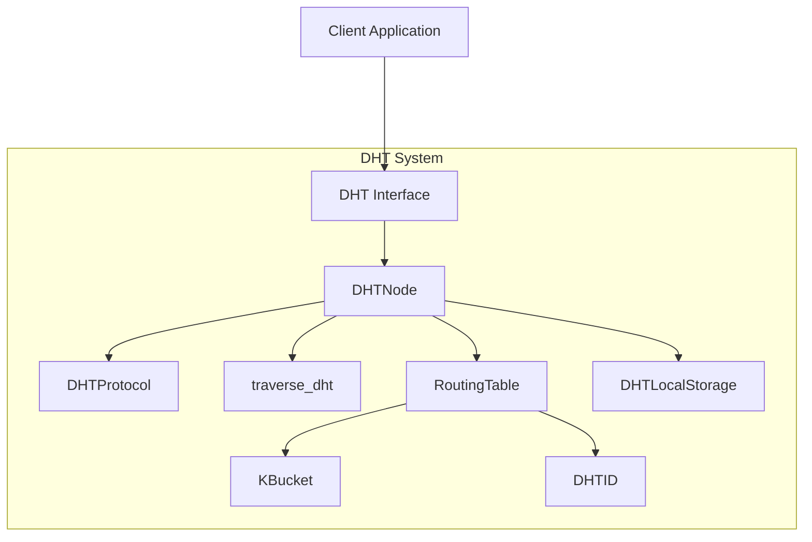
```mermaid
graph TD
    subgraph "DHT System"
        DHT["DHT Interface"] --> DHTNode["DHTNode"]
        DHTNode --> DHTProtocol["DHTProtocol"]
        DHTNode --> TraverseDHT["traverse_dht"]
        DHTNode --> RoutingTable["RoutingTable"]
        RoutingTable --> KBucket["KBucket"]
        RoutingTable --> DHTID["DHTID"]
        DHTNode --> DHTStorage["DHTLocalStorage"]
    end
    
    Client["Client Application"] ---> DHT
```

Sources: [tests/test_moe.py:11-12](), [README.md:17-18]()

The DHT is initialized with:
```python
dht = hivemind.DHT(start=True, initial_peers=[...])
```

Key features of the DHT:
- Stores key-value pairs distributed across the network
- Enables peers to find each other without central coordination
- Manages expert registration and discovery for Mixture of Experts
- Facilitates parameter averaging by connecting peers for synchronization

## Peer-to-Peer Communication (P2P)

The P2P module provides the networking layer that enables direct communication between peers.

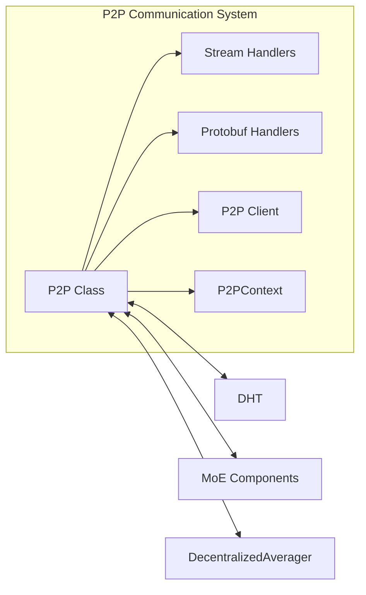
```mermaid
graph LR
    subgraph "P2P Communication System"
        P2P["P2P Class"] --> StreamHandler["Stream Handlers"]
        P2P --> ProtobufHandler["Protobuf Handlers"]
        P2P --> P2PClient["P2P Client"]
        
        P2P --> P2PContext["P2PContext"]
    end
    
    P2P <--> DHT["DHT"]
    P2P <--> MoE["MoE Components"]
    P2P <--> Averager["DecentralizedAverager"]
```

Sources: [hivemind/__init__.py:13](), [tests/test_moe.py:19]()

The P2P system handles:
- Low-level networking between peers
- Protocol handlers for different types of communication
- NAT traversal and connection management
- Error handling for network failures

## Mixture of Experts (MoE)

The Mixture of Experts architecture allows for distributing parts of neural networks across multiple devices.

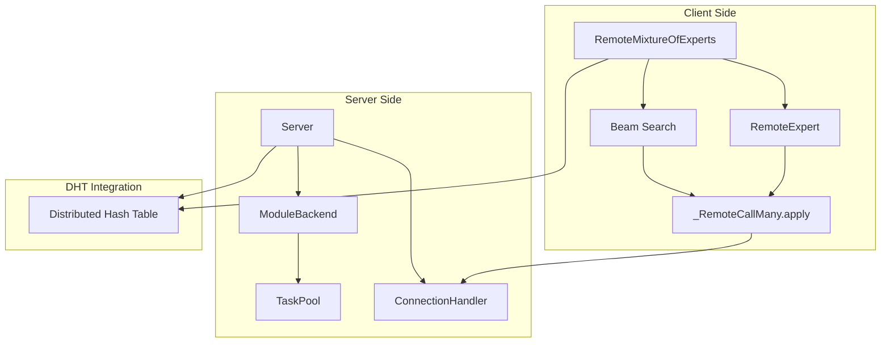
```mermaid
graph TD
    subgraph "Client Side"
        RemoteMoE["RemoteMixtureOfExperts"] --> BeamSearch["Beam Search"]
        RemoteMoE --> RemoteExpert["RemoteExpert"]
        BeamSearch --> RemoteCall["_RemoteCallMany.apply"]
        RemoteExpert --> RemoteCall
    end
    
    subgraph "Server Side"
        Server["Server"] --> ModuleBackend["ModuleBackend"]
        ModuleBackend --> TaskPool["TaskPool"]
        Server --> ConnectionHandler["ConnectionHandler"]
    end
    
    subgraph "DHT Integration"
        RemoteMoE --> DHT["Distributed Hash Table"]
        Server --> DHT
    end
    
    RemoteCall --> ConnectionHandler
```

Sources: [tests/test_moe.py:12-17](), [README.md:23-24]()

The MoE system consists of:
- **Client-side components**: `RemoteMixtureOfExperts` and `RemoteExpert` that discover and communicate with remote experts
- **Server-side components**: `Server` and `ModuleBackend` that host experts and process incoming requests
- **Expert discovery**: Uses the DHT to register and discover experts
- **Fault tolerance**: Handles expert failures and timeouts gracefully

Example of creating a mixture of experts:
```python
moe = RemoteMixtureOfExperts(
    in_features=16, 
    grid_size=(4, 4, 4), 
    dht=dht, 
    k_best=3, 
    uid_prefix="ffn."
)
```

## Decentralized Averager

The DecentralizedAverager enables efficient parameter averaging across peers without requiring a central server.

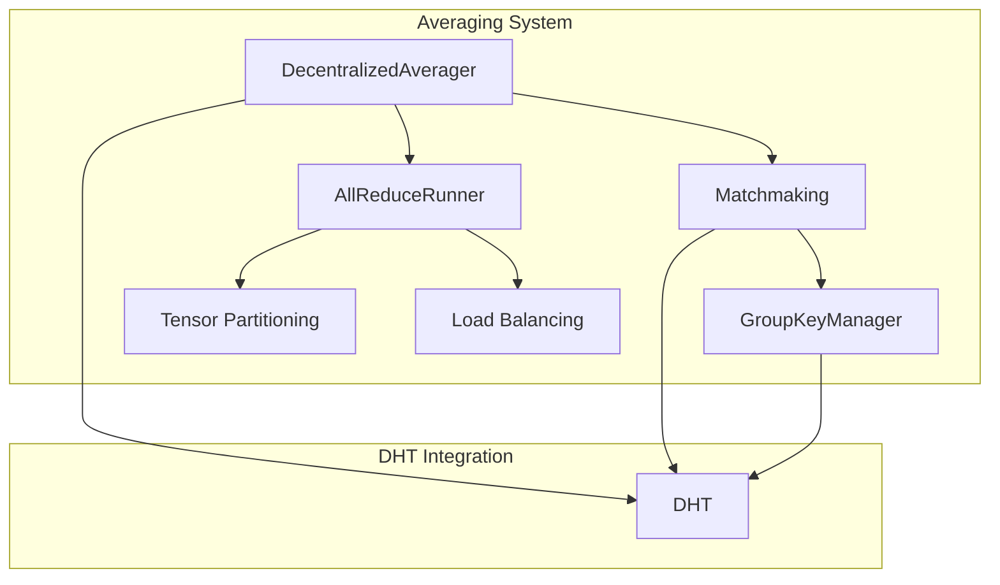
```mermaid
graph TD
    subgraph "Averaging System"
        DecAvg["DecentralizedAverager"] --> Matchmaking["Matchmaking"]
        DecAvg --> AllReduce["AllReduceRunner"]
        Matchmaking --> GroupKeyManager["GroupKeyManager"]
        AllReduce --> Partitioning["Tensor Partitioning"]
        AllReduce --> LoadBalancing["Load Balancing"]
    end
    
    subgraph "DHT Integration"
        DecAvg --> DHT["DHT"]
        Matchmaking --> DHT
        GroupKeyManager --> DHT
    end
```

Sources: [hivemind/__init__.py:1](), [README.md:21-22]()

The DecentralizedAverager:
- Performs tensor averaging across multiple peers
- Uses a matchmaking mechanism to form groups of peers for averaging
- Employs the AllReduce algorithm for efficient communication
- Handles stragglers and network failures

## Optimizer

The Optimizer coordinates the collaborative training process.

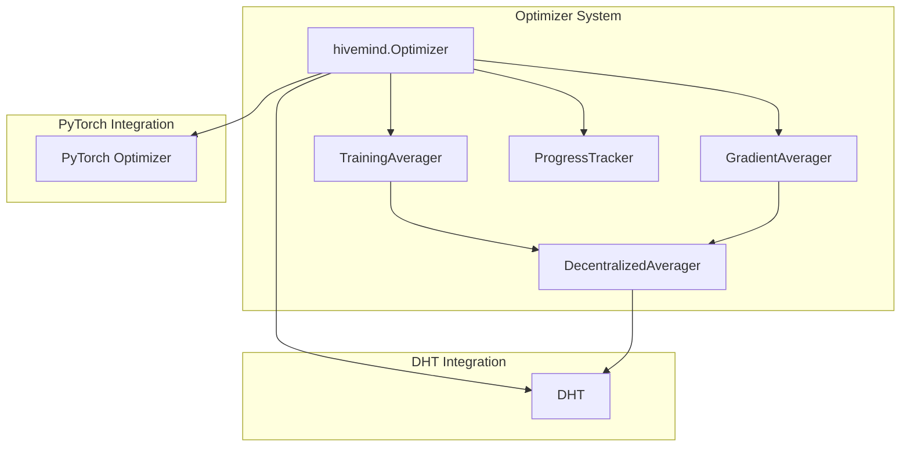
```mermaid
graph TD
    subgraph "Optimizer System"
        Optimizer["hivemind.Optimizer"] --> TSA["TrainingAverager"]
        Optimizer --> GradAverager["GradientAverager"]
        Optimizer --> ProgressTracker["ProgressTracker"]
        TSA --> DecentralizedAverager["DecentralizedAverager"]
        GradAverager --> DecentralizedAverager
    end
    
    subgraph "PyTorch Integration"
        Optimizer --> PyTorchOptim["PyTorch Optimizer"]
    end
    
    subgraph "DHT Integration"
        Optimizer --> DHT["DHT"]
        DecentralizedAverager --> DHT
    end
```

Sources: [hivemind/__init__.py:12](), [tests/test_training.py:41-42]()

Example of creating a collaborative optimizer:
```python
opt = hivemind.Optimizer(
    dht=dht,                   # DHT for peer discovery
    run_id='training_run',     # Unique identifier for this training run
    optimizer=torch_optimizer,  # Underlying PyTorch optimizer
    target_batch_size=10000,   # Collective batch size for synchronization
    batch_size_per_step=32,    # Local batch size per step
    use_local_updates=True,    # Apply local updates between synchronizations
    averaging_timeout=10.0     # Maximum time for averaging
)
```

The Optimizer:
- Wraps a standard PyTorch optimizer
- Tracks training progress across peers
- Coordinates parameter and gradient averaging
- Manages the training state synchronization

## Data Flow in Collaborative Training

The following diagram illustrates the data flow during collaborative training:

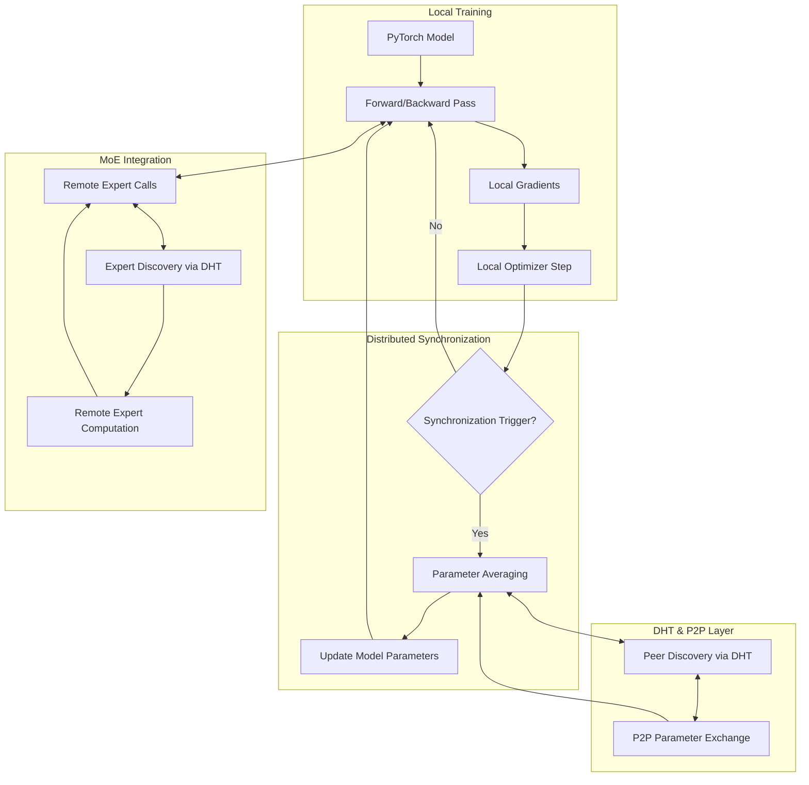
```mermaid
flowchart TD
    subgraph "Local Training"
        A["PyTorch Model"] --> B["Forward/Backward Pass"]
        B --> C["Local Gradients"]
        C --> D["Local Optimizer Step"]
    end
    
    subgraph "Distributed Synchronization"
        D --> E{"Synchronization Trigger?"}
        E -->|"Yes"| F["Parameter Averaging"]
        F --> G["Update Model Parameters"]
        G --> B
        E -->|"No"| B
    end
    
    subgraph "DHT & P2P Layer"
        F <--> H["Peer Discovery via DHT"]
        H <--> I["P2P Parameter Exchange"]
        I --> F
    end
    
    subgraph "MoE Integration"
        B <--> J["Remote Expert Calls"]
        J <--> K["Expert Discovery via DHT"]
        K --> L["Remote Expert Computation"]
        L --> J
    end
```

Sources: [tests/test_training.py:42-48](), [docs/user/quickstart.md:56-67]()

## Asynchronous and Fault-Tolerant Design

Hivemind employs several design patterns to ensure robustness in distributed environments:

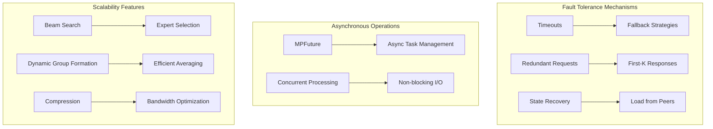
```mermaid
graph TD
    subgraph "Fault Tolerance Mechanisms"
        A["Timeouts"] --> B["Fallback Strategies"]
        C["Redundant Requests"] --> D["First-K Responses"]
        E["State Recovery"] --> F["Load from Peers"]
    end
    
    subgraph "Asynchronous Operations"
        G["MPFuture"] --> H["Async Task Management"]
        I["Concurrent Processing"] --> J["Non-blocking I/O"]
    end
    
    subgraph "Scalability Features"
        K["Beam Search"] --> L["Expert Selection"]
        M["Dynamic Group Formation"] --> N["Efficient Averaging"]
        O["Compression"] --> P["Bandwidth Optimization"]
    end
```

Sources: [tests/test_moe.py:335-373](), [hivemind/__init__.py:14]()

Key aspects:
- **Timeouts and fallbacks**: Handle slow or unresponsive peers
- **Asynchronous design**: Use non-blocking operations for efficiency
- **State recovery**: Automatically recover from peer failures
- **Compression**: Reduce bandwidth requirements for parameter sharing

## System Requirements and Dependencies

Hivemind has the following system requirements and dependencies:

| Requirement | Description |
|-------------|-------------|
| Python | 3.8 or newer |
| PyTorch | 1.9.0 or newer |
| Operating System | Linux (primary), macOS (partial), Windows 10+ (experimental with WSL) |
| Primary Dependencies | PyYAML, numpy, scipy, grpcio-tools, protobuf, uvloop |
| Optional Dependencies | bitsandbytes (for 8-bit compression) |

Sources: [README.md:43-90](), [requirements.txt:1-20]()

## Conclusion

Hivemind's architecture enables decentralized deep learning by combining peer-to-peer communication, distributed hash tables, and specialized components for collaborative model training. This design eliminates the need for centralized servers and allows models to be trained across heterogeneous and potentially unreliable computing resources.

The library is particularly well-suited for:
- Training large models across many devices
- Collaborative training among different organizations
- Leveraging diverse and geographically distributed computing resources
- Maintaining training progress even when some peers disconnect or fail

---

<<< SECTION: 1.2 Getting Started [1-2-getting-started] >>>

# Getting Started

<details>
<summary>Relevant source files</summary>

The following files were used as context for generating this wiki page:

- [.github/workflows/run-tests.yml](.github/workflows/run-tests.yml)
- [README.md](README.md)
- [docs/conf.py](docs/conf.py)
- [docs/index.rst](docs/index.rst)
- [docs/user/quickstart.md](docs/user/quickstart.md)
- [setup.py](setup.py)

</details>


This guide explains how to install Hivemind and start using it for decentralized deep learning in PyTorch. It covers the installation process, basic setup, and a simple example of collaborative training. For more detailed information about specific components, please refer to their respective wiki pages, such as [Distributed Hash Table (DHT)](#2.1) or [Mixture of Experts (MoE)](#2.3).

## System Requirements

Before installing Hivemind, ensure your environment meets the following requirements:

- Python 3.9 or newer (supports Python 3.9, 3.10, 3.11, 3.12)
- PyTorch 1.9.0 or newer
- Linux (recommended), macOS (partially supported), or Windows 10+ with WSL (experimental)

Sources: [README.md:43-90](), [.github/workflows/run-tests.yml:16-17]()

## Installation Options

### From PyPI (Recommended)

The simplest way to install Hivemind is using pip:

```bash
pip install hivemind
```

If you want to use blockwise 8-bit compression for more efficient data transfer, install with:

```bash
pip install hivemind[bitsandbytes]
```

Sources: [README.md:53-59](), [setup.py:159-161]()

### From Source

For the latest development version:

```bash
git clone https://github.com/learning-at-home/hivemind.git
cd hivemind
pip install .
```

To verify your installation, install with development dependencies and run tests:

```bash
pip install .[dev]
pytest tests/
```

Sources: [README.md:63-72](), [setup.py:153-154]()

### Installation Architecture

The following diagram illustrates the Hivemind installation process:

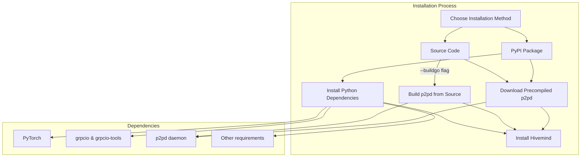
```mermaid
flowchart TD
    subgraph "Installation Process"
        A["Choose Installation Method"]
        B["PyPI Package"]
        C["Source Code"]
        D["Download Precompiled p2pd"]
        E["Build p2pd from Source"]
        F["Install Python Dependencies"]
        G["Install Hivemind"]
        
        A --> B
        A --> C
        B --> D
        B --> F
        C --> D
        C --"--buildgo flag"--> E
        D --> G
        E --> G
        F --> G
    end
    
    subgraph "Dependencies"
        H["PyTorch"]
        I["grpcio & grpcio-tools"]
        J["p2pd daemon"]
        K["Other requirements"]
        
        F --> H
        F --> I
        F --> K
        D --> J
        E --> J
    end
```

Sources: [setup.py:61-115](), [setup.py:175-179]()

## Basic Usage

### Creating a Distributed Hash Table (DHT)

The DHT is the backbone of Hivemind's decentralized architecture, enabling peer discovery and metadata sharing. Here's how to create a DHT node:

```python
import hivemind

# Start a DHT node
dht = hivemind.DHT(start=True)

# Get the node's address for other peers to connect to
peer_addresses = [str(addr) for addr in dht.get_visible_maddrs()]
print("DHT node address:", peer_addresses)
```

For existing networks, connect to other peers by providing their addresses:

```python
# Connect to an existing network
dht = hivemind.DHT(
    initial_peers=['/ip4/192.168.1.100/tcp/12345/p2p/QmExample...'],
    start=True
)
```

Sources: [docs/user/quickstart.md:52-54](), [docs/user/quickstart.md:98-103]()

### Hivemind Components and Architecture

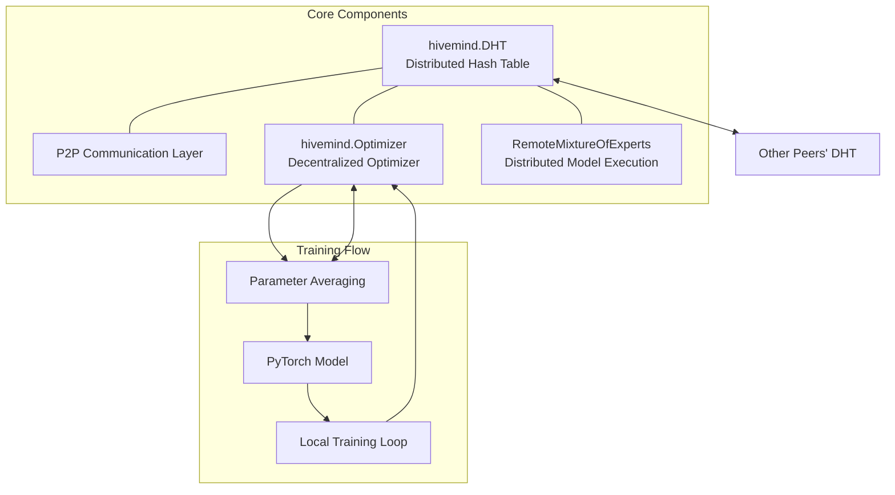
```mermaid
graph TD
    subgraph "Core Components"
        DHT["hivemind.DHT\nDistributed Hash Table"]
        P2P["P2P Communication Layer"]
        Opt["hivemind.Optimizer\nDecentralized Optimizer"]
        MoE["RemoteMixtureOfExperts\nDistributed Model Execution"]
        
        DHT --- P2P
        DHT --- Opt
        DHT --- MoE
    end
    
    subgraph "Training Flow"
        Model["PyTorch Model"]
        Train["Local Training Loop"]
        Avg["Parameter Averaging"]
        
        Model --> Train
        Train --> Opt
        Opt --> Avg
        Avg --> Model
    end
    
    DHT <--> DHT2["Other Peers' DHT"]
    Opt <--> Avg
```

Sources: [docs/user/quickstart.md:32-50](), [README.md:15-24]()

## Decentralized Training Example

Let's walk through a simple example of decentralized training on CIFAR-10 using Hivemind:

### First Peer Setup

```python
import torch
import torch.nn as nn
import torch.nn.functional as F
from torchvision import datasets, transforms
import hivemind

# 1. Create dataset and model
transform = transforms.Compose([
    transforms.ToTensor(),
    transforms.Normalize((0.5, 0.5, 0.5), (0.5, 0.5, 0.5))
])
trainset = datasets.CIFAR10(root='./data', train=True, download=True, transform=transform)

# Simple CNN model
model = nn.Sequential(
    nn.Conv2d(3, 16, (5, 5)), nn.MaxPool2d(2, 2), nn.ReLU(),
    nn.Conv2d(16, 32, (5, 5)), nn.MaxPool2d(2, 2), nn.ReLU(),
    nn.Flatten(), nn.Linear(32 * 5 * 5, 10)
)
local_optimizer = torch.optim.SGD(model.parameters(), lr=0.001, momentum=0.9)

# 2. Initialize DHT for peer discovery
dht = hivemind.DHT(start=True)
print("To join the training, use initial_peers =", [str(addr) for addr in dht.get_visible_maddrs()])

# 3. Create decentralized optimizer
opt = hivemind.Optimizer(
    dht=dht,                  # DHT for peer discovery
    run_id='my_cifar_run',    # Unique identifier for this training run
    batch_size_per_step=32,   # Samples processed per optimizer step
    target_batch_size=10000,  # Total samples before global parameter averaging
    optimizer=local_optimizer, # Wrap local optimizer
    use_local_updates=True,   # Apply local updates between averaging steps
    matchmaking_time=3.0,     # Time to gather peers for averaging
    averaging_timeout=10.0,   # Max time for averaging operation
    verbose=True
)

# 4. Training loop
for epoch in range(10):
    for x_batch, y_batch in torch.utils.data.DataLoader(
            trainset, shuffle=True, batch_size=32):
        opt.zero_grad()
        loss = F.cross_entropy(model(x_batch), y_batch)
        loss.backward()
        opt.step()
        
        print(f"Epoch {epoch}, Loss: {loss.item():.3f}")
```

### Second Peer Setup

To connect additional peers to the training:

```python
# Only change: connect to the first peer's DHT
dht = hivemind.DHT(
    initial_peers=['/ip4/127.0.0.1/tcp/12345/p2p/QmExample...'],  # Address from first peer
    start=True
)

# Load latest training state before starting training
opt.load_state_from_peers()  # Get current model parameters from the network
```

The rest of the code remains the same as the first peer.

Sources: [docs/user/quickstart.md:32-80](), [docs/user/quickstart.md:107-158]()

## How Decentralized Training Works

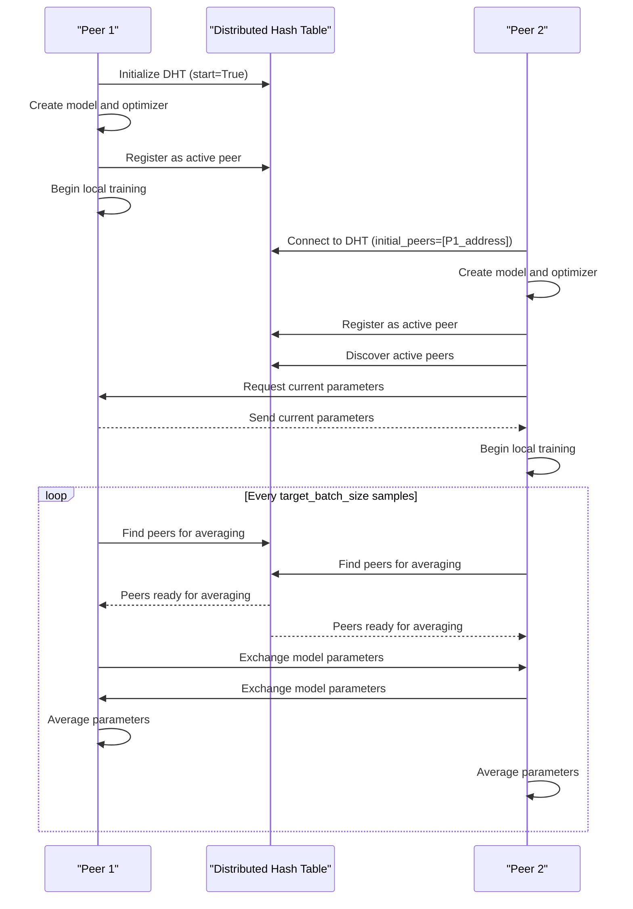
```mermaid
sequenceDiagram
    participant P1 as "Peer 1"
    participant DHT as "Distributed Hash Table"
    participant P2 as "Peer 2"
    
    P1->>DHT: Initialize DHT (start=True)
    P1->>P1: Create model and optimizer
    P1->>DHT: Register as active peer
    P1->>P1: Begin local training
    
    P2->>DHT: Connect to DHT (initial_peers=[P1_address])
    P2->>P2: Create model and optimizer
    P2->>DHT: Register as active peer
    P2->>DHT: Discover active peers
    P2->>P1: Request current parameters
    P1-->>P2: Send current parameters
    P2->>P2: Begin local training
    
    loop Every target_batch_size samples
        P1->>DHT: Find peers for averaging
        P2->>DHT: Find peers for averaging
        DHT-->>P1: Peers ready for averaging
        DHT-->>P2: Peers ready for averaging
        P1->>P2: Exchange model parameters
        P2->>P1: Exchange model parameters
        P1->>P1: Average parameters
        P2->>P2: Average parameters
    end
```

Sources: [docs/user/quickstart.md:166-169](), [README.md:19-22]()

## Command-line Tools

Hivemind provides command-line tools for running standalone DHT nodes and expert servers:

```bash
# Run a standalone DHT node
hivemind-dht

# Run an expert server
hivemind-server --expert_cls my_module.MyExpertClass
```

Sources: [setup.py:197-202]()

## Next Steps

After getting started with Hivemind, you can explore more advanced features:

1. Learn more about the [Distributed Hash Table (DHT)](#2.1) for peer discovery and metadata sharing
2. Explore [Mixture of Experts (MoE)](#2.3) for distributed model computation
3. Check the [Decentralized Averaging](#2.4) system for parameter synchronization
4. See the [Optimizer](#2.5) documentation for advanced training configurations
5. Check out practical examples:
   - [ALBERT training example](https://github.com/learning-at-home/hivemind/tree/master/examples/albert)
   - Integration with [PyTorch Lightning](https://lightning.ai/docs/pytorch/stable/integrations/strategies/Hivemind.html)

For help and questions, join the [Hivemind Discord chat](https://discord.gg/uGugx9zYvN) or file an issue on GitHub.

Sources: [README.md:93-104](), [docs/user/quickstart.md:183-192]()

---

<<< SECTION: 2 Core Components [2-core-components] >>>

# Core Components

<details>
<summary>Relevant source files</summary>

The following files were used as context for generating this wiki page:

- [hivemind/__init__.py](hivemind/__init__.py)
- [requirements.txt](requirements.txt)

</details>


This document provides an overview of the main components that make up the Hivemind system. These components form the foundation for decentralized deep learning in PyTorch. For detailed information about each specific component, follow the links to their dedicated wiki pages.

## Purpose and Scope

Hivemind's architecture is built around five core components that interact to enable decentralized deep learning:

1. **Distributed Hash Table (DHT)** - Enables peer discovery and metadata sharing
2. **Peer-to-Peer Communication (P2P)** - Handles low-level networking between peers
3. **Mixture of Experts (MoE)** - Implements distributed model architecture
4. **Decentralized Averaging** - Synchronizes parameters across peers
5. **Optimizer** - Manages collaborative optimization

These components are exported in the main Hivemind package as seen in the library's initialization file.

Sources: [hivemind/__init__.py:1-13]()

## Component Architecture

The following diagram shows the code entities that represent each core component and their relationships:

### Core Components and Relationships

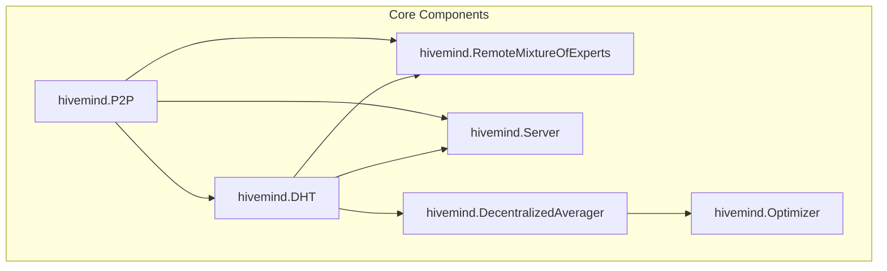
```mermaid
graph TD
    subgraph "Core Components"
        DHT["hivemind.DHT"]
        P2P["hivemind.P2P"]
        MoE_client["hivemind.RemoteMixtureOfExperts"]
        MoE_server["hivemind.Server"]
        DecAvg["hivemind.DecentralizedAverager"]
        Opt["hivemind.Optimizer"]
        
        P2P --> DHT
        DHT --> MoE_client
        DHT --> MoE_server
        DHT --> DecAvg
        P2P --> MoE_client
        P2P --> MoE_server
        DecAvg --> Opt
    end
```

Sources: [hivemind/__init__.py:1-13]()

## Component Descriptions

### Distributed Hash Table (DHT)

The `hivemind.DHT` class implements a distributed hash table based on the Kademlia protocol. It provides a decentralized key-value store for peer discovery and metadata sharing.

Key features:
- Peer discovery without central coordination
- Storing and retrieving key-value pairs
- Expert registration and discovery
- Built on top of the P2P communication layer

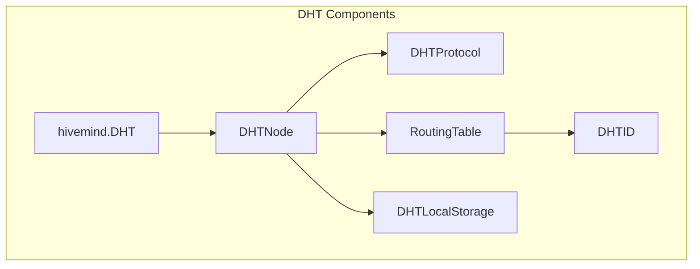
```mermaid
graph TD
    subgraph "DHT Components"
        DHT["hivemind.DHT"]
        DHTNode["DHTNode"]
        DHTProtocol["DHTProtocol"]
        RoutingTable["RoutingTable"]
        DHTID["DHTID"]
        Storage["DHTLocalStorage"]
        
        DHT --> DHTNode
        DHTNode --> DHTProtocol
        DHTNode --> RoutingTable
        RoutingTable --> DHTID
        DHTNode --> Storage
    end
```

For detailed information, see [Distributed Hash Table (DHT)](#2.1).

Sources: [hivemind/__init__.py:3]()

### Peer-to-Peer Communication (P2P)

The `hivemind.P2P` class and related components provide the low-level networking capabilities that enable direct communication between peers.

Key components:
- `hivemind.P2P` - Main class for peer-to-peer communication
- `hivemind.P2PContext` - Context for P2P communication sessions
- `hivemind.PeerID` and `hivemind.PeerInfo` - Peer identification and information
- `hivemind.P2PHandlerError` - Error handling for P2P communication

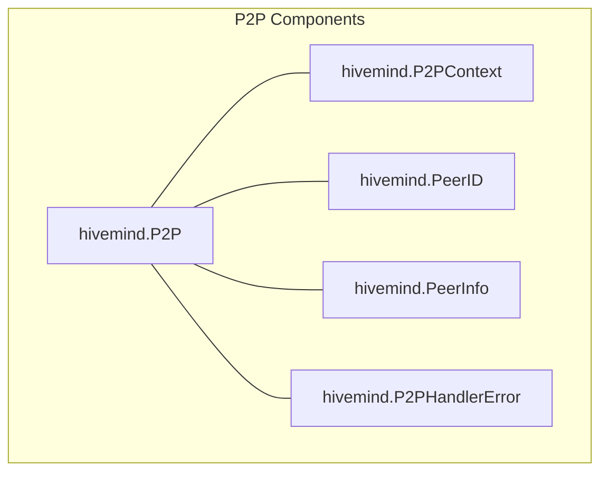
```mermaid
graph TD
    subgraph "P2P Components"
        P2P["hivemind.P2P"]
        P2PContext["hivemind.P2PContext"]
        PeerID["hivemind.PeerID"]
        PeerInfo["hivemind.PeerInfo"]
        P2PHandlerError["hivemind.P2PHandlerError"]
        
        P2P --- P2PContext
        P2P --- PeerID
        P2P --- PeerInfo
        P2P --- P2PHandlerError
    end
```

For detailed information, see [Peer-to-Peer Communication (P2P)](#2.2).

Sources: [hivemind/__init__.py:13]()

### Mixture of Experts (MoE)

The MoE system consists of client-side and server-side components that enable distributed model computation.

Client-side components:
- `hivemind.RemoteMixtureOfExperts` - Client interface for accessing remote experts
- `hivemind.RemoteSwitchMixtureOfExperts` - Variant with switch-based routing
- `hivemind.RemoteExpert` - Represents a single remote expert

Server-side components:
- `hivemind.Server` - Hosts experts and handles incoming requests
- `hivemind.ModuleBackend` - Backend for serving PyTorch modules
- `hivemind.register_expert_class` - Function to register custom expert types

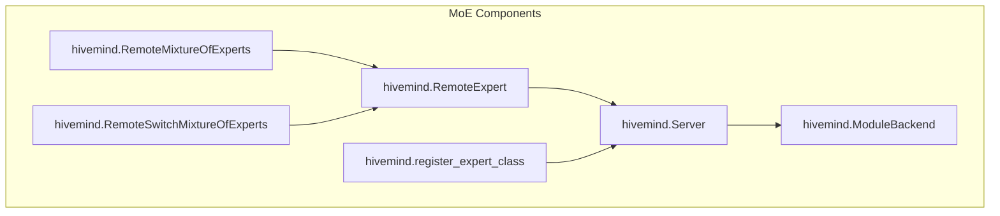
```mermaid
graph TD
    subgraph "MoE Components"
        RemoteMoE["hivemind.RemoteMixtureOfExperts"]
        RemoteSwitchMoE["hivemind.RemoteSwitchMixtureOfExperts"]
        RemoteExpert["hivemind.RemoteExpert"]
        Server["hivemind.Server"]
        ModuleBackend["hivemind.ModuleBackend"]
        RegisterExpert["hivemind.register_expert_class"]
        
        RemoteMoE --> RemoteExpert
        RemoteSwitchMoE --> RemoteExpert
        RemoteExpert --> Server
        Server --> ModuleBackend
        RegisterExpert --> Server
    end
```

For detailed information, see [Mixture of Experts (MoE)](#2.3).

Sources: [hivemind/__init__.py:4-11]()

### Decentralized Averaging

The `hivemind.DecentralizedAverager` class enables parameter synchronization across peers without requiring a central parameter server.

Key features:
- Peer discovery via DHT
- Dynamic group formation for averaging
- Efficient all-reduce implementation
- Load balancing and fault tolerance

```mermaid
graph TD
    subgraph "Decentralized Averaging Components"
        DecAvg["hivemind.DecentralizedAverager"]
        Matchmaking["Matchmaking"]
        AllReduce["AllReduceRunner"]
        GroupKey["GroupKeyManager"]
        
        DecAvg --> Matchmaking
        DecAvg --> AllReduce
        Matchmaking --> GroupKey
    end
```

For detailed information, see [Decentralized Averaging](#2.4).

Sources: [hivemind/__init__.py:1]()

### Optimizer

The `hivemind.Optimizer` and related components support collaborative training by coordinating optimization across peers.

Key components:
- `hivemind.Optimizer` - Main class for collaborative optimization
- `hivemind.GradScaler` - Supports mixed precision training
- `hivemind.TrainingAverager` - Manages parameter averaging during training

```mermaid
graph TD
    subgraph "Optimizer Components"
        Opt["hivemind.Optimizer"]
        GradScaler["hivemind.GradScaler"]
        TrainingAverager["hivemind.TrainingAverager"]
        
        Opt --> GradScaler
        Opt --> TrainingAverager
    end
```

For detailed information, see [Optimizer](#2.5).

Sources: [hivemind/__init__.py:12]()

## Data Flow Between Components

The following diagram illustrates how data flows between the core components in a typical Hivemind application:

```mermaid
flowchart TD
    subgraph "Data Flow"
        Client["PyTorch Model"]
        RemoteMoE["hivemind.RemoteMixtureOfExperts"]
        DHT["hivemind.DHT"]
        P2P["hivemind.P2P"]
        Optimizer["hivemind.Optimizer"]
        DecAvg["hivemind.DecentralizedAverager"]
        Server["hivemind.Server"]
        
        Client -->|"Forward Pass"| RemoteMoE
        RemoteMoE -->|"Find Experts"| DHT
        DHT -->|"Use"| P2P
        RemoteMoE -->|"RPC Calls"| P2P
        P2P -->|"RPC Calls"| Server
        Server -->|"Expert Computation"| P2P
        P2P -->|"Results"| RemoteMoE
        RemoteMoE -->|"Results"| Client
        Client -->|"Backward Pass"| Optimizer
        Optimizer -->|"Average Parameters"| DecAvg
        DecAvg -->|"Form Groups"| DHT
        DecAvg -->|"Exchange Data"| P2P
    end
```

Sources: [hivemind/__init__.py:1-13]()

In a typical application flow:

1. The client model uses `RemoteMixtureOfExperts` for forward passes
2. `RemoteMixtureOfExperts` discovers experts via the `DHT`
3. Communication with experts happens via the `P2P` layer
4. Servers host experts and respond to client requests
5. During training, `Optimizer` coordinates parameter updates
6. `DecentralizedAverager` synchronizes parameters across peers

## Dependencies

Hivemind relies on several key dependencies to enable its functionality:

| Dependency | Version | Purpose |
|------------|---------|---------|
| PyTorch | ≥1.9.0 | Deep learning framework |
| numpy | ≥1.17 | Numerical computing |
| grpcio-tools | ≥1.33.2 | RPC framework |
| protobuf | ≥5.29.0 | Protocol Buffers |
| pydantic | ≥2.0.0 | Data validation |
| uvloop | ≥0.14.0 | Fast asyncio event loop |
| py-multihash | ≥0.2.3 | Hashing for DHT |
| cryptography | ≥3.4.6 | Cryptographic functions |

Sources: [requirements.txt:1-21]()

---

<<< SECTION: 2.1 Distributed Hash Table (DHT) [2-1-distributed-hash-table-dht] >>>

# Distributed Hash Table (DHT)

<details>
<summary>Relevant source files</summary>

The following files were used as context for generating this wiki page:

- [hivemind/dht/__init__.py](hivemind/dht/__init__.py)
- [hivemind/dht/node.py](hivemind/dht/node.py)
- [hivemind/dht/protocol.py](hivemind/dht/protocol.py)
- [hivemind/dht/traverse.py](hivemind/dht/traverse.py)
- [tests/test_dht.py](tests/test_dht.py)
- [tests/test_dht_node.py](tests/test_dht_node.py)
- [tests/test_utils/dht_swarms.py](tests/test_utils/dht_swarms.py)

</details>


The Distributed Hash Table (DHT) is a core component of Hivemind that enables decentralized peer discovery and metadata sharing without requiring a central server. It provides a fault-tolerant key-value storage system that spans across all participating peers in the network. The DHT is optimized for rapidly accessing lightweight metadata that is frequently updated, such as expert availability information and training coordination parameters.

For information about the underlying peer-to-peer communication layer, see [Peer-to-Peer Communication (P2P)](#2.2).

## 1. Overview

Hivemind's DHT is built on Kademlia [1] but extends it with optimizations for deep learning workloads:

- Support for bulk store/get operations to reduce network latency
- Enhanced caching mechanisms to keep frequently used values available
- Value expiration times to handle frequently updated metadata
- Support for dictionary-type values with subkeys

```mermaid
graph TD
    subgraph "DHT System"
        DHTNode["DHTNode"] --> |Uses| DHTProtocol["DHTProtocol"]
        DHTNode --> |Traverses| TraverseDHT["traverse_dht"]
        DHTProtocol --> |Routes via| RoutingTable["RoutingTable"]
        DHTProtocol --> |Stores in| Storage["DHTLocalStorage"]
        DHTProtocol --> |Caches in| Cache["DHTLocalStorage (cache)"]
    end

    subgraph "External Components"
        DHT["DHT (high-level interface)"] --> |Runs| DHTNode
        P2P["P2P Communication"] <--> DHTProtocol
        App["Client Application"] --> DHT
    end

    subgraph "Core Operations"
        Store["store()"] --> DHTNode
        Get["get()"] --> DHTNode
        FindNearest["find_nearest_nodes()"] --> DHTNode
    end
```

Sources: [hivemind/dht/__init__.py:1-20](), [hivemind/dht/node.py:44-88]()

## 2. Key Concepts

### 2.1 Node and Key Identifiers

Every DHT node has a unique identifier (`DHTID`) in the same address space as keys. Keys are generated by hashing their original value, placing them in the same space as node IDs:

```mermaid
graph LR
    subgraph "ID Space (160-bit)"
        NodeID1["Node ID: 0x1a2b..."]
        NodeID2["Node ID: 0xc3d4..."]
        KeyID1["Key ID: 0x4e5f... (from key='expert1')"]
        KeyID2["Key ID: 0xb1c2... (from key='parameter1')"]
    end
```

Sources: [hivemind/dht/node.py:384-386]()

### 2.2 XOR Distance Metric

DHT uses the XOR distance metric to determine "closeness" between nodes and keys. This is a core concept from Kademlia that creates a notion of distance in the ID space:

- Smaller XOR distance means "closer" nodes/keys
- XOR distance is symmetric: distance(A,B) = distance(B,A)
- The triangle inequality holds for this metric

DHT nodes store keys that are "close" to their node ID, and queries for a key are routed to nodes with IDs closest to the key.

Sources: [hivemind/dht/node.py:262-263](), [hivemind/dht/node.py:312-319]()

### 2.3 Value Expiration

Every key-value pair in Hivemind's DHT has an expiration time:

- DHT nodes always prefer values with higher expiration times
- Nodes may delete any value past its expiration
- This mechanism supports frequently updated metadata without requiring explicit deletion

```mermaid
graph TD
    subgraph "Value Lifecycle"
        Store["Store(key, value, expiration_time)"] --> Storage["Node Storage"]
        Storage --> |"Time passes"| Check["Is current_time > expiration_time?"]
        Check -->|"Yes"| Delete["Value may be deleted"]
        Check -->|"No"| Keep["Value remains valid"]
        NewStore["Store(key, new_value, new_expiration)"] --> |"new_expiration > old_expiration"| Replace["Replace old value"]
        NewStore --> |"new_expiration <= old_expiration"| Reject["Reject new value"]
    end
```

Sources: [hivemind/dht/node.py:55-57](), [hivemind/dht/node.py:67-72]()

## 3. Core Components

### 3.1 DHTNode

`DHTNode` is the main class that represents one DHT participant. It provides the core DHT functionality:

- Finding nearest nodes to a key
- Storing key-value pairs
- Retrieving values for keys
- Handling dictionary-type values with subkeys
- Caching and refreshing values

It maintains its local storage, a cache, and a routing table of known peers.

Sources: [hivemind/dht/node.py:45-88]()

### 3.2 DHTProtocol

`DHTProtocol` handles the low-level communication between DHT nodes, implementing three core RPCs:

1. **ping** - Request peer's identifier and update routing table
2. **store** - Send several (key, value, expiration_time) pairs to a peer
3. **find** - Request one or several keys, get values and nearest neighbors from recipient's routing table

```mermaid
sequenceDiagram
    participant NodeA as "Node A"
    participant NodeB as "Node B"
    
    NodeA->>NodeB: ping(node_info)
    NodeB-->>NodeA: ping_response(node_id, dht_time)
    
    NodeA->>NodeB: store(keys, values, expiration_times)
    NodeB-->>NodeA: store_response(store_ok)
    
    NodeA->>NodeB: find(keys)
    NodeB-->>NodeA: find_response(values, nearest_nodes)
```

Sources: [hivemind/dht/protocol.py:25-163](), [hivemind/dht/node.py:58-64]()

### 3.3 Routing Table

Each DHT node maintains a routing table that organizes known peers into k-buckets:

- Buckets contain up to `bucket_size` peers (default 20)
- Peers are grouped by the binary prefix they share with the local node ID
- Farther buckets (less common prefix) store fewer peers
- This structure allows efficient lookup of peers closest to any target ID

Sources: [hivemind/dht/protocol.py:371-406]()

### 3.4 traverse_dht

`traverse_dht` is a core algorithm that crawls the DHT to find the nearest nodes to a key or set of keys:

- Uses beam search to efficiently explore the network
- Can handle multiple queries simultaneously
- Balances exploration across queries
- Supports concurrent workers to parallelize network requests

Sources: [hivemind/dht/traverse.py:72-258]()

## 4. Key Operations

### 4.1 Store Operation

When a node wants to store a value in the DHT:

1. Find the `num_replicas` nodes closest to the key ID
2. Send the (key, value, expiration_time) to each of these nodes
3. Nodes only accept the value if they don't have a newer version (with higher expiration time)

```mermaid
flowchart TD
    Start["store(key, value, expiration_time)"] --> GenerateKeyID["key_id = DHTID.generate(key)"]
    GenerateKeyID --> FindNodes["find_nearest_nodes(key_id, k_nearest=num_replicas)"]
    FindNodes --> |"For each nearest node"| SendStore["call_store(node, key_id, value, expiration_time)"]
    SendStore --> |"Node already has newer value"| RejectStore["Return False (rejected)"]
    SendStore --> |"Node accepts value"| AcceptStore["Return True (stored)"]
```

Sources: [hivemind/dht/node.py:340-349](), [hivemind/dht/node.py:351-503]()

### 4.2 Get Operation

When a node wants to retrieve a value from the DHT:

1. Check local storage and cache for the key
2. If not found or looking for a newer value, find nodes closest to the key
3. Query these nodes for the value, collecting responses
4. Return the value with the highest expiration time

```mermaid
flowchart TD
    Start["get(key, latest=False)"] --> GenerateKeyID["key_id = DHTID.generate(key)"]
    GenerateKeyID --> CheckLocal["Check local storage and cache"]
    CheckLocal --> |"Value found and not latest"| ReturnValue["Return found value"]
    CheckLocal --> |"Value not found or latest=True"| FindNodes["find_nearest_nodes(key_id)"]
    FindNodes --> |"For each nearest node"| QueryNode["call_find(node, key_id)"]
    QueryNode --> CollectValues["Collect values and their expiration times"]
    CollectValues --> SelectBest["Select value with highest expiration time"]
    SelectBest --> |"Cache if configured"| CacheValue["Cache value locally"]
    SelectBest --> Return["Return best value or None"]
```

Sources: [hivemind/dht/node.py:534-546](), [hivemind/dht/node.py:569-678]()

### 4.3 Finding Nearest Nodes

The `find_nearest_nodes` operation is fundamental to both store and get operations:

1. Start with known peers from the routing table
2. Query these peers for their nearest neighbors to the target key
3. Continue exploring, prioritizing peers closest to the target
4. Return the `k_nearest` peers closest to the target

Sources: [hivemind/dht/node.py:278-338]()

## 5. DHT Traversal

Hivemind's DHT uses a sophisticated beam search algorithm to efficiently find the nearest nodes to a key:

```mermaid
graph TD
    subgraph "traverse_dht"
        Init["Initialize data structures"] --> Worker["Spawn num_workers workers"]
        Worker --> Choose["Choose query with least workers"]
        Choose --> Select["Select nearest unvisited node"]
        Select --> Pack["Pack additional queries"]
        Pack --> Request["Request get_neighbors"]
        Request --> Update["Update nearest/candidate heaps"]
        Update --> |"Loop until finished"| Choose
    end

    subgraph "get_neighbors callback"
        Callback["get_neighbors callback"] --> Return["Returns neighbors + should_stop flag"]
    end

    Request --> Callback
```

The algorithm can:
- Handle multiple queries in parallel
- Pack multiple queries into a single RPC for efficiency
- Balance worker allocation across different queries
- Stop early if sufficient results are found

Sources: [hivemind/dht/traverse.py:72-258](), [hivemind/dht/node.py:278-338]()

## 6. Caching Mechanisms

Hivemind's DHT implements several caching strategies to improve performance:

### 6.1 Local Caching

When enabled (`cache_locally=True`), a node caches values it retrieves or stores:

- Reduces latency for frequently accessed keys
- Cache has configurable maximum size
- Values in cache expire according to their expiration time

Sources: [hivemind/dht/node.py:78-84](), [hivemind/dht/protocol.py:343-362]()

### 6.2 Neighbor Caching

When enabled (`cache_nearest>0`), after a value is found, it's also stored on the nearest nodes encountered during the search:

- Helps distribute popular values across the network
- Reduces load on nodes closest to popular keys
- Improves resilience by increasing replication

Sources: [hivemind/dht/node.py:81](), [hivemind/dht/node.py:653]()

### 6.3 Cache Refresh

When enabled (`cache_refresh_before_expiry>0`), nodes can proactively refresh cached values before they expire:

- Checks if cached value was recently used
- Attempts to refresh the value before expiration
- Ensures frequently used values remain available without interruption

```mermaid
flowchart TD
    Access["Access a cached value"] --> CheckExpiry["Check time until expiration"]
    CheckExpiry --> |"< cache_refresh_before_expiry seconds"| Queue["Add to refresh queue"]
    Queue --> |"Background task"| Refresh["Refresh value from DHT"]
    Refresh --> |"Update cache"| UpdateCache["Update cached value"]
```

Sources: [hivemind/dht/node.py:82](), [hivemind/dht/node.py:611](), [hivemind/dht/node.py:680-687]()

## 7. Customization Options

The DHT system offers several configuration options to tailor its behavior:

| Parameter | Description | Default |
|-----------|-------------|---------|
| `bucket_size` | Maximum number of nodes in one k-bucket | 20 |
| `num_replicas` | Number of nearest nodes that will store a key | 5 |
| `parallel_rpc` | Maximum concurrent RPC requests | Unlimited |
| `wait_timeout` | Time before considering an RPC request lost | 3 seconds |
| `cache_locally` | Whether to cache values locally | True |
| `cache_nearest` | Number of nearest nodes to cache found values on | 1 |
| `cache_refresh_before_expiry` | Seconds before expiry to refresh cached values | 5 seconds |
| `reuse_get_requests` | Reuse in-progress get requests for the same key | True |

Sources: [hivemind/dht/node.py:98-168]()

## 8. References

[1] Maymounkov P., Mazieres D. (2002) Kademlia: A Peer-to-Peer Information System Based on the XOR Metric.

Sources: [hivemind/dht/__init__.py:11-13]()

---

<<< SECTION: 2.1.1 DHT Interface [2-1-1-dht-interface] >>>

# DHT Interface

<details>
<summary>Relevant source files</summary>

The following files were used as context for generating this wiki page:

- [hivemind/dht/__init__.py](hivemind/dht/__init__.py)
- [hivemind/dht/dht.py](hivemind/dht/dht.py)
- [hivemind/hivemind_cli/run_dht.py](hivemind/hivemind_cli/run_dht.py)
- [hivemind/hivemind_cli/run_server.py](hivemind/hivemind_cli/run_server.py)
- [tests/test_cli_scripts.py](tests/test_cli_scripts.py)

</details>


The DHT Interface provides the high-level API for interacting with Hivemind's Distributed Hash Table (DHT) system. This document details the user interface and API methods available for applications that need to store, retrieve, and share data across the decentralized network. For details about the internal implementation of the DHT node, see [DHT Node Implementation](#2.1.2).

## Purpose and Architecture

The Distributed Hash Table serves as the backbone coordination mechanism in Hivemind, enabling peer discovery, expert registration, and metadata sharing without requiring a central server. The `DHT` class provides a user-friendly interface to this system by running a `DHTNode` in a background process.

```mermaid
flowchart TB
    subgraph "Application Code"
        UserCode["User Application"]
    end

    subgraph "DHT Interface"
        DHT["DHT Class"]
        DHT -->|"Pipe Communication"| DHT_Process["DHT Process"]
    end

    subgraph "DHT Process (Background)"
        DHT_Process --> DHTNode["DHTNode"]
        DHTNode --> DHTProtocol["DHTProtocol"]
        DHTNode --> RoutingTable["RoutingTable"]
        DHTNode --> P2P["P2P Communication"]
    end

    UserCode -->|"get(), store(), run_coroutine()"| DHT
```

Sources: [hivemind/dht/__init__.py:1-20](), [hivemind/dht/dht.py:22-42]()

## Class Definition and Initialization

The `DHT` class inherits from `mp.context.ForkProcess` and runs a `DHTNode` in a separate process to avoid blocking the main application.

```mermaid
classDiagram
    class DHT {
        +__init__(initial_peers, start, ...)
        +run_in_background()
        +wait_until_ready()
        +get(key, latest, return_future)
        +store(key, value, expiration_time, subkey, return_future)
        +run_coroutine(coro, return_future)
        +shutdown()
        +add_validators(record_validators)
        +get_visible_maddrs(latest)
        +replicate_p2p()
        -_get(key, latest, future)
        -_store(key, value, expiration_time, subkey, future)
        -_run_coroutine(coro, future)
        -_shutdown()
    }
```

### Constructor Parameters

```python
DHT(
    initial_peers: Optional[Sequence[Union[Multiaddr, str]]] = None,
    *,
    start: bool,
    p2p: Optional[P2P] = None,
    daemon: bool = True,
    num_workers: int = DEFAULT_NUM_WORKERS,
    record_validators: Iterable[RecordValidatorBase] = (),
    shutdown_timeout: float = 3,
    await_ready: bool = True,
    **kwargs
)
```

| Parameter | Type | Description |
|-----------|------|-------------|
| `initial_peers` | `Optional[Sequence[Union[Multiaddr, str]]]` | Multiaddrs of active DHT peers to join an existing DHT |
| `start` | `bool` | Whether to automatically start the background process |
| `p2p` | `Optional[P2P]` | Existing P2P instance to reuse |
| `daemon` | `bool` | If True, the background process is marked as daemon |
| `num_workers` | `int` | Maximum parallel workers for operations |
| `record_validators` | `Iterable[RecordValidatorBase]` | Validators for signing and validating stored records |
| `shutdown_timeout` | `float` | Seconds to wait during graceful shutdown |
| `await_ready` | `bool` | If True, waits until the DHT process is ready |
| `**kwargs` | | Additional parameters forwarded to DHTNode and P2P |

Sources: [hivemind/dht/dht.py:22-87]()

## Core API Methods

The DHT Interface provides three core methods for interacting with the distributed hash table:

### `get(key, latest=False, return_future=False, **kwargs)`

Searches for a key across the DHT and returns either the first or latest entry if found.

```python
# Retrieve a value synchronously
value = dht.get("expert_uid")

# Retrieve the latest value asynchronously
future = dht.get("expert_uid", latest=True, return_future=True)
value = future.result()  # Get the result when needed
```

Sources: [hivemind/dht/dht.py:166-190]()

### `store(key, value, expiration_time, subkey=None, return_future=False, **kwargs)`

Stores a key-value pair in the DHT until the specified expiration time.

```python
# Store a value with expiration time
success = dht.store(
    key="expert_uid",
    value={"host": "192.168.1.1", "port": 8888},
    expiration_time=hivemind.get_dht_time() + 300  # Expires in 5 minutes
)

# Store a value under a subkey
future = dht.store(
    key="expert_uid",
    value={"throughput": 100},
    subkey="stats",
    expiration_time=hivemind.get_dht_time() + 60,
    return_future=True
)
```

Sources: [hivemind/dht/dht.py:192-238]()

### `run_coroutine(coro, return_future=False)`

Executes an asynchronous function on a DHT participant and returns the results.

```python
# Run a custom coroutine on the DHT
async def my_custom_operation(dht_instance, node):
    peers = await node.find_nearest_nodes("some_key")
    return [peer.peer_id for peer in peers]

peer_ids = dht.run_coroutine(my_custom_operation)
```

Sources: [hivemind/dht/dht.py:240-268]()

## Process Management

The DHT Interface provides methods to manage the lifecycle of the background DHT process:

### `run_in_background(await_ready=True, timeout=None)`

Starts the DHT in a background process and optionally waits until it's ready.

### `wait_until_ready(timeout=None)`

Blocks until the DHT process is ready to process incoming requests or until the timeout expires.

### `shutdown()`

Terminates the running DHT process, first attempting a graceful shutdown and then forcefully terminating if necessary.

Sources: [hivemind/dht/dht.py:141-164]()

## Inter-Process Communication Architecture

The DHT Interface communicates with the background DHT process using a pipe-based mechanism:

```mermaid
sequenceDiagram
    participant App as Application
    participant DHT as DHT Interface
    participant Pipe as Pipe
    participant Process as DHT Process
    participant Node as DHTNode

    App->>DHT: get(key)
    DHT->>Pipe: Send (_get, key, future)
    Pipe->>Process: Receive (_get, key, future)
    Process->>Node: await node.get(key)
    Node-->>Process: result
    Process->>Pipe: Set future.result
    Pipe-->>DHT: future.result()
    DHT-->>App: value
```

Sources: [hivemind/dht/dht.py:89-139](), [hivemind/dht/dht.py:166-190]()

## Advanced Features

### Record Validation

DHT supports validation of stored records through the `add_validators` method, which appends new record validators to the existing ones.

```python
# Add a custom validator to the DHT
dht.add_validators([MyCustomValidator()])
```

Sources: [hivemind/dht/dht.py:270-281]()

### Network Information

The DHT Interface provides methods to retrieve network information:

- `peer_id` property: Returns the peer ID of the DHT node
- `client_mode` property: Returns whether the node is operating in client mode
- `get_visible_maddrs(latest=False)`: Returns the multiaddresses visible to other peers

### P2P Replication

The `replicate_p2p()` method creates a replica of the P2P instance used in the DHT process, allowing for direct P2P communication while reusing the same P2P daemon.

Sources: [hivemind/dht/dht.py:283-334]()

## Example Usage

### Starting a DHT Node

```python
from hivemind import DHT

# Create and start a DHT node
dht = DHT(
    start=True,
    initial_peers=["/ip4/203.0.113.1/tcp/31337/p2p/XXXX"],
    await_ready=True
)

# Use the DHT for operations
value = dht.get("some_key")

# Shut down when done
dht.shutdown()
```

### Running a Standalone DHT Node

Hivemind provides a command-line tool to run a standalone DHT node:

```bash
hivemind-dht --host_maddrs /ip4/0.0.0.0/tcp/31337 --initial_peers /ip4/203.0.113.1/tcp/31337/p2p/XXXX
```

Sources: [hivemind/hivemind_cli/run_dht.py:1-106]()

## DHT Interface in the Hivemind Architecture

The DHT Interface sits at the foundation of Hivemind's decentralized architecture, enabling other core components to operate in a distributed environment:

```mermaid
flowchart TB
    subgraph "DHT System"
        DHTInterface["DHT Interface"]
        DHTNode["DHTNode"]
        DHTProtocol["DHTProtocol"]
        Routing["Routing & Storage"]
        
        DHTInterface --> DHTNode
        DHTNode --> DHTProtocol
        DHTNode --> Routing
    end
    
    subgraph "Higher-Level Components"
        MoE["Mixture of Experts"]
        DecAvg["Decentralized Averager"]
        Optimizer["Collaborative Optimizer"]
    end
    
    MoE -->|"Expert Discovery\nMetadata Sharing"| DHTInterface
    DecAvg -->|"Peer Matchmaking"| DHTInterface
    Optimizer -->|"Parameter Synchronization"| DHTInterface
```

Sources: [hivemind/dht/__init__.py:1-20](), [hivemind/hivemind_cli/run_server.py:74-76]()

## Technical Considerations

- The DHT Interface is designed to be used from the main process, not from within the DHT process itself; attempting to call external DHT methods from inside the DHT process will result in a deadlock.
- The `run_coroutine` method allows for custom operations, but any changes made to global variables or DHT fields will not be accessible from the host process.
- All time-consuming operations in coroutines should be asynchronous to prevent blocking background DHT tasks.

Sources: [hivemind/dht/dht.py:177](), [hivemind/dht/dht.py:211](), [hivemind/dht/dht.py:250-255]()

---

<<< SECTION: 2.1.2 DHT Node Implementation [2-1-2-dht-node-implementation] >>>

# DHT Node Implementation

<details>
<summary>Relevant source files</summary>

The following files were used as context for generating this wiki page:

- [hivemind/dht/node.py](hivemind/dht/node.py)
- [hivemind/dht/protocol.py](hivemind/dht/protocol.py)
- [hivemind/dht/traverse.py](hivemind/dht/traverse.py)
- [tests/test_dht.py](tests/test_dht.py)
- [tests/test_dht_node.py](tests/test_dht_node.py)
- [tests/test_utils/dht_swarms.py](tests/test_utils/dht_swarms.py)

</details>


This document explains the internals of the Distributed Hash Table (DHT) node implementation in Hivemind. It focuses on the `DHTNode` class, the `DHTProtocol` communication layer, and the `traverse_dht` algorithm. For information about the user-facing DHT interface, see [DHT Interface](#2.1.1), and for details on routing mechanisms, see [DHT Routing](#2.1.3).

## Core Architecture

The `DHTNode` class represents a participant in Hivemind's distributed hash table network. It is responsible for storing key-value pairs, finding closest nodes, and communicating with other peers in the network.

```mermaid
graph TD
    subgraph "DHTNode Components"
        nodeId["node_id: DHTID"] --- protocol
        protocol["protocol: DHTProtocol"] --- storage["storage: DHTLocalStorage"]
        protocol --- cache["cache: DHTLocalStorage"]
        protocol --- routing["routing_table: RoutingTable"]
        blacklist["blacklist: Blacklist"]
        pendingRequests["pending_get_requests: DefaultDict"]
        cacheRefreshQueue["cache_refresh_queue: CacheRefreshQueue"]
    end
    
    subgraph "Key Operations"
        find["find_nearest_nodes()"] --- traverse["traverse_dht()"]
        store["store(), store_many()"] --- find
        get["get(), get_many()"] --- traverse
    end
    
    subgraph "Network Layer"
        protocol --- p2p["p2p: P2P"]
        p2p --- otherNodes["Other DHT Nodes"]
    end
    
    nodeId --- find
    nodeId --- store
    nodeId --- get
    protocol --- find
    blacklist --- find
    pendingRequests --- get
    cache --- cacheRefreshQueue
```

Sources: [hivemind/dht/node.py:45-96](). [hivemind/dht/protocol.py:25-35]()

## Node Lifecycle

### Creation and Initialization

A DHT node is created using the asynchronous factory method `DHTNode.create()`. This pattern allows for asynchronous initialization which is necessary for setting up network connections.

```mermaid
sequenceDiagram
    participant Client
    participant DHTNode
    participant DHTProtocol
    participant P2P
    
    Client->>DHTNode: create(initial_peers, ...)
    DHTNode->>DHTNode: Initialize internal state
    
    alt p2p not provided
        DHTNode->>P2P: create(initial_peers, ...)
        P2P-->>DHTNode: p2p instance
    end
    
    DHTNode->>DHTProtocol: create(p2p, node_id, ...)
    DHTProtocol-->>DHTNode: protocol instance
    
    alt initial_peers provided
        DHTNode->>+DHTNode: Bootstrap process
        DHTNode->>P2P: Ping initial peers
        P2P-->>DHTNode: Responses from peers
        DHTNode->>DHTNode: find_nearest_nodes([self.node_id])
        DHTNode-->>-DHTNode: Update routing table
    end
    
    DHTNode-->>Client: DHTNode instance
```

The initialization process involves:

1. Creating a node ID (random or specified)
2. Setting up a P2P instance (provided or created)
3. Creating the protocol instance
4. Bootstrapping by connecting to initial peers
5. Populating the routing table

Sources: [hivemind/dht/node.py:98-264]()

### Shutdown

When a node is no longer needed, its resources can be released by calling `shutdown()`:

```python
async def shutdown(self):
    """Process existing requests, close all connections and stop the server"""
    self.is_alive = False
    await self.protocol.shutdown()
    if self._should_shutdown_p2p:
        await self.p2p.shutdown()
```

Sources: [hivemind/dht/node.py:271-276]()

## DHT Protocol

The `DHTProtocol` class handles all peer-to-peer communication for the DHT node. It implements three main RPC methods similar to Kademlia:

```mermaid
graph LR
    subgraph "RPC Methods"
        rpcPing["rpc_ping()"] --- rpcStore["rpc_store()"]
        rpcStore --- rpcFind["rpc_find()"]
    end
    
    subgraph "Client Methods"
        callPing["call_ping()"] --- callStore["call_store()"]
        callStore --- callFind["call_find()"]
    end
    
    subgraph "Routing"
        updateRT["update_routing_table()"]
    end
    
    callPing --> rpcPing
    callStore --> rpcStore
    callFind --> rpcFind
    
    rpcPing --> updateRT
    rpcStore --> updateRT
    rpcFind --> updateRT
    callPing --> updateRT
    callStore --> updateRT
    callFind --> updateRT
```

### Protocol Operations

| RPC Method | Purpose | Description |
|------------|---------|-------------|
| `rpc_ping` | Node discovery and liveness check | Responds with the node's ID and updates routing table |
| `rpc_store` | Store key-value pairs | Accepts keys, values, and expiration times to store locally |
| `rpc_find` | Retrieve values and find nodes | Returns values if available, plus nearest neighbors |

Each RPC method has a corresponding client method (`call_ping`, `call_store`, `call_find`) that initiates the request to remote peers.

Sources: [hivemind/dht/protocol.py:97-369]()

## DHT Traversal

The `traverse_dht` function is a critical component that implements a beam search algorithm to efficiently find the closest nodes to a target ID in the DHT network.

```mermaid
graph TD
    subgraph "traverse_dht Function"
        init["Initialize heaps and counters"]
        worker["Worker function (concurrent)"]
        select["Select query with least workers"]
        explore["Get nearest unexplored peer"]
        request["Request neighbors from peer"]
        update["Update heaps with results"]
        finish["Finish when all queries complete"]
    end
    
    init --> worker
    worker --> select
    select --> explore
    explore --> request
    request --> update
    update --> worker
    update --> finish
```

The traversal algorithm:

1. Maintains priority heaps of unvisited nodes for each query
2. Uses multiple concurrent workers to explore the network
3. Prioritizes queries with fewer active workers
4. Stops when sufficient nearest nodes are found or no more candidates exist

This implementation is a generalization of a simple DHT traversal that allows for multiple concurrent queries and workers, making it highly efficient.

Sources: [hivemind/dht/traverse.py:72-258]()

## Key Operations

### Finding Nearest Nodes

The `find_nearest_nodes` method locates the k-nearest nodes to a given DHTID:

```mermaid
sequenceDiagram
    participant Client
    participant DHTNode
    participant TraverseDHT
    participant RemotePeers
    
    Client->>DHTNode: find_nearest_nodes(queries, k_nearest)
    DHTNode->>DHTNode: Get initial nodes from routing table
    DHTNode->>TraverseDHT: traverse_dht(queries, initial_nodes, ...)
    
    loop For each nearest node
        TraverseDHT->>RemotePeers: get_neighbors(peer, queries)
        RemotePeers-->>TraverseDHT: Neighbors for each query
        TraverseDHT->>TraverseDHT: Update nearest nodes
    end
    
    TraverseDHT-->>DHTNode: nearest_nodes_per_query
    DHTNode-->>Client: {query: {node_id: peer_id, ...}, ...}
```

Sources: [hivemind/dht/node.py:278-338]()

### Storing Values

The `store` and `store_many` methods store key-value pairs in the DHT. The process involves:

1. Finding the nearest nodes to the key's DHTID
2. Requesting those nodes to store the value
3. Ensuring the value is stored on at least `num_replicas` nodes
4. Optionally caching the value locally

For dictionary values, the node supports storing individual subkeys, allowing partial updates to dictionary values.

Sources: [hivemind/dht/node.py:340-533]()

### Retrieving Values

The `get` and `get_many` methods retrieve values from the DHT:

```mermaid
sequenceDiagram
    participant Client
    participant DHTNode
    participant Storage
    participant Cache
    participant RemotePeers
    
    Client->>DHTNode: get(key)
    DHTNode->>DHTNode: key_id = DHTID.generate(key)
    DHTNode->>Storage: Check local storage
    DHTNode->>Cache: Check local cache
    
    alt Value found locally
        DHTNode-->>Client: Return value
    else Value not found locally
        DHTNode->>RemotePeers: Traverse DHT to find value
        RemotePeers-->>DHTNode: Value and expiration time
        DHTNode->>Cache: Update cache if cache_locally=True
        DHTNode->>RemotePeers: Cache on nearest nodes if cache_nearest>0
        DHTNode-->>Client: Return value
    end
```

The retrieval process includes sophisticated mechanisms:

1. Concurrent get requests for the same key can be reused
2. Values can be cached locally and on nearest nodes
3. Cached values can be refreshed before expiration
4. The algorithm finds either the first non-expired value or the value with the latest expiration time

Sources: [hivemind/dht/node.py:534-678]()

## Caching Mechanisms

The DHT node implements several caching policies to improve performance:

| Policy | Description |
|--------|-------------|
| `cache_locally` | Store values in a local cache after retrieval |
| `cache_nearest` | Store found values on the nearest nodes that don't have the value |
| `cache_on_store` | Update cache entries when storing new values |
| `cache_refresh_before_expiry` | Refresh cached values before they expire |
| `reuse_get_requests` | Reuse results from concurrent get requests for the same key |

These caching mechanisms help reduce network traffic and improve response times, especially for frequently accessed values.

```mermaid
flowchart TD
    subgraph "Cache Refresh Mechanism"
        access["Access cached value"]
        check["Check expiration time"]
        schedule["Schedule for refresh if expiring soon"]
        refresh["Refresh in background"]
        update["Update cache with new value"]
    end
    
    access --> check
    check -->|"Time remaining < cache_refresh_before_expiry"| schedule
    schedule --> refresh
    refresh --> update
```

Sources: [hivemind/dht/node.py:505-533](), [hivemind/dht/node.py:680-724]()

## Blacklisting

To improve resilience against unresponsive peers, DHTNode implements a blacklisting mechanism:

```mermaid
graph TD
    findCall["_call_find_with_blacklist()"]
    callFind["call_find()"]
    blacklist["self.blacklist"]
    
    findCall --> blacklist
    findCall --> callFind
    blacklist -->|"Filter out blacklisted peers"| callFind
    callFind -->|"Success"| clearBlacklist["Clear from blacklist"]
    callFind -->|"Failure"| addToBlacklist["Add to blacklist with backoff"]
```

When a peer fails to respond, it's temporarily blacklisted with an exponential backoff mechanism. This prevents the node from repeatedly attempting to contact unresponsive peers.

Sources: [hivemind/dht/node.py:725-769]()

## Implementation Details

### Internal Helper Methods

The DHTNode class includes several internal helper methods:

- `_filter_blacklisted`: Filters out blacklisted peers
- `_call_find_with_blacklist`: Calls find while respecting the blacklist
- `_update_cache_on_store`: Updates cache after a store operation
- `_cache_new_result`: Caches newly found values
- `_trigger_cache_refresh`: Schedules a value for refresh
- `_schedule_for_refresh`: Adds a key to the refresh queue
- `_reuse_finished_search_result`: Reuses search results for concurrent requests

These methods support the higher-level operations and implement the caching policies.

Sources: [hivemind/dht/node.py:771-903]()

## Summary

The DHT Node implementation in Hivemind provides a robust, decentralized key-value store with:

1. Asynchronous communication using asyncio
2. Multiple caching strategies to optimize performance
3. Kademlia-inspired protocol with extensions for bulk operations
4. Efficient traversal with concurrent workers
5. Blacklisting of unresponsive peers
6. Support for dictionary values with subkeys

Together, these components form a highly efficient and resilient distributed hash table that serves as the foundation for Hivemind's peer discovery and metadata sharing.

---

<<< SECTION: 2.1.3 DHT Routing [2-1-3-dht-routing] >>>

# DHT Routing

<details>
<summary>Relevant source files</summary>

The following files were used as context for generating this wiki page:

- [hivemind/dht/routing.py](hivemind/dht/routing.py)
- [hivemind/utils/serializer.py](hivemind/utils/serializer.py)
- [pyproject.toml](pyproject.toml)
- [tests/conftest.py](tests/conftest.py)
- [tests/test_allreduce_fault_tolerance.py](tests/test_allreduce_fault_tolerance.py)
- [tests/test_dht_experts.py](tests/test_dht_experts.py)
- [tests/test_routing.py](tests/test_routing.py)

</details>


This document details the routing mechanisms used in Hivemind's Distributed Hash Table (DHT) implementation. It covers the core components that enable efficient peer discovery and message routing in a decentralized network: DHTID, RoutingTable, and KBucket. For information about the DHT interface and usage, see [DHT Interface](#2.1.1). For implementation details of DHT nodes, see [DHT Node Implementation](#2.1.2).

## 1. Overview

Hivemind's DHT routing system is based on the Kademlia distributed hash table protocol, which provides efficient lookup operations in a peer-to-peer network. The routing mechanism enables peers to find each other and route messages across the network with logarithmic efficiency.

```mermaid
graph TD
    subgraph "DHT Routing Components"
        DHTID["DHTID"] --> RoutingTable["RoutingTable"]
        RoutingTable --> KBucket["KBucket"]
    end
    
    subgraph "Key Properties"
        XORD["XOR Distance Metric"] --> DHTID
        BucketOrg["Bucket Organization"] --> RoutingTable
        ReplacementNodes["Replacement Strategy"] --> KBucket
    end
    
    subgraph "Related Systems"
        DHT["DHT Interface"] -.-> RoutingTable
        DHTNode["DHTNode"] -.-> RoutingTable
        P2P["P2P Communication"] -.-> RoutingTable
    end
```

Sources: [hivemind/dht/routing.py:1-304]()

## 2. DHTID

The `DHTID` class represents identifiers for nodes in the DHT network. It is a subclass of `int` that constrains values to be within a specific range and provides methods for working with these identifiers.

### 2.1 Properties

- `HASH_FUNC`: Uses SHA1 for generating node IDs
- `HASH_NBYTES`: 20 bytes (160 bits)
- `MIN`: 0
- `MAX`: 2^160

### 2.2 ID Generation and Distance Calculation

DHT IDs are generated using SHA1 hashing, either from random bits or from a provided source value. The distance between two IDs is calculated using the XOR metric, which satisfies the properties required for a proper distributed hash table:

```mermaid
graph TD
    subgraph "DHTID Generation and Metrics"
        InputData["Input Data"] --> |"Serialize"| SerializedData["Serialized Bytes"]
        SerializedData --> |"SHA1"| HashOutput["SHA1 Hash"]
        HashOutput --> |"Convert to int"| DHTID["DHTID"]
        
        DHTID1["DHTID A"] --> |"XOR"| XORDistance["XOR Distance"]
        DHTID2["DHTID B"] --> |"XOR"| XORDistance
    end
```

Key methods:
- `generate()`: Creates a new DHTID by hashing the input
- `xor_distance()`: Calculates the distance between two IDs
- `longest_common_prefix_length()`: Determines the number of common prefix bits
- `to_bytes()` and `from_bytes()`: Serialize/deserialize the ID

Sources: [hivemind/dht/routing.py:252-304]()

## 3. Routing Table

The `RoutingTable` class implements the core of the Kademlia routing mechanism. It maintains a collection of buckets (`KBucket` instances) that organize peers based on their distance from the local node.

### 3.1 Structure and Organization

The routing table starts with a single bucket covering the entire ID space. As more nodes are added, the buckets split to maintain the Kademlia properties:

```mermaid
graph TD
    subgraph "RoutingTable Structure"
        RT["RoutingTable"] --> B1["KBucket 1: [0, 2^159)"]
        RT --> B2["KBucket 2: [2^159, 2^160)"]
        
        B1 --> B1_1["KBucket 1.1: [0, 2^158)"]
        B1 --> B1_2["KBucket 1.2: [2^158, 2^159)"]
        
        B1_1 --> |"..."| MoreBuckets["..."]
    end
    
    subgraph "Mappings"
        RT --> NodeMap["node_id_to_peer_id"]
        RT --> PeerMap["peer_id_to_uid"]
    end
```

Important parameters:
- `bucket_size`: Maximum number of entries in each bucket (k in Kademlia)
- `depth_modulo`: Controls bucket splitting frequency (b in Kademlia)

Sources: [hivemind/dht/routing.py:20-165]()

### 3.2 Nearest Neighbor Search

One of the most important operations in the routing table is finding the nearest neighbors to a given node ID. This is implemented in the `get_nearest_neighbors` method:

```mermaid
flowchart TD
    Start["Find Nearest Neighbors"] --> GetBucket["Get bucket containing query_id"]
    GetBucket --> AddCandidates["Add nodes from bucket to candidates heap"]
    AddCandidates --> EnoughNodes{"Enough\ncandidates?"}
    
    EnoughNodes -->|"No"| TraverseUp["Traverse up the routing tree"]
    TraverseUp --> AddMore["Add nodes from adjacent buckets"]
    AddMore --> EnoughNodes
    
    EnoughNodes -->|"Yes"| HeapSort["Get k nearest from min-heap"]
    HeapSort --> Return["Return sorted neighbors"]
```

The algorithm works by:
1. Finding the bucket that would contain the query ID
2. Adding all nodes from that bucket to a candidates heap
3. Adding nodes from adjacent buckets until enough candidates are found
4. Selecting the k nearest ones using the XOR distance metric

Sources: [hivemind/dht/routing.py:109-157]()

## 4. KBucket

The `KBucket` class represents a single routing bucket that stores node information for a specific range of the ID space.

### 4.1 Structure and Node Management

Each bucket has:
- A range defined by `lower` and `upper` bounds
- A maximum `size` (bucket_size)
- A `depth` in the routing tree
- Active nodes (`nodes_to_peer_id`) and replacement nodes (`replacement_nodes`)

```mermaid
graph TD
    subgraph "KBucket Structure"
        KB["KBucket"] --> Range["Range: [lower, upper)"]
        KB --> ActiveNodes["Active Nodes (up to size)"]
        KB --> Replacements["Replacement Nodes"]
        KB --> Depth["Bucket Depth"]
    end
    
    subgraph "Node Operations"
        AddNode["Add Node"] --> |"Bucket not full"| InsertActive["Insert as active node"]
        AddNode --> |"Bucket full"| InsertReplacement["Insert as replacement"]
        RemoveNode["Remove Node"] --> PromoteReplacement["Promote replacement to active"]
        SplitBucket["Split Bucket"] --> |"Midpoint"| TwoBuckets["Create two new buckets"]
    end
```

### 4.2 Node Replacement Strategy

When a KBucket is full, new nodes are kept as replacements. If an active node becomes unresponsive, it's replaced with one from the replacement list. This is implemented through the interaction between `add_or_update_node` and `request_ping_node` methods.

Sources: [hivemind/dht/routing.py:167-249]()

## 5. Routing Process

The routing mechanism in Hivemind uses these components to enable efficient lookups. Here's how the process works:

```mermaid
sequenceDiagram
    participant Source as "Source Node"
    participant RT as "Routing Table"
    participant Target as "Target Node"
    
    Source->>RT: Find k nearest nodes to target ID
    RT->>Source: Return k nearest neighbors
    
    loop Until target found or no closer neighbors
        Source->>Neighbor: Query for target or closer nodes
        Neighbor->>Source: Return target info or closer nodes
        Source->>RT: Update routing table with new information
    end
    
    Source->>Target: Direct communication
```

The process leverages the XOR distance metric and the structured organization of the routing table to progressively find nodes closer to the target. Each step in the search updates the routing table, making future searches more efficient.

Sources: [hivemind/dht/routing.py:109-157]()

## 6. Bucket Splitting Logic

Bucket splitting is a crucial aspect of the Kademlia routing table. It determines how the network topology is represented in the local routing table.

```mermaid
flowchart TD
    AddNode["Add node to routing table"] --> BucketFull{"Bucket\nfull?"}
    
    BucketFull -->|"No"| AddToActive["Add to active nodes"]
    BucketFull -->|"Yes"| ShouldSplit{"Should\nsplit?"}
    
    ShouldSplit -->|"No"| AddToReplacement["Add to replacement nodes"]
    ShouldSplit -->|"Yes"| SplitBucket["Split bucket at midpoint"]
    SplitBucket --> Redistribute["Redistribute nodes to new buckets"]
    Redistribute --> TryAddAgain["Try to add node again"]
    
    subgraph "Split Decision"
        SplitCriteria["Split if:
        1. Our node ID falls in bucket range OR
        2. Bucket depth % depth_modulo == 0"]
    end
```

The decision to split a bucket depends on:
1. Whether the bucket contains the local node's ID
2. The depth of the bucket and the `depth_modulo` parameter

Sources: [hivemind/dht/routing.py:67-76](), [hivemind/dht/routing.py:233-242]()

## 7. Practical Implementation

In Hivemind, the DHT routing system enables peers to find each other and share resources like expert models. Here's how the routing components are used in practice:

### 7.1 Node Lookups and Expert Discovery

When a client needs to find expert models in the network, it uses the routing mechanisms to efficiently locate the nodes hosting those experts:

```mermaid
flowchart LR
    subgraph "Client Operations"
        BeamSearch["MoEBeamSearcher"] --> FindExperts["find_best_experts()"]
        FindExperts --> |"Uses"| DHTLookup["DHT Routing Lookup"]
    end
    
    subgraph "DHT Routing"
        DHTLookup --> GetNearestNeighbors["get_nearest_neighbors()"]
        GetNearestNeighbors --> TraverseDHT["traverse_dht()"]
    end
    
    subgraph "Expert Service"
        TraverseDHT --> DiscoverExperts["Expert Discovery"]
        DiscoverExperts --> CreateConnections["Create connections to experts"]
    end
```

### 7.2 System Resilience

The replacement node mechanism in KBuckets provides resilience to node failures:

1. When active nodes fail, they are replaced from the replacement list
2. Buckets store additional node information beyond what's actively used
3. The XOR distance metric ensures diverse routing paths, avoiding single points of failure

Sources: [tests/test_dht_experts.py:16-49](), [tests/test_routing.py:10-132]()

## 8. Performance Considerations

### 8.1 Routing Table Size

The routing table structure provides a good balance between storage requirements and lookup efficiency:

- For a network with n nodes, each node stores approximately O(log n) routing entries
- Lookups require O(log n) steps on average
- The bucket_size parameter (k in Kademlia) controls the trade-off between storage and lookup redundancy

### 8.2 Parameter Tuning

The key parameters that affect routing performance are:

| Parameter | Description | Effect |
|-----------|-------------|--------|
| bucket_size | Maximum nodes per bucket | Higher values improve lookup reliability but increase memory usage |
| depth_modulo | Controls bucket splitting frequency | Higher values reduce routing table size but might increase lookup hops |

Sources: [tests/test_routing.py:64-79]()

## 9. Conclusion

The DHT routing mechanisms in Hivemind provide an efficient and resilient way for peers to discover each other in a fully decentralized network. Based on the Kademlia protocol, the system uses XOR distance metrics and structured bucket organization to enable logarithmic-time lookups.

This routing system forms the foundation for Hivemind's decentralized approach to distributed machine learning, allowing peers to find and collaborate with each other without requiring central coordination.

---

<<< SECTION: 2.2 Peer-to-Peer Communication (P2P) [2-2-peer-to-peer-communication-p2p] >>>

# Peer-to-Peer Communication (P2P)

<details>
<summary>Relevant source files</summary>

The following files were used as context for generating this wiki page:

- [hivemind/p2p/p2p_daemon.py](hivemind/p2p/p2p_daemon.py)
- [hivemind/p2p/p2p_daemon_bindings/datastructures.py](hivemind/p2p/p2p_daemon_bindings/datastructures.py)
- [tests/test_p2p_daemon.py](tests/test_p2p_daemon.py)

</details>


The P2P module in Hivemind provides a robust communication layer that enables nodes to establish direct connections and exchange messages, even through NATs and firewalls. It serves as the foundation for distributed operations like parameter synchronization in the [Distributed Hash Table (DHT)](#2.1) and remote computation in the [Mixture of Experts (MoE)](#2.3).

Built on libp2p, the P2P system manages peer discovery, connection establishment, and provides both structured (protobuf) and unstructured (binary stream) communication primitives.

## Architecture Overview

The P2P system architecture consists of the following key components:

```mermaid
graph TD
    subgraph "P2P System Components"
        P2P["P2P Class\n(hivemind.p2p.P2P)"] 
        P2PD["p2pd daemon\n(libp2p daemon process)"]
        P2PC["p2pclient\n(client for p2pd)"]
    end
    
    subgraph "Communication Handlers"
        PRH["Protobuf Handlers\nadd_protobuf_handler()\ncall_protobuf_handler()"]
        BSH["Binary Stream Handlers\nadd_binary_stream_handler()\ncall_binary_stream_handler()"]
    end
    
    subgraph "Data Structures"
        PID["PeerID\nUnique peer identifier"]
        SI["StreamInfo\nStream connection info"]
        PI["PeerInfo\nPeer connection info"]
    end
    
    subgraph "Higher-Level Components"
        DHT["Distributed Hash Table\n(uses P2P for communication)"]
        MoE["Mixture of Experts\n(uses P2P for remote calls)"]
    end
    
    P2P --> P2PD: "manages"
    P2P --> P2PC: "communicates via"
    P2P --> PRH: "provides"
    P2P --> BSH: "provides"
    P2PC --> P2PD: "connects to"
    P2P --> PID: "uses"
    P2P --> SI: "uses"
    P2P --> PI: "uses"
    DHT --> P2P: "uses"
    MoE --> P2P: "uses"
```

The main components are:

1. **P2P Class**: Core interface that provides methods to create and manage P2P connections
2. **p2pd daemon**: Background process that handles the actual networking
3. **Communication Handlers**: Both protobuf (structured) and binary (unstructured) handlers
4. **Data Structures**: `PeerID`, `StreamInfo`, and `PeerInfo` for managing connections

Sources: [hivemind/p2p/p2p_daemon.py:41-734]()

## P2P Class

The `P2P` class is the main interface for the P2P subsystem, handling lifecycle management of the p2pd daemon and providing methods for communication.

```mermaid
classDiagram
    class P2P {
        +peer_id: PeerID
        -_client: p2pclient.Client
        -_child: subprocess
        -_alive: bool
        +create(initial_peers, host_maddrs, etc.) P2P
        +replicate(daemon_listen_maddr) P2P
        +add_protobuf_handler(name, handler, input_type)
        +call_protobuf_handler(peer_id, name, input, output_type)
        +add_binary_stream_handler(name, handler)
        +call_binary_stream_handler(peer_id, handler_name)
        +get_visible_maddrs(latest)
        +list_peers()
        +wait_for_at_least_n_peers(n_peers)
        +shutdown()
    }
```

### Creation Methods

The P2P class provides two main methods to initialize a P2P instance:

1. **`P2P.create`**: Creates a new P2P instance with a new p2pd daemon
   ```python
   p2p = await P2P.create(
       initial_peers=["/ip4/192.168.1.1/tcp/8000/p2p/QmYyQSo1c1Ym7orWxLYvCrM2EmxFTANf8wXmmE7DWjhx5N"],
       host_maddrs=["/ip4/0.0.0.0/tcp/0"],
       identity_path="/path/to/identity.key"
   )
   ```

2. **`P2P.replicate`**: Connects to an existing p2pd daemon
   ```python
   p2p_replica = await P2P.replicate(p2p.daemon_listen_maddr)
   ```

Sources: [hivemind/p2p/p2p_daemon.py:82-313]()

### Handler Methods

The P2P class supports two types of communication handlers:

#### Protobuf Handlers

For structured message passing using Protocol Buffers:

```python
# Add a protobuf handler
async def handler(request_proto, context):
    return response_proto

await p2p.add_protobuf_handler("handler_name", handler, request_proto_type)

# Call a protobuf handler on a remote peer
response = await p2p.call_protobuf_handler(
    peer_id, 
    "handler_name", 
    request_proto, 
    response_proto_type
)
```

Streaming protobuf handlers are also supported:

```python
# Add a streaming protobuf handler
async def stream_handler(request_stream, context):
    async for request in request_stream:
        yield response_proto

await p2p.add_protobuf_handler(
    "stream_handler", 
    stream_handler, 
    request_proto_type,
    stream_input=True,
    stream_output=True
)

# Call a streaming protobuf handler
async for response in p2p.iterate_protobuf_handler(
    peer_id, 
    "stream_handler", 
    request_stream, 
    response_proto_type
):
    # Process response
    ...
```

Sources: [hivemind/p2p/p2p_daemon.py:499-609]()

#### Binary Stream Handlers

For raw data transfer with manual serialization:

```python
# Add a binary stream handler
async def binary_handler(stream_info, reader, writer):
    data = await P2P.receive_raw_data(reader)
    # Process data
    await P2P.send_raw_data(response_data, writer)

await p2p.add_binary_stream_handler("binary_handler", binary_handler)

# Call a binary stream handler
stream_info, reader, writer = await p2p.call_binary_stream_handler(
    peer_id, 
    "binary_handler"
)
await P2P.send_raw_data(request_data, writer)
response_data = await P2P.receive_raw_data(reader)
```

Sources: [hivemind/p2p/p2p_daemon.py:352-632]()

### Peer Management Methods

Methods for managing peer connections:

```python
# Get multiaddresses for others to connect to this peer
maddrs = await p2p.get_visible_maddrs(latest=True)

# List connected peers
peers = await p2p.list_peers()

# Wait for at least 5 peers to connect
await p2p.wait_for_at_least_n_peers(5)
```

Sources: [hivemind/p2p/p2p_daemon.py:319-345]()

### Shutdown Method

To terminate the P2P instance and the associated daemon:

```python
await p2p.shutdown()
```

Sources: [hivemind/p2p/p2p_daemon.py:637-664]()

## Communication Flow

The following diagram illustrates the typical communication flow in the P2P system:

```mermaid
sequenceDiagram
    participant Client as "Client P2P Instance"
    participant ClientP2PD as "Client p2pd daemon"
    participant ServerP2PD as "Server p2pd daemon"
    participant Server as "Server P2P Instance"
    participant Handler as "Handler Function"
    
    Client->>Client: add_protobuf_handler("example", handler, proto_type)
    Client->>ClientP2PD: Register handler
    
    Client->>Client: call_protobuf_handler(peer_id, "example", request, response_type)
    Client->>ClientP2PD: Open connection to peer_id
    ClientP2PD->>ServerP2PD: Connect and send request
    ServerP2PD->>Server: Stream open event
    Server->>Handler: Call handler(request, context)
    Handler->>Server: Return response
    Server->>ServerP2PD: Send response
    ServerP2PD->>ClientP2PD: Transmit data
    ClientP2PD->>Client: Return response
```

This diagram shows how:
1. A handler is registered on the server
2. The client connects to the server and sends a request
3. The server processes the request and returns a response
4. The response is propagated back to the client

Sources: [hivemind/p2p/p2p_daemon.py:396-600](), [tests/test_p2p_daemon.py:177-226]()

## Identity Management

Each P2P instance has a unique identity represented by a `PeerID`, which is derived from an RSA key pair:

### Identity Generation and Loading

```python
# Generate and save a new identity
P2P.generate_identity("/path/to/identity.key")  # Creates RSA key and saves as protobuf

# Create a P2P instance with this identity
p2p = await P2P.create(identity_path="/path/to/identity.key")

# Check if an identity is already in use
is_taken = await P2P.is_identity_taken(
    "/path/to/identity.key", 
    initial_peers=[...], 
    tls=True,
    use_relay=True,
    use_auto_relay=False,
    use_ipfs=False
)
```

The `PeerID` is derived from the public key of the peer using a multihash of the SHA-256 hash of the public key.

Sources: [hivemind/p2p/p2p_daemon.py:248-290](), [hivemind/p2p/p2p_daemon_bindings/datastructures.py:18-88]()

## Network Configuration

The P2P system provides extensive configuration options through the `P2P.create` method:

| Parameter | Type | Description |
|-----------|------|-------------|
| `initial_peers` | List[Multiaddr] | Bootstrap peers to connect to |
| `announce_maddrs` | List[Multiaddr] | Addresses to announce for external connections |
| `auto_nat` | bool | Enable AutoNAT service for NAT traversal |
| `conn_manager` | bool | Enable connection manager |
| `dht_mode` | str | "auto", "client", or "server" |
| `force_reachability` | str | Force reachability mode ("public" or "private") |
| `host_maddrs` | List[Multiaddr] | Addresses to listen on |
| `identity_path` | str | Path to private key file for deterministic peer ID |
| `idle_timeout` | float | Kill daemon after this many seconds of inactivity |
| `nat_port_map` | bool | Enable NAT port mapping |
| `relay_hop_limit` | int | Hop limit for relay connections |
| `tls` | bool | Enable TLS1.3 channel security |
| `use_auto_relay` | bool | Use relays to become reachable if behind NAT/firewall |
| `use_ipfs` | bool | Bootstrap to IPFS network |
| `use_relay` | bool | Enable circuit relay functionality |
| `check_if_identity_free` | bool | Check if identity is not already in use |

Example:

```python
p2p = await P2P.create(
    initial_peers=["/ip4/192.168.1.1/tcp/8000/p2p/QmYyQSo1c1Ym7orWxLYvCrM2EmxFTANf8wXmmE7DWjhx5N"],
    host_maddrs=["/ip4/0.0.0.0/tcp/0"],
    dht_mode="server",
    use_relay=True,
    use_auto_relay=True,
    identity_path="/path/to/identity.key"
)
```

Sources: [hivemind/p2p/p2p_daemon.py:82-246]()

## Data Structures

The P2P system uses several key data structures:

### PeerID

Represents a unique identifier for a peer, derived from the peer's public key:

```python
# Create from base58 string
peer_id = PeerID.from_base58("QmYyQSo1c1Ym7orWxLYvCrM2EmxFTANf8wXmmE7DWjhx5N")

# Convert to string representation
peer_id_str = peer_id.to_base58()

# Create from identity file
peer_id = PeerID.from_identity(identity_data)
```

Sources: [hivemind/p2p/p2p_daemon_bindings/datastructures.py:18-88]()

### StreamInfo and PeerInfo

`StreamInfo` contains information about a stream connection, while `PeerInfo` contains information about a peer:

```python
# Stream information
stream_info = StreamInfo(peer_id, addr, proto)

# Peer information
peer_info = PeerInfo(peer_id, addrs)
```

Sources: [hivemind/p2p/p2p_daemon_bindings/datastructures.py:97-134]()

## Common Usage Patterns

Here are typical usage patterns for the P2P system:

### Creating and Connecting P2P Instances

```python
# Create the first peer
p2p1 = await P2P.create(host_maddrs=["/ip4/0.0.0.0/tcp/0"])
maddrs1 = await p2p1.get_visible_maddrs()

# Create the second peer and connect to the first
p2p2 = await P2P.create(initial_peers=maddrs1, host_maddrs=["/ip4/0.0.0.0/tcp/0"])

# Wait for connection
await p2p2.wait_for_at_least_n_peers(1)
```

Sources: [tests/test_p2p_daemon.py:114-126]()

### Using Protobuf Handlers

```python
# Define a handler
async def square_handler(request: test_pb2.TestRequest, context):
    return test_pb2.TestResponse(number=request.number**2)

# Add the handler to the first peer
await p2p1.add_protobuf_handler("square", square_handler, test_pb2.TestRequest)

# Call the handler from the second peer
request = test_pb2.TestRequest(number=5)
response = await p2p2.call_protobuf_handler(
    p2p1.peer_id, 
    "square", 
    request, 
    test_pb2.TestResponse
)
print(response.number)  # Should print 25
```

Sources: [tests/test_p2p_daemon.py:143-165]()

### Using Binary Stream Handlers

```python
# Define a binary stream handler
async def handle_square_stream(_, reader, writer):
    with closing(writer):
        while True:
            try:
                x = await P2P.receive_raw_data(reader)
                x = int.from_bytes(x, byteorder='big')
                result = x**2
                await P2P.send_raw_data(result.to_bytes(8, byteorder='big'), writer)
            except asyncio.IncompleteReadError:
                break

# Add the handler to the first peer
await p2p1.add_binary_stream_handler("square", handle_square_stream)

# Call the handler from the second peer
_, reader, writer = await p2p2.call_binary_stream_handler(p2p1.peer_id, "square")
with closing(writer):
    await P2P.send_raw_data((5).to_bytes(8, byteorder='big'), writer)
    result_bytes = await P2P.receive_raw_data(reader)
    result = int.from_bytes(result_bytes, byteorder='big')
    print(result)  # Should print 25
```

Sources: [tests/test_p2p_daemon.py:254-295]()

### Error Handling

```python
# Handle errors from remote handlers
try:
    response = await p2p2.call_protobuf_handler(
        p2p1.peer_id, 
        "square", 
        request, 
        test_pb2.TestResponse
    )
except P2PHandlerError as e:
    print(f"Handler error: {e}")
except P2PDaemonError as e:
    print(f"Daemon error: {e}")
```

Sources: [tests/test_p2p_daemon.py:229-252]()

This completes the overview of the P2P communication system in Hivemind. For more details on how it's used by other components, see the [Distributed Hash Table (DHT)](#2.1) and [Mixture of Experts (MoE)](#2.3) pages.

---

<<< SECTION: 2.3 Mixture of Experts (MoE) [2-3-mixture-of-experts-moe] >>>

# Mixture of Experts (MoE)

<details>
<summary>Relevant source files</summary>

The following files were used as context for generating this wiki page:

- [hivemind/__init__.py](hivemind/__init__.py)
- [requirements.txt](requirements.txt)
- [tests/test_moe.py](tests/test_moe.py)
- [tests/test_training.py](tests/test_training.py)

</details>


The Mixture of Experts (MoE) architecture in Hivemind provides a decentralized approach to sparsely-gated neural networks. It allows distributing different "expert" neural networks across multiple machines, with each expert specializing in processing different types of inputs. This page documents the core MoE implementation in Hivemind, covering both client-side and server-side components.

For details on setting up specific expert types, see [MoE Server](#4.1). For information about integrating MoE with decentralized optimization, see [Collaborative Optimizer](#2.5.1).

## 1. Conceptual Overview

Mixture of Experts is a neural network architecture where inputs are dynamically routed to specialized "expert" sub-networks, and their outputs are combined to produce the final result. In Hivemind's implementation, these experts can be distributed across different machines in a network.

```mermaid
flowchart LR
    Input["Input Tensor"] --> Router["Router Network"]
    Router --> Expert1["Expert 1"]
    Router --> Expert2["Expert 2"]
    Router --> ExpertN["Expert N"]
    Expert1 --> Combiner["Output Combiner"]
    Expert2 --> Combiner
    ExpertN --> Combiner
    Combiner --> Output["Output Tensor"]
```

**Key features of Hivemind's MoE implementation:**
- **Decentralized**: Experts run on different machines in the network
- **Dynamic discovery**: Clients find experts using the DHT
- **Fault tolerance**: System works even if some experts are unavailable
- **Efficient routing**: Uses beam search to find the best experts for each input

Sources: [hivemind/__init__.py:4-11](), [tests/test_moe.py:23-39]()

## 2. Architecture

The MoE system is split between client-side and server-side components, connected through the DHT for discovery and P2P for communication.

```mermaid
graph TD
    subgraph "Client Side"
        RMoE["RemoteMixtureOfExperts"] --> BS["BeamSearch"]
        RMoE --> RE["RemoteExpert"]
        BS --> RCM["_RemoteCallMany.apply"]
        RE --> RCM
        RMoE --> Proj["proj (Expert Scoring)"]
    end
    
    subgraph "Server Side"
        Srv["Server"] --> MB["ModuleBackend"]
        MB --> TP["TaskPool"]
        TP --> RT["Runtime"]
        Srv --> CH["ConnectionHandler"]
        CH --> TP
    end
    
    subgraph "DHT Integration"
        RMoE --> DHT["Distributed Hash Table"]
        Srv --> DHT
    end
    
    RCM -- "RPC over P2P" --> CH
```

Sources: [hivemind/__init__.py:4-11](), [tests/test_moe.py:11-20]()

### 2.1 Client-Server Interaction Flow

```mermaid
sequenceDiagram
    participant Client
    participant RMoE as RemoteMixtureOfExperts
    participant DHT
    participant Server
    participant Experts
    
    Client->>RMoE: Forward pass input
    RMoE->>RMoE: Project input to expert scores
    RMoE->>RMoE: Beam search for best experts
    RMoE->>DHT: Query for expert locations
    DHT-->>RMoE: Return expert information
    RMoE->>Server: Send inputs to selected experts
    Server->>Experts: Forward inputs through experts
    Experts-->>Server: Return expert outputs
    Server-->>RMoE: Return results
    RMoE->>RMoE: Combine expert outputs
    RMoE-->>Client: Return combined output
```

Sources: [tests/test_moe.py:34-38](), [tests/test_moe.py:142-179]()

## 3. Key Components

### 3.1 RemoteMixtureOfExperts

The primary client-side class that manages routing to remote experts. It projects inputs to determine which experts to use, selects the best experts via beam search, and combines their outputs.

```python
# Example usage:
dht = DHT(start=True, initial_peers=server_peer_info.addrs)
moe = RemoteMixtureOfExperts(
    in_features=16,      # Dimension of input features
    grid_size=(4, 4, 4), # Grid of expert dimensions
    dht=dht,             # DHT for expert discovery
    k_best=3,            # Number of experts to route to
    uid_prefix="ffn."    # Prefix for expert UIDs
)
output = moe(input_tensor)
output.sum().backward()  # Backward pass works too
```

Key parameters:
- `in_features`: Dimension of input tensor
- `grid_size`: Dimensions of expert grid
- `k_best`: Number of top experts to route inputs to
- `k_min`: Minimum number of experts required for successful forward pass
- `timeout_after_k_min`: Maximum wait time after receiving k_min expert outputs
- `detect_anomalies`: Whether to check for NaN/Inf values

Sources: [tests/test_moe.py:34](), [tests/test_training.py:72-73]()

### 3.2 RemoteExpert

Represents a connection to a single remote expert. Handles forward and backward pass communication with the remote expert.

```python
# Creating remote experts directly:
expert1, expert2 = create_remote_experts(
    [
        ExpertInfo(uid="expert.0", peer_id=server_peer_id),
        ExpertInfo(uid="expert.1", peer_id=server_peer_id)
    ],
    dht=dht
)
```

Sources: [tests/test_moe.py:12](), [tests/test_moe.py:92-96]()

### 3.3 Server and ModuleBackend

The server-side components that host experts and process incoming requests.

```python
# Example server setup
server = Server(
    dht=dht,
    experts={
        "expert.0": ModuleBackend(
            name="expert.0",
            module=expert_module,  # PyTorch module
            optimizer=optimizer,   # Optional optimizer
            args_schema=(...),     # Input schema
            outputs_schema=(...),  # Output schema
            max_batch_size=16      # Maximum batch size
        )
    },
    num_connection_handlers=4
)
server.start()
```

Alternatively, the `background_server` function provides a convenient way to start a server in a background process:

```python
with background_server(
    expert_uids=["expert.0", "expert.1"],
    device="cpu",
    expert_cls="ffn",  # Type of experts to create
    num_handlers=4     # Number of connection handlers
) as server_info:
    # Client code here
```

Sources: [tests/test_moe.py:17](), [tests/test_moe.py:29-31]()

## 4. Expert Selection

### 4.1 Beam Search

Hivemind uses beam search to efficiently find the best experts for each input without computing scores for all possible experts.

```mermaid
graph TD
    subgraph "Expert Selection Process"
        Input["Input tensor"] --> Project["Project to grid scores"]
        Project --> BS["Beam Search"]
        BS --> TopK["Select top-k experts"]
        TopK --> RPC["Call selected experts"]
    end
    
    subgraph "Beam Search Algorithm"
        BS1["Start with top candidates from first dimension"] --> BS2["Expand beam to second dimension"]
        BS2 --> BS3["Keep top beam_size candidates"]
        BS3 --> BS4["Expand to next dimension"]
        BS4 --> BS5["Repeat until all dimensions processed"]
    end
```

The beam search algorithm efficiently searches the grid of experts by:
1. Selecting top candidates from the first dimension
2. Expanding to the next dimension and keeping only the top beam_size candidates
3. Repeating until all dimensions are processed

This is much more efficient than calculating scores for all possible expert combinations.

Sources: [tests/test_moe.py:185-213]()

### 4.2 Expert Scoring

The scoring mechanism determines which experts should process which inputs:

```python
# From test_compute_expert_scores
gx, gy = torch.randn(4, 5, requires_grad=True), torch.randn(4, 3, requires_grad=True)
batch_experts = [...]  # List of RemoteExpert objects
logits = moe.compute_expert_scores([gx, gy], batch_experts)
```

Each expert's score is computed as the sum of projections across each grid dimension. The system routes inputs to experts with the highest scores.

Sources: [tests/test_moe.py:249-276]()

## 5. Variants

### 5.1 RemoteSwitchMixtureOfExperts

A variant inspired by the Switch Transformer that routes each input to exactly one expert. It includes a load balancing loss to ensure even expert utilization.

```python
# Example from test_switch_training
moe = RemoteSwitchMixtureOfExperts(
    in_features=in_features,
    grid_size=(num_experts,),
    dht=dht,
    jitter_eps=0,
    uid_prefix="expert.",
    k_best=1,
    k_min=1,
)

# Forward returns both output and balancing loss
moe_output, balancing_loss = moe(x)
loss = task_loss + 0.01 * balancing_loss  # Add balancing loss to task loss
```

The balancing loss encourages even utilization of experts across the training data.

Sources: [tests/test_training.py:92-107](), [tests/test_training.py:112-141]()

## 6. Advanced Features

### 6.1 Fault Tolerance

The MoE system can handle situations where some experts are unavailable:

- `k_min`: Specifies the minimum number of experts required to proceed
- `timeout_after_k_min`: Maximum time to wait for additional experts after receiving k_min responses
- `allow_zero_outputs`: Whether to proceed if no experts are available

```python
moe = RemoteMixtureOfExperts(
    ...,
    k_best=4,      # Try to get 4 experts
    k_min=2,       # But proceed with just 2 if needed
    timeout_after_k_min=0.1,  # Wait 100ms for additional experts
    allow_zero_outputs=True,  # Continue even if no experts respond
)
```

Sources: [tests/test_moe.py:51-58](), [tests/test_moe.py:70-78]()

### 6.2 Anomaly Detection

The system can detect numerical anomalies (NaN/Inf values) during forward and backward passes:

```python
moe = RemoteMixtureOfExperts(
    ...,
    detect_anomalies=True  # Check for NaN/Inf values
)
```

This helps catch numerical stability issues early, especially in distributed training scenarios.

Sources: [tests/test_moe.py:279-332]()

## 7. Integration with PyTorch Models

MoE components can be seamlessly integrated into PyTorch models:

```python
# Example from test_training.py
moe = RemoteMixtureOfExperts(in_features=64, grid_size=(num_experts,), dht=dht, uid_prefix="expert.", k_best=2)
model = nn.Sequential(moe, nn.Linear(64, 2))

# Standard PyTorch training loop
opt = torch.optim.SGD(model.parameters(), lr=0.05)
for step in range(max_steps):
    outputs = model(X_train)
    loss = F.cross_entropy(outputs, y_train)
    loss.backward()
    opt.step()
    opt.zero_grad()
```

For more advanced usage patterns, see the SwitchNetwork example in [tests/test_training.py:91-107]().

Sources: [tests/test_training.py:17-89](), [tests/test_training.py:112-141]()

---

<<< SECTION: 2.3.1 RemoteMixtureOfExperts [2-3-1-remotemixtureofexperts] >>>

# RemoteMixtureOfExperts

<details>
<summary>Relevant source files</summary>

The following files were used as context for generating this wiki page:

- [pyproject.toml](pyproject.toml)
- [tests/conftest.py](tests/conftest.py)
- [tests/test_allreduce_fault_tolerance.py](tests/test_allreduce_fault_tolerance.py)
- [tests/test_dht_experts.py](tests/test_dht_experts.py)
- [tests/test_moe.py](tests/test_moe.py)
- [tests/test_training.py](tests/test_training.py)

</details>


## Purpose and Scope

This document details the `RemoteMixtureOfExperts` class, which is the client-side implementation of the Mixture of Experts (MoE) architecture in Hivemind. This class enables distributed neural network computations by routing inputs to multiple remote expert models and aggregating their outputs. For server-side MoE implementation, see [MoE Server](#2.3.2).

## Architecture Overview

```mermaid
graph TD
    subgraph "Client Side"
        Input["Input Tensor"] --> RemoteMoE["RemoteMixtureOfExperts"]
        RemoteMoE --> Proj["proj (Linear Layer)"]
        Proj --> BeamSearch["beam_search (MoEBeamSearcher)"]
        BeamSearch --> RemoteCallMany["_RemoteCallMany.apply"]
        RemoteCallMany --> ExpertAgg["Expert Output Aggregation"]
        ExpertAgg --> Output["Output Tensor"]
    end
    
    subgraph "Network"
        BeamSearch --> DHT["DHT (Expert Discovery)"]
        RemoteCallMany --> RE1["RemoteExpert 1"]
        RemoteCallMany --> RE2["RemoteExpert 2"]
        RemoteCallMany --> RE3["RemoteExpert 3"]
    end
    
    subgraph "Server Side"
        RE1 --> Server1["Expert Server 1"]
        RE2 --> Server2["Expert Server 2"]
        RE3 --> Server3["Expert Server 3"]
    end
```

Sources: [tests/test_moe.py:33-39](), [tests/test_training.py:72-73]()

## How RemoteMixtureOfExperts Works

The `RemoteMixtureOfExperts` operates by:

1. Projecting input tensors to compute expert selection scores
2. Using beam search to find the best matching experts in the network
3. Dispatching computation to selected remote experts
4. Aggregating the results from multiple experts

```mermaid
sequenceDiagram
    participant Client as "Client Code"
    participant RMoE as "RemoteMixtureOfExperts"
    participant Proj as "proj (Linear Layer)"
    participant BeamSearch as "MoEBeamSearcher"
    participant DHT as "Distributed Hash Table"
    participant RCM as "_RemoteCallMany"
    participant Experts as "Remote Experts"
    
    Client->>RMoE: forward(input)
    RMoE->>Proj: Project input to get scores
    Proj-->>RMoE: Grid dimension scores
    RMoE->>BeamSearch: find_best_experts(scores)
    BeamSearch->>DHT: Query for expert availability
    DHT-->>BeamSearch: Available expert info
    BeamSearch-->>RMoE: Top-k expert instances
    RMoE->>RCM: _RemoteCallMany.apply(experts, input)
    RCM->>Experts: Send inputs to each expert
    Experts-->>RCM: Return expert outputs
    RCM-->>RMoE: Return mask and outputs
    RMoE-->>Client: Return aggregated output
```

Sources: [tests/test_moe.py:34-38](), [tests/test_moe.py:191-200](), [tests/test_moe.py:98-110]()

## Key Components

### Initialization Parameters

`RemoteMixtureOfExperts` requires several key parameters:

- `in_features`: The input tensor dimension
- `grid_size`: Tuple defining dimensions of the expert grid (e.g., `(32, 32, 32)`)
- `dht`: A DHT instance for expert discovery
- `k_best`: Number of top experts to select for each input
- `uid_prefix`: Prefix for expert UIDs (e.g., "ffn." or "expert.")

Optional parameters:

- `k_min`: Minimum number of responding experts required
- `timeout_after_k_min`: Additional waiting time after k_min experts respond
- `forward_timeout`, `backward_timeout`: Maximum time for forward/backward passes
- `allow_zero_outputs`: Whether to handle cases when no experts respond
- `detect_anomalies`: Whether to check for NaN/Inf values

Sources: [tests/test_moe.py:34](), [tests/test_moe.py:254-255](), [tests/test_moe.py:307-308](), [tests/test_moe.py:324-325]()

### Linear Projection Layer

The `proj` layer is a linear projection that maps the input tensor to scores for each dimension of the expert grid. These scores are used to determine which experts should process a given input.

Sources: [tests/test_moe.py:194-195](), [tests/test_moe.py:256-257]()

### Beam Search for Expert Selection

The beam search algorithm efficiently finds the best experts in a potentially large grid:

```mermaid
graph TD
    subgraph "Beam Search Process"
        Input["Input: Projected Scores"] --> InitialBeam["Get Initial Beam"]
        InitialBeam --> ExpansionLoop["Expansion Loop"]
        ExpansionLoop --> QueryDHT["Query DHT for Expert Availability"]
        QueryDHT --> UpdateBeam["Update Beam with Available Experts"]
        UpdateBeam --> TopK["Select Top-K Experts"]
        TopK --> Output["Output: Selected Expert Instances"]
    end
```

Sources: [tests/test_moe.py:196-198](), [tests/test_dht_experts.py:70-84](), [tests/test_dht_experts.py:114-118]()

### Remote Expert Calling

The `_RemoteCallMany.apply` method handles the parallel execution of remote experts:

1. It takes batched inputs and a list of expert instances
2. Forwards inputs to each expert in parallel
3. Returns a mask indicating which experts responded and their outputs
4. Supports gradient calculation during backpropagation

Sources: [tests/test_moe.py:98-110](), [tests/test_moe.py:128-137]()

## Usage Examples

### Basic Usage

```python
import torch
import hivemind
from hivemind.moe.client.moe import RemoteMixtureOfExperts

# Initialize a DHT
dht = hivemind.DHT(start=True)

# Create a RemoteMixtureOfExperts
moe = RemoteMixtureOfExperts(
    in_features=16,  # Input dimension
    grid_size=(4, 4, 4),  # 3D grid of experts
    dht=dht,  # DHT for expert discovery
    k_best=3,  # Use top 3 experts for each input
    uid_prefix="ffn."  # Expert ID prefix
)

# Forward pass
input_tensor = torch.randn(10, 16)
output = moe(input_tensor)

# Backward pass
output.sum().backward()
```

Sources: [tests/test_moe.py:34-39](), [tests/test_training.py:72-86]()

### Integration with Neural Networks

```python
import torch.nn as nn
from hivemind.moe.client import RemoteMixtureOfExperts

# Create a model using RemoteMixtureOfExperts
model = nn.Sequential(
    nn.Linear(input_dim, hidden_dim),
    nn.ReLU(),
    RemoteMixtureOfExperts(
        in_features=hidden_dim,
        grid_size=(num_experts,),
        dht=dht,
        uid_prefix="expert.",
        k_best=2
    ),
    nn.Linear(hidden_dim, output_dim)
)
```

Sources: [tests/test_training.py:72-73]()

## Expert Scoring and Selection Algorithm

The expert selection process:

1. The input tensor is projected through a linear layer to obtain dimension-specific scores
2. These scores are split according to grid dimensions
3. The beam search algorithm finds top-k combinations of experts based on these scores
4. For each selected expert, a score is computed as the sum of its dimension scores

```python
# Compute grid scores
grid_scores = moe.proj(input).split_with_sizes(moe.beam_search.grid_size, dim=-1)

# Find best experts using beam search
chosen_experts = moe.beam_search.find_best_experts(
    [tensor.detach().numpy() for tensor in grid_scores], 
    beam_size=moe.k_best
)

# Compute expert scores
chosen_scores = moe.compute_expert_scores(
    [dim_scores[None] for dim_scores in grid_scores], 
    [chosen_experts]
)[0]
```

Sources: [tests/test_moe.py:194-201](), [tests/test_moe.py:256-268]()

## Fault Tolerance

`RemoteMixtureOfExperts` includes mechanisms to handle network failures and expert unavailability:

- Specifying `k_min` ensures the system continues even if some experts are unavailable
- Timeouts prevent hanging when experts are slow or unavailable
- Anomaly detection identifies and handles NaN/Inf values in inputs or outputs
- The `allow_zero_outputs` parameter determines behavior when no experts respond

Sources: [tests/test_moe.py:307-327](), [tests/test_moe.py:71-77]()

## Performance Considerations

For optimal performance:

1. Choose an appropriate `k_best` value (higher values improve quality but increase computation)
2. Set reasonable timeout values based on network latency
3. Consider using `client_mode` if the node should not host experts
4. Balance the expert grid size with the number of available experts in the network

Sources: [tests/test_moe.py:254-255]()

## Internal Implementation Details

### Expert UID Format

Expert UIDs follow a specific format: a prefix followed by numeric indices separated by dots (e.g., "expert.1.2.3").

The format allows efficient hierarchical organization and lookup of experts in the DHT.

Sources: [tests/test_dht_experts.py:161-176]()

### Beam Search Implementation

The beam search maintains a beam of the most promising expert prefixes and expands it by querying the DHT for available experts that match these prefixes.

```mermaid
graph TD
    Start["start(input_scores)"] --> InitBeam["initial_beam = get_initial_beam(scores)"]
    InitBeam --> Loop["For each beam expansion iteration"]
    Loop --> GetPrefixes["Extract prefixes from beam"]
    GetPrefixes --> QueryDHT["successors = get_active_successors(prefixes)"]
    QueryDHT --> ExpandBeam["Expand beam with available successors"]
    ExpandBeam --> PruneBeam["Keep top beam_size entries"]
    PruneBeam --> CheckComplete["Check if beam contains complete expert UIDs"]
    CheckComplete --> Complete{Complete?}
    Complete -->|Yes| Return["Return top-k complete experts"]
    Complete -->|No| Loop
```

Sources: [tests/test_dht_experts.py:92-94](), [tests/test_dht_experts.py:106-118]()

## Example: Computing Expert Scores

The following example shows how `RemoteMixtureOfExperts` computes scores for experts:

```python
# Create a RemoteMixtureOfExperts
moe = RemoteMixtureOfExperts(
    dht=dht, in_features=16, grid_size=(40,), k_best=4, 
    k_min=1, timeout_after_k_min=1, uid_prefix="expert."
)

# Create dimension scores
gx, gy = torch.randn(4, 5, requires_grad=True), torch.randn(4, 3, requires_grad=True)

# Expert indices for different batch items
ii = [[4, 0, 2], [3, 1, 1, 1, 3], [0], [3, 2]]
jj = [[2, 2, 1], [0, 1, 2, 0, 1], [0], [1, 2]]

# Create expert instances for each batch item
batch_experts = [
    [RemoteExpert(ExpertInfo(f"expert.{ii[batch_i][expert_i]}.{jj[batch_i][expert_i]}", None), None)
     for expert_i in range(len(ii[batch_i]))]
    for batch_i in range(len(ii))
]

# Compute expert scores
logits = moe.compute_expert_scores([gx, gy], batch_experts)

# Verify score computation
for batch_i in range(len(ii)):
    for expert_i in range(len(ii[batch_i])):
        assert torch.allclose(
            logits[batch_i, expert_i], 
            gx[batch_i, ii[batch_i][expert_i]] + gy[batch_i, jj[batch_i][expert_i]]
        )
```

Sources: [tests/test_moe.py:250-274]()

---

<<< SECTION: 2.3.2 MoE Server [2-3-2-moe-server] >>>

# MoE Server

<details>
<summary>Relevant source files</summary>

The following files were used as context for generating this wiki page:

- [hivemind/dht/dht.py](hivemind/dht/dht.py)
- [hivemind/hivemind_cli/run_dht.py](hivemind/hivemind_cli/run_dht.py)
- [hivemind/hivemind_cli/run_server.py](hivemind/hivemind_cli/run_server.py)
- [hivemind/utils/tensor_descr.py](hivemind/utils/tensor_descr.py)
- [tests/test_cli_scripts.py](tests/test_cli_scripts.py)

</details>


This page documents the server-side implementation of the Mixture of Experts (MoE) architecture in Hivemind. The MoE Server is responsible for hosting expert models that can be accessed remotely by clients. For information about the client-side implementation, see [RemoteMixtureOfExperts](#2.3.1). For details about the task processing system used by the MoE Server, see [TaskPool and Runtime](#2.3.3).

## Overview

The MoE Server hosts expert neural networks that can be dynamically discovered and utilized by clients through the Distributed Hash Table (DHT). It allows multiple machines to collaboratively serve a large distributed model by hosting different experts across the network.

```mermaid
flowchart TD
    subgraph "MoE Server"
        Server["Server"] --> DHT["Distributed Hash Table"]
        Server --> ModuleBackend["ModuleBackend"]
        Server --> ExpertBackend["ExpertBackend"]
        ModuleBackend --> TaskPool["TaskPool"]
        ExpertBackend --> TaskPool
    end
    
    subgraph "Network"
        DHT <--> ClientDHT["Client DHT"]
        Server <--> RemoteClient["RemoteMixtureOfExperts"]
    end
    
    subgraph "External Resources"
        Server --> Device["GPU/CPU Device"]
        Server --> Optimizer["PyTorch Optimizer"]
    end
```

Sources: [hivemind/hivemind_cli/run_server.py:9-107]()

## Server Architecture

The MoE Server is built around the `Server` class which handles expert registration, request processing, and network communication. The server can be created and started programmatically or through the command-line interface.

```mermaid
classDiagram
    class Server {
        +create(expert_cls, num_experts, etc.)
        +shutdown()
        +join()
        -ModuleBackend
        -ExpertBackend
        -DHT connection
    }
    
    class ExpertPattern {
        +pattern string
        +num_experts
    }
    
    class ExpertUID {
        +exact expert identifiers
    }
    
    Server --> ExpertPattern : uses
    Server --> ExpertUID : uses
    Server --> DHT : connects to
```

Sources: [hivemind/hivemind_cli/run_server.py:107](), [hivemind/dht/dht.py:22-42]()

### Expert Configuration

The MoE Server can host multiple experts with different configurations:

1. **Expert Pattern**: Experts can be created using a pattern (e.g., "myexpert.[0:256].[0:1024]") which automatically generates expert UIDs within the specified ranges.
2. **Expert UIDs**: Alternatively, specific expert UIDs can be provided directly.
3. **Expert Types**: Different expert types can be specified (e.g., feed-forward networks, transformers).
4. **Hidden Dimensions**: The size of the expert's hidden layers can be configured.

The server registers these experts with the DHT, making them discoverable by clients.

Sources: [hivemind/hivemind_cli/run_server.py:24-34]()

### Request Processing

When the server receives requests from clients, it processes them as follows:

1. Incoming requests are received through the network interface
2. Requests are dispatched to the appropriate expert models
3. The expert model processes the input (typically forward/backward computation)
4. Results are sent back to the client

This process is handled asynchronously to allow efficient batching of requests.

## Performance Optimization

The MoE Server includes several features for optimizing performance:

### Batch Processing

To efficiently utilize hardware resources, the server supports batch processing of requests with configurable parameters:

| Parameter | Description |
|-----------|-------------|
| `min_batch_size` | Minimum required batch size for expert operations |
| `max_batch_size` | Maximum allowed batch size for a single batch |

Sources: [hivemind/hivemind_cli/run_server.py:54-57]()

### Device Selection

Experts can be placed on specific devices (CPU or GPU) for optimal performance:

```mermaid
flowchart LR
    Server["Server"] --> DeviceSelection["Device Selection"]
    DeviceSelection --> CPU["CPU Device"]
    DeviceSelection --> CUDA["CUDA Device"]
    CPU --> Experts1["CPU Experts"]
    CUDA --> Experts2["GPU Experts"]
```

Sources: [hivemind/hivemind_cli/run_server.py:58-59]()

### Tensor Compression

The server supports tensor compression to reduce network bandwidth usage during communication:

```mermaid
flowchart TD
    Request["Client Request"] --> Server["Server"]
    Server --> ProcessRequest["Process Request"]
    ProcessRequest --> CompressResponse["Compress Response"]
    CompressResponse --> SendResponse["Send Response"]
    
    subgraph "Compression Types"
        NONE["NONE"]
        FLOAT16["FLOAT16"]
        QUANTIZE["QUANTIZE"]
    end
```

Sources: [hivemind/hivemind_cli/run_server.py:79](), [hivemind/utils/tensor_descr.py:10-34]()

## Training Configuration

The MoE Server supports training of experts with various optimization options:

### Optimizers

The server can be configured with different optimizers for training the expert models:

| Optimizer | Description |
|-----------|-------------|
| Adam | Adaptive Momentum Estimation optimizer |
| SGD | Stochastic Gradient Descent optimizer |
| None | No optimization (inference only) |

Sources: [hivemind/hivemind_cli/run_server.py:61-99]()

### Learning Rate Scheduling

Various learning rate schedulers are supported to adjust the learning rate during training:

```mermaid
flowchart TD
    Server["Server"] --> Scheduler["LR Scheduler"]
    Scheduler --> Types["Scheduler Types"]
    Types --> Linear["Linear"]
    Types --> Cosine["Cosine"]
    Types --> ReduceOnPlateau["ReduceOnPlateau"]
    Types --> None["None"]
```

Sources: [hivemind/hivemind_cli/run_server.py:62-69]()

### Gradient Clipping

The server supports gradient clipping to prevent exploding gradients:

Sources: [hivemind/hivemind_cli/run_server.py:72]()

## Network Configuration

### DHT Integration

The MoE Server integrates with Hivemind's DHT for peer discovery and expert registration:

```mermaid
flowchart TD
    Server["Server"] --> DHT["DHT Integration"]
    DHT --> Register["Register Experts"]
    DHT --> Discover["Discover Peers"]
    DHT --> Update["Update Registrations"]
    
    subgraph "DHT Operations"
        Register
        Discover
        Update
    end
    
    Update --> Periodic["Periodic Updates"]
    Periodic --> Expiration["Entry Expiration"]
```

Sources: [hivemind/hivemind_cli/run_server.py:74-77](), [hivemind/dht/dht.py:166-221]()

### Network Addresses

The server can be configured with specific network addresses:

| Parameter | Description |
|-----------|-------------|
| `host_maddrs` | Multiaddresses to listen for connections |
| `announce_maddrs` | Visible multiaddresses to announce to peers |

Sources: [hivemind/hivemind_cli/run_server.py:36-39]()

### Relay Options

The server supports circuit relay functionality to handle NAT/firewall situations:

| Option | Description |
|--------|-------------|
| `use_relay` | Enable circuit relay functionality |
| `use_auto_relay` | Look for relays to become reachable behind NAT/firewall |

Sources: [hivemind/hivemind_cli/run_server.py:40-50]()

## Command-line Interface

The MoE Server can be started using the `hivemind-server` command-line tool. For a complete reference of this tool, see [MoE Server CLI](#4.1).

Here's a simplified invocation example:

```
hivemind-server --num_experts 8 --expert_pattern "my_expert.[0:8]" --expert_cls ffn --device cuda:0
```

Sources: [hivemind/hivemind_cli/run_server.py:19-126]()

## Server Lifecycle

The server's lifecycle consists of the following stages:

1. **Initialization**: Create the server with the desired configuration
2. **Start**: Begin listening for connections and register experts with DHT
3. **Running**: Process incoming requests from clients
4. **Shutdown**: Gracefully terminate connections and stop the server

```mermaid
stateDiagram-v2
    [*] --> Initialize
    Initialize --> Start
    Start --> Running
    Running --> Shutdown
    Shutdown --> [*]
    
    Running --> Running: Process Requests
    Running --> Update: Periodic DHT Update
    Update --> Running
```

Sources: [hivemind/hivemind_cli/run_server.py:107-122]()

## Error Handling and Shutdown

The MoE Server implements proper signal handling to ensure graceful shutdown when receiving SIGTERM or SIGINT (Ctrl+C) signals:

```mermaid
flowchart TD
    Signal["Signal (SIGTERM/SIGINT)"] --> Handler["Signal Handler"]
    Handler --> SetEvent["Set Exit Event"]
    SetEvent --> ExitLoop["Exit Main Loop"]
    ExitLoop --> Shutdown["Server.shutdown()"]
    Shutdown --> Join["Server.join()"]
```

Sources: [hivemind/hivemind_cli/run_server.py:109-122]()

---

<<< SECTION: 2.3.3 TaskPool and Runtime [2-3-3-taskpool-and-runtime] >>>

# TaskPool and Runtime

<details>
<summary>Relevant source files</summary>

The following files were used as context for generating this wiki page:

- [hivemind/moe/server/connection_handler.py](hivemind/moe/server/connection_handler.py)
- [hivemind/moe/server/runtime.py](hivemind/moe/server/runtime.py)
- [hivemind/moe/server/task_pool.py](hivemind/moe/server/task_pool.py)
- [tests/test_connection_handler.py](tests/test_connection_handler.py)
- [tests/test_expert_backend.py](tests/test_expert_backend.py)

</details>


## Purpose and Scope

This page documents the TaskPool and Runtime components of Hivemind, which form the core backend processing system for the Mixture of Experts (MoE) architecture. These components are responsible for efficiently batching and processing tasks (such as forward and backward passes through neural network experts) in a high-performance, parallel computing environment.

For information about the broader MoE architecture, see [Mixture of Experts (MoE)](#2.3). For details on the server-side implementation that uses TaskPool and Runtime, see [MoE Server](#2.3.2).

## Overview

TaskPool and Runtime work together to efficiently process neural network tasks while maximizing hardware utilization through intelligent batching and prioritization:

1. **TaskPool** receives individual tasks, groups them into optimally-sized batches, and manages communication with the Runtime.
2. **Runtime** selects the highest-priority batches from multiple TaskPools, processes them using the appropriate ModuleBackends, and returns results.

The diagram below illustrates how these components fit within the larger Hivemind architecture:

```mermaid
flowchart TD
    subgraph "Client Side"
        RMoE["RemoteMixtureOfExperts"] --> RemoteExpert
        RemoteExpert --> RPC["RPC Calls"]
    end
    
    subgraph "Server Side"
        RPC --> ConnHandler["ConnectionHandler"]
        
        subgraph "Task Processing Pipeline"
            ConnHandler --> TaskPool
            TaskPool --> Runtime
            Runtime --> ModBackend["ModuleBackend"]
            ModBackend --> Experts["Neural Network Experts"]
        end
        
        Runtime --> StatsReporter
    end
    
    TaskPool <-.-> BatchQueue["Batched Tasks Queue"]
    Runtime <-.-> BatchQueue
```

Sources: [hivemind/moe/server/task_pool.py:1-257](), [hivemind/moe/server/runtime.py:1-199](), [hivemind/moe/server/connection_handler.py:1-177]()

## TaskPool

TaskPool is a specialized process that receives individual computational tasks (typically neural network forward or backward passes), groups them into optimally-sized batches, and coordinates with the Runtime to process these batches.

### Core Components

```mermaid
classDiagram
    class TaskPoolBase {
        <<Abstract>>
        +process_func: callable
        +priority: float
        +run()
        +submit_task(*args) Future
        +load_batch_to_runtime() Tuple
        +empty property
    }
    
    class TaskPool {
        +min_batch_size: int
        +max_batch_size: int
        +timeout: float
        +prefetch_batches: int
        +tasks: mp.Queue
        +run()
        +submit_task(*args) Future
        +iterate_minibatches()
        +get_task_size(task) int
    }
    
    class Task {
        +future: MPFuture
        +args: Tuple[Tensor]
    }
    
    TaskPoolBase <|-- TaskPool
    TaskPool o-- Task
```

Sources: [hivemind/moe/server/task_pool.py:22-26](), [hivemind/moe/server/task_pool.py:25-56](), [hivemind/moe/server/task_pool.py:59-256]()

### TaskPool Initialization

When creating a TaskPool, you can configure several parameters to optimize performance:

| Parameter | Description | Default |
|-----------|-------------|---------|
| process_func | Function to process batches | Required |
| max_batch_size | Maximum inputs in a batch | Required |
| name | Pool identifier | Required |
| min_batch_size | Minimum inputs per batch | 1 |
| timeout | Wait time for gathering a batch | None |
| pool_size | Max unprocessed tasks in queue | None (unlimited) |
| prefetch_batches | Number of batches to prefetch | 1 |
| daemon | Run as daemon process | True |
| start | Auto-start the process | False |

Sources: [hivemind/moe/server/task_pool.py:75-100]()

### Task Submission and Processing Flow

```mermaid
sequenceDiagram
    participant Client
    participant TP as TaskPool
    participant RT as Runtime
    
    Client->>TP: submit_task(*tensors)
    TP-->>Client: return MPFuture
    
    Note over TP: Accumulates tasks into batches
    
    loop Batch Formation
        TP->>TP: iterate_minibatches()
    end
    
    TP->>RT: batch_sender.send(batch_index, batch_inputs)
    RT->>TP: load_batch_to_runtime()
    RT->>RT: process_batch()
    RT->>TP: send_outputs_from_runtime(batch_index, outputs)
    
    TP->>Client: task.future.set_result(results)
```

Sources: [hivemind/moe/server/task_pool.py:102-111](), [hivemind/moe/server/task_pool.py:144-193](), [hivemind/moe/server/task_pool.py:194-227]()

### Key Methods

- **submit_task(*args)**: Accepts tensor inputs and returns a Future that will eventually contain the results.
- **iterate_minibatches()**: Forms optimal batches by grouping tasks together up to max_batch_size.
- **load_batch_to_runtime()**: Provides batched inputs to the Runtime.
- **send_outputs_from_runtime()/send_exception_from_runtime()**: Receives processed results or exceptions from Runtime.

The TaskPool operates with two main internal loops:
1. **_pool_input_loop**: Aggregates tasks into batches and sends them to Runtime
2. **_pool_output_loop**: Receives results from Runtime and dispatches them to task Futures

Sources: [hivemind/moe/server/task_pool.py:102-111](), [hivemind/moe/server/task_pool.py:113-143](), [hivemind/moe/server/task_pool.py:144-193](), [hivemind/moe/server/task_pool.py:194-227](), [hivemind/moe/server/task_pool.py:233-252]()

## Runtime

Runtime is a thread that manages multiple TaskPools, selects batches based on priority, and processes them using ModuleBackends. It efficiently leverages available computing resources by intelligently scheduling and executing batches.

### Core Components

```mermaid
classDiagram
    class Runtime {
        +module_backends: Dict[str, ModuleBackend]
        +pools: Tuple[TaskPoolBase]
        +device: torch.device
        +prefetch_batches: int
        +ready: mp.Event
        +run()
        +process_batch()
        +shutdown()
        +iterate_minibatches_from_pools()
    }
    
    class StatsReporter {
        +report_interval: int
        +stop: threading.Event
        +stats_queue: SimpleQueue
        +run()
        +report_stats()
    }
    
    class BatchStats {
        +batch_size: int
        +processing_time: float
    }
    
    Runtime o-- StatsReporter
    StatsReporter o-- BatchStats
```

Sources: [hivemind/moe/server/runtime.py:22-155](), [hivemind/moe/server/runtime.py:158-158](), [hivemind/moe/server/runtime.py:161-199]()

### Runtime Initialization

| Parameter | Description | Default |
|-----------|-------------|---------|
| module_backends | Dict mapping expert UIDs to ModuleBackends | Required |
| prefetch_batches | Number of batches to prefetch | 64 |
| sender_threads | Threads for sending outputs | 1 |
| device | Device to place modules and data on | None |
| stats_report_interval | Interval for performance reporting | None |

Sources: [hivemind/moe/server/runtime.py:48-64]()

### Runtime Processing Flow

```mermaid
flowchart TD
    subgraph "Runtime Processing"
        Start["Runtime.run()"] --> Init["Initialize pools & modules"]
        Init --> Ready["Set ready event"]
        Ready --> SelectBatch["Select highest priority pool with available batch"]
        SelectBatch --> LoadBatch["Load batch from selected pool"]
        LoadBatch --> Process["Process batch using pool.process_func"]
        Process --> SendOutputs["Send outputs to pool asynchronously"]
        SendOutputs --> SelectBatch
    end
    
    subgraph "Batch Selection Logic"
        Selector["DefaultSelector"] --> RegisterPools["Register all pool receivers"]
        RegisterPools --> WaitReady["Wait for ready file descriptors"]
        WaitReady --> MinPriority["Select pool with minimum priority value"]
    end
    
    SelectBatch --> Selector
```

Sources: [hivemind/moe/server/runtime.py:68-107](), [hivemind/moe/server/runtime.py:133-155]()

### Statistics Reporting

Runtime includes an optional StatsReporter that collects and logs performance metrics at regular intervals:

- Batches processed per second
- Total examples processed
- Average batch size
- Processing time per example

This information helps with monitoring and debugging the system performance.

Sources: [hivemind/moe/server/runtime.py:161-199]()

## Integration with ConnectionHandler

ConnectionHandler bridges the network layer with the TaskPool and Runtime system. It receives network requests, submits them to appropriate TaskPools, and returns the results.

```mermaid
sequenceDiagram
    participant Client
    participant CH as ConnectionHandler
    participant TP as TaskPool
    participant RT as Runtime
    
    Client->>CH: RPC request (forward/backward)
    CH->>TP: submit_task(*inputs)
    TP-->>CH: return MPFuture
    
    Note over TP,RT: TaskPool batches and Runtime processes
    
    CH->>CH: await MPFuture.result()
    CH-->>Client: RPC response
```

Sources: [hivemind/moe/server/connection_handler.py:22-177](), [hivemind/moe/server/connection_handler.py:100-177]()

## Parallelism and Performance Considerations

The TaskPool and Runtime architecture provides multiple layers of parallelism:

1. **Multi-processing**: TaskPool runs as a separate process
2. **Multi-threading**: Runtime uses threads for output sending
3. **Batching**: Combines multiple requests into optimal batches
4. **Prefetching**: Prepares batches in advance to minimize idle time
5. **Priority-based scheduling**: Processes urgent batches first

This design allows efficient utilization of CPU and GPU resources while maintaining responsiveness to client requests.

Sources: [hivemind/moe/server/task_pool.py:144-193](), [hivemind/moe/server/runtime.py:68-107]()

## Usage Example

A typical usage pattern involves:

1. Creating ModuleBackends for experts
2. TaskPools are created automatically by ModuleBackend
3. Initializing a Runtime with these ModuleBackends
4. Starting the Runtime
5. Submitting tasks through the ModuleBackend's pools

```python
# Example code flow (simplified):
module_backends = {
    'expert_name': ModuleBackend(module=expert_model, ...)
}
runtime = Runtime(module_backends, device=torch.device('cuda'))
runtime.start()
runtime.ready.wait()  # wait until runtime is ready

# Submit task via ConnectionHandler or directly:
future = module_backends['expert_name'].forward_pool.submit_task(*inputs)
result = future.result()  # wait for result
```

Sources: [hivemind/moe/server/runtime.py:29-35]()

---

<<< SECTION: 2.4 Decentralized Averaging [2-4-decentralized-averaging] >>>

# Decentralized Averaging

<details>
<summary>Relevant source files</summary>

The following files were used as context for generating this wiki page:

- [hivemind/averaging/averager.py](hivemind/averaging/averager.py)
- [hivemind/proto/averaging.proto](hivemind/proto/averaging.proto)
- [tests/test_averaging.py](tests/test_averaging.py)

</details>


Decentralized Averaging is a core component of Hivemind that enables multiple distributed trainers to synchronize their model parameters without requiring a central parameter server. This page explains how the decentralized averaging system works, its architecture, and how to use it in your distributed training workflows.

For information about the overall Hivemind architecture, see [Architecture](#1.1). For details on the Distributed Hash Table (DHT) used for peer discovery, see [Distributed Hash Table (DHT)](#2.1).

## Overview

The Decentralized Averaging system allows trainers to periodically average their neural network parameters with other trainers in a peer-to-peer fashion. The system is designed with several key features:

- **Scalability**: Trainers only need to average with a small group of peers at a time, not the entire network
- **Convergence**: Despite only communicating with a subset of peers, all trainers converge to the global average in a logarithmic number of steps
- **Fault Tolerance**: The system can handle peers joining, leaving, or failing during operation
- **Flexibility**: Supports various modes including client-only, auxiliary nodes, and weighted averaging

Sources: [hivemind/averaging/averager.py:1-55](). [hivemind/proto/averaging.proto:1-56]()

## Architecture

```mermaid
graph TD
    subgraph "Trainer Process"
        LocalModel["Local Model Parameters"]
        UserCode["User Training Code"]
    end

    subgraph "DecentralizedAverager Process"
        Averager["DecentralizedAverager"]
        Matchmaking["Matchmaking"]
        AllReduce["AllReduceRunner"]
        GroupKeyManager["GroupKeyManager"]
    end
    
    DHT["Distributed Hash Table (DHT)"]
    
    UserCode --> LocalModel
    UserCode -- "step()" --> Averager
    UserCode -- "get_tensors()" --> Averager
    
    Averager --> Matchmaking
    Matchmaking -- "Find peers" --> DHT
    Matchmaking -- "Form group" --> GroupKeyManager
    Averager -- "Averaging" --> AllReduce
    
    OtherPeers["Other DecentralizedAveragers"] -- "P2P Communication" --> AllReduce
    GroupKeyManager -- "Manage group keys" --> DHT
```

The DecentralizedAverager runs in a separate process and handles all the communication and averaging logic. When the user calls `step()`, the averager finds a group of peers, performs the averaging, and updates the local tensors.

Sources: [hivemind/averaging/averager.py:50-104](), [hivemind/averaging/averager.py:367-420]()

## Key Components

### DecentralizedAverager Class

The `DecentralizedAverager` is the main class responsible for parameter averaging. It creates a background process that communicates with other peers, finds groups for averaging, and performs the actual averaging operations.

```mermaid
classDiagram
    class DecentralizedAverager {
        +__init__(averaged_tensors, dht, ...)
        +run_in_background()
        +shutdown()
        +step(gather, weight, ...)
        +get_tensors()
        +load_state_from_peers()
        +get_group_bits()
        +set_group_bits()
        -_run_internal()
        -_step()
        -_aggregate_with_group()
        -_run_allreduce_inplace_()
    }
    
    DecentralizedAverager --|> "mp.Process"
    DecentralizedAverager --|> "ServicerBase"
    
    DecentralizedAverager -- Matchmaking
    DecentralizedAverager -- AllReduceRunner
    DecentralizedAverager -- StepControl
```

The DecentralizedAverager maintains a collection of tensors (typically model parameters) that are synchronized with other peers. It provides methods to access these tensors, perform averaging steps, and manage group membership.

Sources: [hivemind/averaging/averager.py:50-104](), [hivemind/averaging/averager.py:111-198]()

### Averaging Process

The averaging process consists of several phases:

1. **Matchmaking**: Finding a group of peers to average with
2. **Group Formation**: Establishing a communication channel with the group
3. **All-Reduce**: Efficiently exchanging and averaging tensor parts
4. **Parameter Update**: Updating local parameters with the averaged values

```mermaid
sequenceDiagram
    participant User as "User Code"
    participant Avg as "DecentralizedAverager"
    participant Match as "Matchmaking"
    participant DHT as "DHT"
    participant Peers as "Other Peers"
    participant AllReduce as "AllReduceRunner"
    
    User->>Avg: step()
    Avg->>Match: look_for_group()
    Match->>DHT: find peers with matching group key
    DHT-->>Match: potential peers
    Match->>Peers: send join requests
    Peers-->>Match: accept/reject
    Match-->>Avg: group_info
    
    Avg->>AllReduce: create runner with group_info
    AllReduce->>Peers: exchange tensor parts
    Peers-->>AllReduce: receive averaged parts
    AllReduce-->>Avg: averaged tensors
    Avg->>User: return group metadata
```

This process happens whenever the `step()` method is called on the DecentralizedAverager.

Sources: [hivemind/averaging/averager.py:367-420](), [hivemind/averaging/averager.py:421-500]()

### Group Keys and Matchmaking

The system uses a binary tree-like structure to organize nodes. Each node belongs to a "group" identified by a string of bits (0s and 1s). During matchmaking, nodes with matching group keys form groups for averaging.

```mermaid
graph TD
    subgraph "Group Keys"
        Root["Root (empty string)"]
        B0["0"]
        B1["1"]
        B00["00"]
        B01["01"]
        B10["10"]
        B11["11"]
    end
    
    Root --> B0
    Root --> B1
    B0 --> B00
    B0 --> B01
    B1 --> B10
    B1 --> B11
    
    A1["Peer A (00)"] --- B00
    A2["Peer B (00)"] --- B00
    A3["Peer C (01)"] --- B01
    A4["Peer D (10)"] --- B10
    A5["Peer E (11)"] --- B11
    A6["Peer F (11)"] --- B11
```

Peers with the same group key form averaging groups. After each averaging step, peers may change their group key to ensure eventual convergence to the global average.

Sources: [hivemind/averaging/averager.py:739-767]()

### AllReduce Implementation

The AllReduce algorithm distributes the averaging workload among peers by partitioning the tensors and having each peer responsible for a part of the computation.

```mermaid
graph LR
    subgraph "Before AllReduce"
        P1["Peer 1 Tensor: [1, 2, 3]"]
        P2["Peer 2 Tensor: [4, 5, 6]"]
        P3["Peer 3 Tensor: [7, 8, 9]"]
    end
    
    subgraph "Partitioning"
        Part1["Peer 1: Part [0]"]
        Part2["Peer 2: Part [1]"]
        Part3["Peer 3: Part [2]"]
    end
    
    subgraph "Averaging"
        Avg1["Average Part [0]: (1+4+7)/3 = 4"]
        Avg2["Average Part [1]: (2+5+8)/3 = 5"]
        Avg3["Average Part [2]: (3+6+9)/3 = 6"]
    end
    
    subgraph "After AllReduce"
        RP1["Peer 1 Tensor: [4, 5, 6]"]
        RP2["Peer 2 Tensor: [4, 5, 6]"]
        RP3["Peer 3 Tensor: [4, 5, 6]"]
    end
    
    P1 --> Part1
    P2 --> Part2
    P3 --> Part3
    
    Part1 --> Avg1
    Part2 --> Avg2
    Part3 --> Avg3
    
    Avg1 --> RP1
    Avg1 --> RP2
    Avg1 --> RP3
    
    Avg2 --> RP1
    Avg2 --> RP2
    Avg2 --> RP3
    
    Avg3 --> RP1
    Avg3 --> RP2
    Avg3 --> RP3
```

The size of each tensor partition is determined by the bandwidth of each peer, with higher bandwidth peers handling larger partitions.

Sources: [hivemind/averaging/averager.py:514-562](), [tests/test_averaging.py:254-294]()

## Peer Modes

The DecentralizedAverager supports different modes of operation:

| Mode | Description | Can Accept Connections | Contributes Parameters |
|------|-------------|------------------------|------------------------|
| NODE | Normal peer | Yes | Yes |
| CLIENT | Client-only peer | No | Yes |
| AUX | Auxiliary peer | Yes | No |

- **NODE mode**: The default mode where peers both contribute their parameters and help with averaging computations
- **CLIENT mode**: For peers behind NATs or firewalls that cannot accept incoming connections
- **AUX mode**: For peers that help with the averaging computation but don't contribute their own parameters

Sources: [hivemind/averaging/averager.py:152-169](), [tests/test_averaging.py:58-69]()

## Usage

Here's how to use the DecentralizedAverager in your code:

1. Create an instance with your model parameters:

```python
averager = DecentralizedAverager(
    model.parameters(),  # Tensors to be averaged
    dht,                 # DHT instance for peer discovery
    prefix="my_experiment", # Unique prefix for this averaging group
    target_group_size=4, # Target number of peers in each group
    start=True,          # Start the averager immediately
)
```

2. Periodically perform averaging steps:

```python
# Train your model for a while
for batch in dataloader:
    optimizer.zero_grad()
    loss = model(batch)
    loss.backward()
    optimizer.step()
    
    # Every N steps, average with peers
    if step % averaging_period == 0:
        # Optional: gather metadata from peers
        gathered_data = averager.step(gather={"batch_size": len(batch)})
        print(f"Averaged with {len(gathered_data)} peers")
```

3. Access the averaged parameters:

```python
with averager.get_tensors() as tensors:
    # tensors now contain the averaged values
    # you can use them but don't modify after the context manager exits
    current_norm = sum(t.norm() for t in tensors)
```

4. Shutdown when done:

```python
averager.shutdown()
```

Sources: [hivemind/averaging/averager.py:92-103](), [tests/test_averaging.py:80-109]()

## Advanced Features

### Load Balancing

The system automatically balances the workload based on peer bandwidth:

```python
# During averaging, peers report their bandwidth
bandwidths = [0.3, 0.5, 0.9, 0.6]  # Bandwidth in GB/s

# The system computes optimal partitioning
partitions = load_balance_peers(vector_size=1024*1024, bandwidths=bandwidths)
# Result: [0, 169327, 602629, 276620]
```

This ensures that peers with higher bandwidth handle larger portions of the tensors.

Sources: [tests/test_averaging.py:254-295]()

### State Sharing

Peers can share their current state with others, allowing new peers to quickly get up-to-date:

```python
# On a new peer:
metadata, tensors = averager.load_state_from_peers()
if metadata is not None:
    # Update local model with downloaded parameters
    with torch.no_grad():
        for param, downloaded_tensor in zip(model.parameters(), tensors):
            param.copy_(downloaded_tensor)
```

This is useful for adding new peers to an existing training run or recovering from failures.

Sources: [hivemind/averaging/averager.py:628-736](), [tests/test_averaging.py:352-453]()

## Conclusion

The Decentralized Averaging system is a powerful component of Hivemind that enables truly distributed deep learning without centralized infrastructure. By using smart group formation strategies and efficient all-reduce algorithms, it allows parameters to be synchronized across an arbitrary number of trainers with minimal communication overhead.

For more details on how this system integrates with the complete distributed training workflow, see [Optimizer](#2.5) which builds on top of this component.

---

<<< SECTION: 2.4.1 DecentralizedAverager [2-4-1-decentralizedaverager] >>>

# DecentralizedAverager

<details>
<summary>Relevant source files</summary>

The following files were used as context for generating this wiki page:

- [hivemind/averaging/averager.py](hivemind/averaging/averager.py)
- [tests/test_averaging.py](tests/test_averaging.py)

</details>


DecentralizedAverager is a parameter averaging service in Hivemind that enables distributed trainers to periodically average their model parameters with other trainers in a decentralized manner. It implements an efficient averaging pattern where trainers only need to coordinate with small groups of peers at a time, yet all trainers converge to the global average in a logarithmic number of steps. This document covers the implementation, usage, and operation of the DecentralizedAverager component.

For information about the matchmaking process used to form peer groups, see [Matchmaking](#2.4.2). For details on the underlying AllReduce algorithm, see [AllReduce Implementation](#2.4.3).

## Overview

DecentralizedAverager provides a key capability for collaborative deep learning by enabling parameter synchronization without requiring a centralized parameter server. This component runs as a background process that manages the averaging of tensors with peers, handling all aspects of peer discovery, group formation, tensor exchange, and state management.

```mermaid
flowchart TD
    subgraph "DecentralizedAverager"
        Process["mp.Process"]
        ServicerBase["ServicerBase"]
        DecentralizedAverager_class["DecentralizedAverager"]
        Process --> DecentralizedAverager_class
        ServicerBase --> DecentralizedAverager_class
    end

    subgraph "Core Components"
        Matchmaking["Matchmaking"]
        AllReduceRunner["AllReduceRunner"]
        GroupKeyManager["GroupKeyManager"]
    end

    subgraph "Infrastructure"
        DHT["DHT"]
        P2P["P2P"]
    end

    subgraph "User Interface"
        step["step()"]
        get_tensors["get_tensors()"]
        load_state["load_state_from_peers()"]
    end

    DecentralizedAverager_class --> Matchmaking
    DecentralizedAverager_class --> AllReduceRunner
    Matchmaking --> GroupKeyManager
    Matchmaking --> DHT
    DecentralizedAverager_class --> DHT
    DecentralizedAverager_class --> P2P
    AllReduceRunner --> P2P
    
    step --> DecentralizedAverager_class
    get_tensors --> DecentralizedAverager_class
    load_state --> DecentralizedAverager_class
```

Sources: [hivemind/averaging/averager.py:50-53]()

## Core Concepts

### Modes of Operation

DecentralizedAverager supports three distinct modes of operation:

| Mode | Description | When to Use |
|------|-------------|------------|
| NODE | Regular peer that both contributes parameters and receives averaged values | Default for most trainers |
| CLIENT | Only joins existing groups, doesn't accept incoming connections | When behind NAT or firewall |
| AUX | Assists with averaging without contributing parameters | For compute resources without valid model parameters |

Sources: [hivemind/averaging/averager.py:162-167]()

### Operating as a Background Process

DecentralizedAverager runs as a separate process to avoid potential issues with OpenMP on forked processes. It communicates with the main process through pipes and uses multiprocessing primitives for synchronization.

```mermaid
sequenceDiagram
    participant HostProcess as "Host Process"
    participant Averager as "DecentralizedAverager Process"
    participant DHT as "DHT"
    participant Peers as "Peer Averagers"
    
    HostProcess->>Averager: Create and start
    Averager->>DHT: Connect
    
    Note over HostProcess,Averager: Normal Operation
    
    HostProcess->>Averager: step()
    Averager->>DHT: Find peers
    DHT-->>Averager: Peer information
    Averager->>Peers: Form group
    Peers-->>Averager: Exchange tensors
    Averager->>HostProcess: Return results
    
    Note over HostProcess,Averager: Accessing Tensors
    
    HostProcess->>Averager: get_tensors()
    Averager-->>HostProcess: Provide locked access to tensors
    HostProcess->>Averager: Release lock
    
    Note over HostProcess,Averager: Shutdown
    
    HostProcess->>Averager: shutdown()
    Averager->>DHT: Disconnect
    Averager-->>HostProcess: Process terminated
```

Sources: [hivemind/averaging/averager.py:262-272](), [hivemind/averaging/averager.py:273-328]()

## Initialization and Configuration

To create a DecentralizedAverager instance, you need to provide:

1. A sequence of PyTorch tensors to be averaged
2. A DHT node for peer discovery
3. Configuration parameters

Here's an example of the key initialization parameters:

```python
averager = DecentralizedAverager(
    averaged_tensors=[model_param1, model_param2, ...],  # Tensors to average
    dht=dht_node,                                        # DHT node for peer discovery
    prefix="training_run_123",                           # Unique identifier for this averaging group
    target_group_size=8,                                 # Target size for averaging groups
    min_matchmaking_time=5.0,                            # Time to wait for group formation
    compression=hivemind.Float16Compression(),           # Optional tensor compression
    client_mode=False,                                   # Whether to operate in client mode
    start=True                                           # Start the background process immediately
)
```

Sources: [hivemind/averaging/averager.py:111-141]()

## Averaging Process

The averaging process in DecentralizedAverager follows these main steps:

```mermaid
flowchart TD
    Start["Call step()"] --> Matchmaking["Find peers via Matchmaking"]
    Matchmaking --> GroupFormation["Form group with compatible peers"]
    GroupFormation --> Partitioning["Partition tensors based on bandwidth"]
    Partitioning --> AllReduce["Run AllReduce to average tensors"]
    AllReduce --> Update["Update local tensors with averaged values"]
    Update --> GatherMetadata["Return gathered metadata"]
    
    subgraph "Error Handling"
        AllReduce -- "Failure" --> Retry["Retry if allow_retries=True"]
        Retry --> Matchmaking
    end
```

Sources: [hivemind/averaging/averager.py:367-420](), [hivemind/averaging/averager.py:421-500]()

### Step Method

The primary method for initiating averaging is `step()`, which can be called synchronously or asynchronously:

```python
# Synchronous averaging (blocks until complete)
gathered_metadata = averager.step()

# Asynchronous averaging with control object
control = averager.step(wait=False)
# ... do other work ...
gathered_metadata = control.result()  # Wait for completion when needed
```

Key parameters for `step()`:

| Parameter | Description |
|-----------|-------------|
| gather | Data to share with group members during averaging |
| weight | Averaging weight for this peer (default: 1.0) |
| scheduled_time | When to begin averaging (for coordination) |
| timeout | Maximum time to wait for group formation |
| allow_retries | Whether to retry on failure |
| require_trigger | Wait for explicit trigger before starting AllReduce |
| wait | Whether to block until averaging completes |

Sources: [hivemind/averaging/averager.py:367-420]()

### Accessing Tensors

DecentralizedAverager provides a context manager for safely accessing the averaged tensors:

```python
with averager.get_tensors() as tensors:
    # Use tensors safely here
    # Avoid storing references beyond this context
    loss = compute_loss(tensors[0])
```

Sources: [hivemind/averaging/averager.py:564-572]()

## State Sharing

DecentralizedAverager can share its current state with other peers, enabling newly joined peers to quickly synchronize.

```mermaid
sequenceDiagram
    participant NewPeer as "New Peer"
    participant DHT as "DHT"
    participant ExistingPeer as "Existing Peer"
    
    NewPeer->>DHT: Query for available peers
    DHT-->>NewPeer: List of peers with state_sharing_priority
    NewPeer->>ExistingPeer: rpc_download_state()
    ExistingPeer->>NewPeer: Stream metadata
    ExistingPeer->>NewPeer: Stream compressed tensors
    NewPeer->>NewPeer: Update local state
```

Key state sharing methods:

- `load_state_from_peers()`: Download state from available peers
- `get_current_state()`: Prepare local state for sharing with peers
- `allow_state_sharing`: Property to control whether state can be shared

Sources: [hivemind/averaging/averager.py:600-737]()

## Internal Components

### Matchmaking Integration

DecentralizedAverager uses the Matchmaking component to discover peers and form groups:

1. Peers register in the DHT with their availability
2. Matchmaking assigns peers to groups based on group bits
3. Group formation proceeds once enough peers are found

Sources: [hivemind/averaging/averager.py:289-295]()

### AllReduce Implementation

The actual tensor averaging uses the AllReduceRunner component:

1. Tensors are partitioned among peers based on bandwidth
2. Each peer is responsible for aggregating its assigned partition
3. Results are broadcast back to all peers
4. Local tensors are updated with the averaged values

Sources: [hivemind/averaging/averager.py:537-562]()

## RPC Handlers

DecentralizedAverager implements several RPC handlers for peer communication:

| RPC Method | Purpose |
|------------|---------|
| rpc_join_group | Handle join requests from peers during group formation |
| rpc_aggregate_part | Process tensor parts during AllReduce |
| rpc_download_state | Provide state data to requesting peers |

Sources: [hivemind/averaging/averager.py:574-652]()

## Usage Example

Here's a complete example of using DecentralizedAverager in a training loop:

```python
import torch
import hivemind

# Initialize DHT and model
dht = hivemind.DHT(start=True)
model = torch.nn.Linear(10, 10)
optimizer = torch.optim.SGD(model.parameters(), lr=0.01)

# Create averager for model parameters
averager = hivemind.DecentralizedAverager(
    list(model.parameters()),
    dht=dht,
    prefix="training_run_123",
    target_group_size=4,
    start=True
)

# Training loop
for epoch in range(10):
    for batch in dataloader:
        # Local training step
        optimizer.zero_grad()
        loss = compute_loss(model, batch)
        loss.backward()
        optimizer.step()
        
        # Periodically average with peers
        if step % averaging_period == 0:
            # Share batch size and gather peer batch sizes
            peer_info = averager.step(gather={"batch_size": len(batch)})
            print(f"Averaged with peers: {peer_info}")
            
            # Access updated parameters
            with averager.get_tensors() as tensors:
                # Parameters are already updated in-place
                pass

# Shutdown
averager.shutdown()
dht.shutdown()
```

Sources: [hivemind/averaging/averager.py:92-103]()

## Performance Considerations

### Load Balancing

DecentralizedAverager includes load balancing to optimize the distribution of tensor partitions based on peer bandwidth:

- Peers with higher bandwidth process larger tensor partitions
- Partitioning aims to equalize completion time across peers
- Minimum partition sizes can be enforced to avoid excessive overhead

Sources: [hivemind/averaging/averager.py:523-528]()

### Compression

Tensor compression can significantly reduce communication overhead:

- Default is no compression (`NoCompression`)
- Common options include Float16Compression and Quantization
- Custom compression can be implemented via the CompressionBase interface

Sources: [hivemind/averaging/averager.py:129-132]()

## Conclusion

DecentralizedAverager provides a robust, flexible mechanism for parameter averaging in distributed deep learning. By leveraging a decentralized approach with small group averaging, it enables efficient collaboration between trainers without requiring a central parameter server.

Key benefits include:
- Logarithmic convergence to global average
- Support for heterogeneous peer capabilities
- Efficient load balancing and tensor partitioning
- Built-in state sharing for new peers

The component is designed to be used as a background service that periodically synchronizes model parameters, making it easy to integrate with existing training loops.

---

<<< SECTION: 2.4.2 Matchmaking [2-4-2-matchmaking] >>>

# Matchmaking

<details>
<summary>Relevant source files</summary>

The following files were used as context for generating this wiki page:

- [hivemind/averaging/key_manager.py](hivemind/averaging/key_manager.py)
- [hivemind/averaging/matchmaking.py](hivemind/averaging/matchmaking.py)

</details>


## Purpose and Scope

This document describes the matchmaking system in Hivemind that enables peers to find each other and form groups for decentralized parameter averaging. Matchmaking serves as the coordination mechanism that allows peers to discover potential partners, negotiate group formation, and establish leader-follower relationships before performing actual parameter averaging. 

For information about the overall decentralized averaging system, see [Decentralized Averaging](#2.4). For details on how the actual parameter averaging is performed once groups are formed, see [AllReduce Implementation](#2.4.3).

Sources: [hivemind/averaging/matchmaking.py:1-4]()

## System Overview

The matchmaking system implements a peer discovery and group formation protocol that works over the Distributed Hash Table (DHT). It follows a leader-follower model where peers can take either role based on priority and availability.

```mermaid
flowchart TB
    subgraph "Matchmaking System"
        M["Matchmaking"] --> PL["PotentialLeaders"]
        M --> GKM["GroupKeyManager"]
        
        subgraph "Key Components"
            PL --> |"Finds"| Leaders["Potential Leaders"]
            M --> |"Manages"| Followers["Current Followers"]
            GKM --> |"Manages"| GroupKeys["Group Keys"]
        end
        
        subgraph "External Interfaces"
            M <--> |"look_for_group()"| Client["Client Code"]
            M <--> |"RPC"| RemotePeers["Remote Peers"]
            GKM <--> |"Store/Get"| DHT["Distributed Hash Table"]
        end
    end
```

Sources: [hivemind/averaging/matchmaking.py:23-35](), [hivemind/averaging/matchmaking.py:111-176]()

## Key Components

### Matchmaking Class

The `Matchmaking` class is the core component responsible for the entire matchmaking process. It manages both leader and follower roles, handling incoming join requests and outgoing group join attempts.

Key responsibilities:
- Looking for groups to join (as a follower)
- Accepting followers (as a leader)
- Assembling groups when enough peers have joined
- Disbanding groups when not enough peers join within a time limit

```mermaid
classDiagram
    class Matchmaking {
        +peer_id: PeerID
        +schema_hash: bytes
        +group_key_manager: GroupKeyManager
        +current_leader: Optional[PeerID]
        +current_followers: Dict[PeerID, JoinRequest]
        +potential_leaders: PotentialLeaders
        +look_for_group(StepControl) GroupInfo
        +rpc_join_group(JoinRequest, P2PContext) AsyncIterator
        -_request_join_potential_leaders(StepControl) GroupInfo
        -_request_join_group(PeerID) Optional[GroupInfo]
        +leader_assemble_group() GroupInfo
        +follower_assemble_group(PeerID, MessageFromLeader) GroupInfo
        +leader_disband_group()
    }
```

Sources: [hivemind/averaging/matchmaking.py:23-35](), [hivemind/averaging/matchmaking.py:36-111]()

### PotentialLeaders Class

The `PotentialLeaders` class manages the discovery and prioritization of potential leader peers. It maintains a queue of peers that could potentially serve as leaders, ordered by their expiration time and peer ID.

```mermaid
classDiagram
    class PotentialLeaders {
        +peer_id: PeerID
        +leader_queue: TimedStorage[PeerID, DHTExpiration]
        +past_attempts: Set[Tuple[PeerID, DHTExpiration]]
        +declared_expiration_time: float
        +declared_group_key: Optional[GroupKey]
        +begin_search(StepControl, GroupKeyManager, bool)
        +pause_search()
        +pop_next_leader() PeerID
        -_update_queue_periodically(GroupKeyManager)
        -_declare_averager_periodically(StepControl, GroupKeyManager)
    }
```

Sources: [hivemind/averaging/matchmaking.py:413-546]()

### GroupKeyManager

The `GroupKeyManager` class handles the storage and retrieval of peer information in the DHT. It provides methods for declaring peer availability and discovering other peers.

```mermaid
classDiagram
    class GroupKeyManager {
        +dht: DHT
        +prefix: str
        +group_bits: str
        +target_group_size: Optional[int]
        +peer_id: PeerID
        +current_key() GroupKey
        +declare_averager(GroupKey, PeerID, float, bool) bool
        +get_averagers(GroupKey, bool) List[Tuple[PeerID, DHTExpiration]]
        +update_key_on_group_assembled(GroupInfo)
        +update_key_on_not_enough_peers()
    }
```

Sources: [hivemind/averaging/key_manager.py:22-110]()

## Matchmaking Workflow

The matchmaking process follows these main steps:

```mermaid
sequenceDiagram
    participant P as "Peer"
    participant MM as "Matchmaking"
    participant PL as "PotentialLeaders"
    participant GKM as "GroupKeyManager"
    participant DHT as "DHT"
    participant LP as "Leader Peer"
    
    P->>MM: look_for_group(step)
    activate MM
    MM->>PL: begin_search(step, key_manager)
    activate PL
    PL->>GKM: declare_averager(group_key, peer_id, expiration_time)
    GKM->>DHT: store(key, subkey, value, expiration_time)
    
    loop Until group formed or timeout
        PL->>GKM: get_averagers(group_key, only_active=True)
        GKM->>DHT: get(group_key)
        DHT-->>GKM: averager_list
        GKM-->>PL: filtered_averager_list
        PL->>PL: update leader_queue
        
        MM->>PL: pop_next_leader()
        PL-->>MM: leader_peer_id
        
        MM->>LP: _request_join_group(leader_peer_id)
        LP-->>MM: accept/reject
        
        alt Accepted as follower
            LP->>MM: BEGIN_ALLREDUCE message
            MM->>MM: follower_assemble_group()
            MM-->>P: assembled group
        else Acting as leader
            alt Enough followers joined
                MM->>MM: leader_assemble_group()
                MM-->>P: assembled group
            end
        end
    end
    deactivate PL
    deactivate MM
```

Sources: [hivemind/averaging/matchmaking.py:111-176](), [hivemind/averaging/matchmaking.py:177-252]()

## Leadership and Group Formation

### Leader-Follower Protocol

The matchmaking system uses a leader-follower protocol where:

1. All peers declare themselves in the DHT with an expiration time
2. Peers with lower priority (determined by expiration time and peer ID) request to join peers with higher priority
3. Higher-priority peers act as leaders, accepting followers up to a target group size
4. Once a group is formed, the leader initiates the parameter averaging process

```mermaid
flowchart TD
    subgraph "Leader Role"
        L1["Declare in DHT"] --> L2["Accept followers"]
        L2 --> L3{"Target group\nsize reached?"}
        L3 -->|"Yes"| L4["Assemble group"]
        L3 -->|"No"| L5{"Min group size\nreached and\ntimeout?"}
        L5 -->|"Yes"| L4
        L5 -->|"No"| L6["Disband group"]
    end

    subgraph "Follower Role"
        F1["Declare in DHT"] --> F2["Find potential leaders"]
        F2 --> F3["Request to join leader"]
        F3 --> F4{"Accepted?"}
        F4 -->|"Yes"| F5["Wait for group assembly"]
        F4 -->|"No"| F2
        F5 --> F6{"Group assembled?"}
        F6 -->|"Yes"| F7["Join assembled group"]
        F6 -->|"No"| F8{"Redirected?"}
        F8 -->|"Yes"| F2
        F8 -->|"No"| F2
    end
```

Sources: [hivemind/averaging/matchmaking.py:111-176](), [hivemind/averaging/matchmaking.py:261-332]()

### Group Assembly Process

When a leader decides to assemble a group (either because the target group size is reached or the timeout is up with minimum group size met), the following happens:

1. A random group ID is generated
2. Peer IDs (including both leader and followers) are shuffled randomly
3. Gathered data from all peers is collected
4. The group key is updated based on the assembled group
5. The assembled group information is returned to all peers

Sources: [hivemind/averaging/matchmaking.py:370-388](), [hivemind/averaging/matchmaking.py:390-405]()

## DHT-Based Peer Discovery

The matchmaking system uses the DHT as its coordination mechanism. Each peer registers itself in the DHT with:
- A group key (determined by the prefix and group bits)
- Its peer ID as subkey
- A value indicating it's looking for a group
- An expiration time

```mermaid
flowchart LR
    subgraph "DHT Key-Value Space"
        K1["myapp_averaging.0b0101"] --> P1["Peer1: {value: true, expiration: t1}"]
        K1 --> P2["Peer2: {value: true, expiration: t2}"]
        K1 --> P3["Peer3: {value: true, expiration: t3}"]
        
        K2["myapp_averaging.0b0110"] --> P4["Peer4: {value: true, expiration: t4}"]
        K2 --> P5["Peer5: {value: true, expiration: t5}"]
    end
```

Peers discover each other by:
1. Querying the DHT for a specific group key
2. Filtering based on activity status
3. Prioritizing by expiration time and peer ID

Sources: [hivemind/averaging/key_manager.py:46-69](), [hivemind/averaging/key_manager.py:70-93]()

## Group Key Evolution

The `GroupKeyManager` uses a binary string (the "group bits") to determine the current group key. This evolves over time as groups are formed and disbanded:

1. When a group is assembled, a new set of bits is generated based on the group ID and the peer's position in the group
2. These new bits are appended to the existing bits, keeping the total length the same
3. This creates a "moving window" of bits that helps distribute peers across different groups over time

```mermaid
flowchart LR
    subgraph "Group Key Evolution Example"
        Start["Initial Key: myapp.0b01"] --> G1["After first group: myapp.0b10"]
        G1 --> G2["After second group: myapp.0b01"]
        G2 --> G3["After third group: myapp.0b11"]
    end
```

Sources: [hivemind/averaging/key_manager.py:94-106]()

## Error Handling and Edge Cases

The matchmaking system handles several error conditions and edge cases:

1. **Timeout Handling**: If not enough peers join before the timeout, the group either disbands (if below minimum size) or proceeds with the available peers (if at or above minimum size)

2. **Peer Rejection**: Peers can be rejected for various reasons including:
   - Schema hash mismatch
   - Group key mismatch
   - The leader is already following another leader
   - The group is already full
   - Protocol violations

3. **Deadlock Prevention**: The system explicitly handles potential deadlocks that can occur when two peers try to join each other simultaneously, using timeouts to break such cycles

4. **Group Disbanding**: When a group needs to be disbanded, all followers are notified and can be redirected to an alternative leader

Sources: [hivemind/averaging/matchmaking.py:28-34](), [hivemind/averaging/matchmaking.py:333-368]()

## Example Configuration

Here's a typical configuration for the matchmaking system:

| Parameter | Description | Typical Value |
|-----------|-------------|---------------|
| `prefix` | String prefix for DHT keys | `"myapp_averaging"` |
| `target_group_size` | Desired number of peers in a group | `8` (power of 2 recommended) |
| `min_group_size` | Minimum number of peers to form a group | `2` |
| `min_matchmaking_time` | Minimum time to spend looking for peers | `30.0` seconds |
| `request_timeout` | Timeout for individual join requests | `10.0` seconds |
| `client_mode` | If True, peer doesn't accept followers | `False` |
| `initial_group_bits` | Initial binary string for group key | `"01"` |

Sources: [hivemind/averaging/matchmaking.py:36-61]()

## Integration with DecentralizedAverager

The Matchmaking system is typically used by the `DecentralizedAverager` component to coordinate parameter averaging across peers. When a peer wants to average its parameters:

1. The `DecentralizedAverager` creates a `StepControl` object with configuration for the current step
2. It calls `look_for_group` on the Matchmaking instance, passing the step control
3. If a group is successfully formed, the averager proceeds with the AllReduce algorithm
4. If no group could be formed, the peer continues with local updates

For more details on how parameter averaging is performed once groups are formed, see [AllReduce Implementation](#2.4.3).

Sources: [hivemind/averaging/matchmaking.py:111-128]()

---

<<< SECTION: 2.4.3 AllReduce Implementation [2-4-3-allreduce-implementation] >>>

# AllReduce Implementation

<details>
<summary>Relevant source files</summary>

The following files were used as context for generating this wiki page:

- [hivemind/averaging/averager.py](hivemind/averaging/averager.py)
- [hivemind/proto/averaging.proto](hivemind/proto/averaging.proto)
- [tests/test_averaging.py](tests/test_averaging.py)

</details>


This document provides a detailed technical overview of Hivemind's decentralized AllReduce implementation, which allows peers to efficiently aggregate tensors across a distributed network. This page focuses specifically on the algorithm and mechanisms enabling the actual averaging of parameters once groups have been formed. For information about how peers find each other and form groups, see [Matchmaking](#2.4.2).

## Overview

AllReduce is a collective communication pattern commonly used in distributed deep learning to efficiently aggregate (typically average) model parameters or gradients across multiple workers. The Hivemind implementation adapts this pattern to work in a fully decentralized peer-to-peer environment with the following key characteristics:

- Peers can have heterogeneous computing capabilities and network bandwidths
- Any peer can join or leave at any time
- Peers can operate in different modes (full participants, clients, or auxiliary helpers)
- The system can handle network failures and peer disconnections

```mermaid
flowchart TD
    subgraph "AllReduce Process"
        direction LR
        A["Group Formation\n(Matchmaking)"] --> B["Load Balancing"]
        B --> C["Tensor Exchange"]
        C --> D["Aggregation"]
        D --> E["Result Distribution"]
    end

    subgraph "Peer Components"
        F["DecentralizedAverager"] --> G["AllReduceRunner"]
        F --> H["GroupKeyManager"]
    end

    A --- F
    C --- G
    E --- G
```

Sources: [hivemind/averaging/averager.py:537-562](), [tests/test_averaging.py:58-72]()

## Core Components

The AllReduce implementation consists of several key components working together to enable efficient distributed averaging:

```mermaid
classDiagram
    class DecentralizedAverager {
        +step()
        +get_tensors()
        -_aggregate_with_group()
        -_run_allreduce_inplace_()
    }
    
    class AllReduceRunner {
        +rpc_aggregate_part()
        +modes
        +peer_fractions
    }
    
    class AveragingMode {
        <<enumeration>>
        NODE
        CLIENT
        AUX
    }
    
    DecentralizedAverager --> AllReduceRunner : creates
    AllReduceRunner --> AveragingMode : uses
    
    class LoadBalancing {
        +load_balance_peers()
    }
    
    AllReduceRunner --> LoadBalancing : uses
```

Sources: [hivemind/averaging/averager.py:21-22](), [hivemind/averaging/averager.py:543-554]()

### Key Classes and Their Roles

1. **DecentralizedAverager**: The main class that coordinates the averaging process, manages tensor access, and schedules AllReduce operations.

2. **AllReduceRunner**: Responsible for executing the AllReduce algorithm, handling the actual tensor exchanges and aggregation.

3. **AveragingMode**: An enumeration defining the possible roles of peers:
   - `NODE`: A full participant that contributes tensors and helps with computation
   - `CLIENT`: A peer that contributes tensors but doesn't help with computation
   - `AUX`: An auxiliary peer that helps with computation but doesn't contribute its own tensors

Sources: [hivemind/averaging/averager.py:10-21](), [hivemind/averaging/averager.py:162-167]()

## AllReduce Algorithm

The AllReduce algorithm in Hivemind follows these main steps:

```mermaid
sequenceDiagram
    participant C as "Client Process"
    participant A as "Averager Process"
    participant P1 as "Peer 1"
    participant P2 as "Peer 2"
    
    C->>A: step(weight, gather=metadata)
    A->>A: Find group via Matchmaking
    A->>P1: Join group
    A->>P2: Join group
    
    A->>A: Load balance peers
    
    rect rgb(240, 240, 240)
        Note over A,P2: AllReduce Round
        A->>P1: Send tensor part
        A->>P2: Send tensor part
        P1->>A: Send tensor part
        P2->>A: Send tensor part
        
        A->>A: Average received parts
        P1->>P1: Average received parts
        P2->>P2: Average received parts
        
        A->>P1: Send averaged result
        A->>P2: Send averaged result
        P1->>A: Send averaged result
        P2->>A: Send averaged result
    end
    
    A->>A: Update local tensors
    A->>C: Return gathered metadata
```

Sources: [hivemind/averaging/averager.py:367-419](), [hivemind/averaging/averager.py:514-535]()

### Step 1: Start the Averaging Process

When a client calls `averager.step()`, the `DecentralizedAverager` initiates the averaging process. The client can specify:
- A weight for its contribution to the average
- Optional metadata to share with the group
- Whether to wait for a manual trigger before starting AllReduce

Sources: [hivemind/averaging/averager.py:367-419]()

### Step 2: Load Balancing

Once a group is formed, the system calculates optimal partition sizes for each peer based on their reported bandwidths. This ensures efficient use of network resources and prevents slow peers from bottlenecking the process.

```mermaid
flowchart TD
    A["Calculate peer bandwidths"] --> B["Set CLIENT peers to 0 bandwidth"]
    B --> C["Run load_balance_peers"]
    C --> D["Assign tensor partitions"]
    D --> E["Create AllReduceRunner with partitions"]
```

Sources: [hivemind/averaging/averager.py:514-527](), [tests/test_averaging.py:254-277]()

### Step 3: Tensor Exchange and Aggregation

The core of the AllReduce algorithm is implemented in the `_run_allreduce_inplace_` method, which:
1. Creates an `AllReduceRunner` with the current tensors and group information
2. Registers the runner with the active group
3. Iterates through the tensor updates as they are computed
4. Applies the updates to the local tensors

```python
async def _run_allreduce_inplace_(self, tensors, group_info, group_id=None, **kwargs):
    # Create AllReduceRunner and execute the AllReduce operation
    runner = AllReduceRunner(
        p2p=self._p2p,
        servicer_type=type(self),
        prefix=self.prefix,
        tensors=tensors,
        group_id=group_id or group_info.group_id,
        ordered_peer_ids=group_info.peer_ids,
        **kwargs,
    )
    
    # Apply updates to local tensors
    if runner.modes[group_info.peer_ids.index(self.peer_id)] != AveragingMode.AUX:
        async for tensor, update in azip(as_aiter(*tensors), runner):
            tensor.add_(update, alpha=self._averaging_alpha)
```

Sources: [hivemind/averaging/averager.py:537-562]()

### Step 4: Remote Tensor Aggregation

The `rpc_aggregate_part` RPC handler receives tensor parts from peers, aggregates them with the help of the appropriate `AllReduceRunner`, and returns the aggregated results:

```python
async def rpc_aggregate_part(self, stream, context):
    request = await anext(stream)
    # Get the AllReduceRunner for this group
    future = self._running_groups.get(request.group_id)
    if future is None:
        yield averaging_pb2.AveragingData(code=averaging_pb2.BAD_GROUP_ID)
        return
    
    # Forward the request to the AllReduceRunner
    group = await future
    async for message in group.rpc_aggregate_part(achain(as_aiter(request), stream), context):
        yield message
```

Sources: [hivemind/averaging/averager.py:574-598]()

## Communication Protocol

The AllReduce implementation uses a custom protocol defined in the averaging.proto file for all communication between peers:

```mermaid
classDiagram
    class MessageCode {
        <<enumeration>>
        REQUEST_JOIN
        ACCEPTED
        BEGIN_ALLREDUCE
        PART_FOR_AVERAGING
        AVERAGED_PART
        NOT_DECLARED
        NOT_A_LEADER
        BAD_EXPIRATION_TIME
        BAD_SCHEMA_HASH
        BAD_GROUP_ID
        ...
    }
    
    class JoinRequest {
        bytes schema_hash
        double expiration
        bytes gather
        bool client_mode
        string group_key
    }
    
    class MessageFromLeader {
        MessageCode code
        bytes group_id
        bytes suggested_leader
        repeated bytes ordered_peer_ids
        repeated bytes gathered
    }
    
    class AveragingData {
        MessageCode code
        bytes group_id
        bytes peer_id
        Tensor tensor_part
        double weight
    }
    
    MessageCode <-- MessageFromLeader : uses
    MessageCode <-- AveragingData : uses
```

Sources: [hivemind/proto/averaging.proto:5-25](), [hivemind/proto/averaging.proto:27-56]()

### Key Message Types

1. **JoinRequest**: Sent by peers to request joining a group
2. **MessageFromLeader**: Sent by group leaders to coordinate the group
3. **AveragingData**: Used to exchange tensor parts during AllReduce

The protocol also includes status codes for handling various scenarios like peer failures, protocol violations, and successful operations.

Sources: [hivemind/proto/averaging.proto:27-49]()

## Load Balancing

The load balancing algorithm is a crucial part of the AllReduce implementation, ensuring efficient use of network resources. It distributes tensor partitions based on the reported bandwidths of peers:

```mermaid
flowchart TD
    A["Input: tensor size, peer bandwidths"] --> B["Filter out client peers (0 bandwidth)"]
    B --> C["Calculate optimal partition sizes"]
    C --> D["Check minimum partition size constraints"]
    D --> E["Adjust partitions to cover entire tensor"]
    E --> F["Return partition sizes for each peer"]
```

The `load_balance_peers` function computes the optimal partition sizes to minimize the time required for the AllReduce operation. The peer with the highest bandwidth gets the largest partition, and peers with zero bandwidth receive no partition.

Sources: [hivemind/averaging/averager.py:514-527](), [tests/test_averaging.py:254-277]()

## Handling Different Peer Modes

Hivemind's AllReduce implementation supports multiple peer modes that affect how peers participate in the averaging process:

```mermaid
flowchart TD
    A["Peer Mode"] -->|"NODE"| B["Full participant:\nSends data\nHelps with computation\nReceives results"]
    A -->|"CLIENT"| C["Client peer:\nSends data\nDoesn't help with computation\nReceives results"]
    A -->|"AUX"| D["Auxiliary peer:\nDoesn't send data\nHelps with computation\nDoesn't receive results"]
```

This mode-based approach allows for flexible deployment scenarios, such as:
- Having powerful servers act as auxiliary nodes to help with computation
- Allowing resource-constrained devices to participate as clients
- Ensuring that only valid peers receive the final averaged results

Sources: [hivemind/averaging/averager.py:162-167](), [tests/test_averaging.py:58-72]()

## Error Handling and Recovery

The AllReduce implementation includes robust error handling to deal with various failure scenarios:

1. **Peer Failures**: If a peer becomes unresponsive during AllReduce, the system can continue with the remaining peers.
2. **Timeouts**: Various timeout mechanisms prevent the system from getting stuck waiting for unresponsive peers.
3. **Automatic Retries**: The `step` method supports automatic retries when failures occur.
4. **Cancellation**: AllReduce operations can be canceled if needed.

Sources: [hivemind/averaging/averager.py:469-486](), [tests/test_averaging.py:516-521]()

## Integration with DecentralizedAverager

The AllReduce implementation is tightly integrated with the `DecentralizedAverager` class, which provides the main user interface for parameter averaging:

```python
# Example usage
averager = DecentralizedAverager(
    averaged_tensors=[model_parameters], 
    dht=dht,
    start=True
)

# Run averaging
with averager.get_tensors() as tensors:
    # Modify tensors if needed
    pass

# Step starts the AllReduce process
result = averager.step(gather={"batch_size": 32})

# After averaging, tensors are updated in-place
with averager.get_tensors() as updated_tensors:
    # Use the averaged tensors
    pass
```

The `step` method orchestrates the entire process, from finding peers to executing the AllReduce algorithm and returning gathered metadata.

Sources: [hivemind/averaging/averager.py:92-102](), [hivemind/averaging/averager.py:367-419]()

## Advanced Features

The AllReduce implementation includes several advanced features:

1. **Weighted Averaging**: Peers can specify weights for their contributions to the average, allowing for techniques like federated averaging.
2. **Metadata Gathering**: Peers can share metadata (e.g., batch sizes, losses) during averaging, which can be used for monitoring or adaptive training strategies.
3. **Tensor Compression**: The system supports compression to reduce network bandwidth usage.
4. **Asynchronous Execution**: AllReduce operations can be executed asynchronously.
5. **State Sharing**: Peers can share their entire state with other peers, useful for late-joining peers.

Sources: [hivemind/averaging/averager.py:111-211](), [tests/test_averaging.py:126-169]()

---

<<< SECTION: 2.5 Optimizer [2-5-optimizer] >>>

# Optimizer

<details>
<summary>Relevant source files</summary>

The following files were used as context for generating this wiki page:

- [docs/modules/optim.rst](docs/modules/optim.rst)
- [hivemind/moe/server/module_backend.py](hivemind/moe/server/module_backend.py)
- [hivemind/optim/__init__.py](hivemind/optim/__init__.py)
- [hivemind/optim/grad_scaler.py](hivemind/optim/grad_scaler.py)
- [hivemind/optim/optimizer.py](hivemind/optim/optimizer.py)
- [hivemind/optim/state_averager.py](hivemind/optim/state_averager.py)
- [tests/test_optimizer.py](tests/test_optimizer.py)

</details>


## Overview

The Optimizer component in Hivemind enables collaborative distributed training by wrapping PyTorch optimizers to synchronize model parameters and gradients across peers in a decentralized network. It serves as the coordination layer that allows multiple devices to collectively train a model, handling gradient accumulation, parameter averaging, and epoch synchronization.

For gradient averaging implementation details, see [Decentralized Averaging](#2.4). For information on specific gradient averaging algorithms, see [DecentralizedAverager](#2.4.1).

Sources: [hivemind/optim/optimizer.py:32-165]()

## Architecture

The Optimizer integrates several components to enable collaborative training:

```mermaid
graph TD
    subgraph "hivemind.Optimizer"
        opt["Optimizer Class"] --> pt[".step() / .zero_grad()"]
        opt --> load["load_state_from_peers()"]
        
        subgraph "Core Components"
            tracker["ProgressTracker"] --> epoch["Epoch Synchronization"]
            grads["GradientAverager"] --> allr["All-Reduce Operations"]
            state["TrainingStateAverager"] --> params["Parameter Synchronization"]
            state --> optState["Optimizer State Sync"]
        end
        
        pt --> tracker
        pt --> grads
        pt --> state
        load --> state
    end
    
    subgraph "PyTorch Integration"
        pyOpt["torch.optim.Optimizer"]
        pyScaler["GradScaler (mixed precision)"]
    end
    
    subgraph "Hivemind Infrastructure"
        dht["DHT (Distributed Hash Table)"]
    end
    
    opt -.implements.-> pyOpt
    opt --> pyScaler
    opt --> dht
    tracker --> dht
    grads --> dht
    state --> dht
```

Sources: [hivemind/optim/optimizer.py:167-344](), [hivemind/optim/__init__.py:1-4]()

## Key Components

### ProgressTracker

Monitors and coordinates training progress across peers. It tracks:
- Samples accumulated towards the target batch size
- Global epoch transitions
- Performance metrics (samples/second)

### GradientAverager

Responsible for:
- Accumulating gradients locally
- Performing global gradient averaging when the target batch size is reached
- Supporting different gradient compression strategies

### TrainingStateAverager

Handles:
- Synchronization of model parameters
- Optimizer state averaging
- Learning rate scheduler synchronization

Sources: [hivemind/optim/optimizer.py:250-323](), [hivemind/optim/state_averager.py:37-105]()

## Training Modes

The Optimizer supports multiple training modes, providing flexibility for different network conditions and performance requirements:

```mermaid
flowchart TD
    subgraph "Training Modes"
        sync["Synchronous Training\n(Default)"]
        semi["Semi-Asynchronous\n(Delayed Updates)"]
        async["Fully Asynchronous\n(Local Updates)"]
    end
    
    sync --> |"delay_optimizer_step=True\ndelay_grad_averaging=True"| semi
    semi --> |"use_local_updates=True"| async
    
    subgraph "Synchronous Details"
        sync1["1. Accumulate gradients"]
        sync2["2. Average gradients with peers"]
        sync3["3. Apply optimizer step"]
        sync4["4. Transition to next epoch"]
        
        sync1 --> sync2 --> sync3 --> sync4
    end
    
    subgraph "Delayed Updates"
        semi1["1. Accumulate gradients"]
        semi2["2. Average gradients in background"]
        semi3["3. Run optimizer step in background"]
        semi4["4. Apply updates in future step"]
        
        semi1 --> semi2
        semi2 --> semi3 --> semi4
    end
    
    subgraph "Local Updates"
        async1["1. Apply local optimizer step"]
        async2["2. Periodically average parameters"]
        async3["3. Continue with averaged parameters"]
        
        async1 --> async2 --> async3
    end
    
    sync -.-> sync1
    semi -.-> semi1
    async -.-> async1
```

Sources: [hivemind/optim/optimizer.py:32-98](), [hivemind/optim/optimizer.py:369-510]()

## Optimizer Step Process

The `.step()` method is the central operation of the Optimizer, handling gradient accumulation, averaging, and parameter updates:

```mermaid
flowchart TD
    step["optimizer.step()"] --> outOfSync{"Out of sync?"}
    outOfSync -->|"Yes"| load["Load state from peers"]
    outOfSync -->|"No"| mode{"Training mode?"}
    
    mode -->|"Gradient Averaging"| accumulate["Accumulate gradients"]
    accumulate --> schedule["Schedule averaging if needed"]
    schedule --> updateEpoch{"Ready for\nnew epoch?"}
    
    mode -->|"Local Updates"| localStep["Apply local optimizer step"]
    localStep --> reportProgress["Report progress to tracker"]
    reportProgress --> scheduleState["Schedule state averaging if needed"]
    scheduleState --> updateEpoch
    
    updateEpoch -->|"No"| done["Done"]
    updateEpoch -->|"Yes"| beginUpdate["Begin epoch update"]
    
    beginUpdate --> |"Gradient Averaging"| beginGradAvg["Begin averaging gradients"] 
    beginGradAvg --> epochUpdate["Update local epoch"]
    
    beginUpdate --> |"Local Updates"| epochUpdate
    
    epochUpdate --> maybeAvgState{"Should average\nstate?"}
    maybeAvgState -->|"Yes"| avgState["Average parameters and optimizer state"]
    maybeAvgState -->|"No"| resetGrad["Reset accumulated gradients"]
    
    avgState --> resetGrad
    resetGrad --> done
```

Sources: [hivemind/optim/optimizer.py:369-510](), [hivemind/optim/optimizer.py:511-544]()

## Gradient Accumulation and Averaging

Gradient accumulation allows peers to collectively reach a larger effective batch size than any individual peer could process. The process works as follows:

1. Each peer performs forward/backward passes with their local batch
2. Gradients are accumulated locally until target batch size is reached
3. Peers collectively average gradients using all-reduce
4. Global optimizer step is performed with averaged gradients

```mermaid
sequenceDiagram
    participant P1 as "Peer 1"
    participant P2 as "Peer 2"
    participant DHT as "DHT"
    
    Note over P1,P2: Both peers accumulating gradients
    
    P1->>P1: Local batch (16 samples)
    P1->>P1: accumulate_grads_(16)
    P2->>P2: Local batch (32 samples)
    P2->>P2: accumulate_grads_(32)
    
    P1->>DHT: Report progress (16 samples)
    P2->>DHT: Report progress (32 samples)
    
    P1->>P1: Local batch (16 samples)
    P1->>P1: accumulate_grads_(16)
    
    P1->>DHT: Report progress (32 samples)
    
    Note over P1,P2: Target batch size (48) reached
    
    P1->>P1: Begin gradient averaging
    P2->>P2: Begin gradient averaging
    
    P1->>P2: Exchange gradients (all-reduce)
    P2->>P1: Exchange gradients (all-reduce)
    
    P1->>P1: Apply averaged gradients, optimizer.step()
    P2->>P2: Apply averaged gradients, optimizer.step()
    
    P1->>DHT: Update epoch
    P2->>DHT: Update epoch
    
    Note over P1,P2: Next epoch begins
```

Sources: [hivemind/optim/optimizer.py:511-592](), [hivemind/optim/optimizer.py:546-557]()

## Mixed Precision Training with GradScaler

Hivemind provides a specialized `GradScaler` for mixed precision training that works seamlessly with the Optimizer. This is particularly important for memory efficiency in distributed training.

### GradScaler Features

- Compatible with PyTorch's AMP (Automatic Mixed Precision)
- Handles gradient accumulation across multiple steps
- Supports 16-bit parameter training
- Coordinates scaling across distributed peers

### Usage with Optimizer

```python
# Create scaler
scaler = hivemind.GradScaler()

# Training loop
for batch in dataloader:
    # Forward pass in mixed precision
    with torch.cuda.amp.autocast():
        outputs = model(batch)
        loss = loss_fn(outputs, targets)
    
    # Backward with scaling
    scaler.scale(loss).backward()
    
    # Pass scaler to optimizer step
    optimizer.step(batch_size=len(batch), grad_scaler=scaler)
    
    # Update scaler
    scaler.update()
```

Sources: [hivemind/optim/grad_scaler.py:25-127](), [hivemind/optim/optimizer.py:384-386]()

## State Synchronization

The `TrainingStateAverager` component handles synchronization of model parameters and optimizer state across peers:

```mermaid
flowchart TD
    subgraph "TrainingStateAverager"
        step["step()"] --> waitDelayed{"Wait for delayed\nupdates?"}
        waitDelayed -->|"Yes"| wait["Wait for background tasks"]
        waitDelayed -->|"No"| applyDelayed{"Apply delayed\nupdates?"}
        wait --> applyDelayed
        
        applyDelayed -->|"Yes"| apply["Apply finished updates"]
        applyDelayed -->|"No"| incEpoch{"Increment\nepoch?"}
        apply --> incEpoch
        
        incEpoch -->|"Yes"| increment["Increment local epoch"]
        incEpoch -->|"No"| optimStep{"Optimizer\nstep?"}
        increment --> optimStep
        
        optimStep -->|"Yes"| runOpt["Run optimizer step"]
        optimStep -->|"No"| zeroGrad{"Zero grad?"}
        runOpt --> zeroGrad
        
        zeroGrad -->|"Yes"| zero["Zero gradients"]
        zeroGrad -->|"No"| avgRound{"Average\nround?"}
        zero --> avgRound
        
        avgRound -->|"Yes"| runAvg["Average parameters and state"]
        avgRound -->|"No"| done["Done"]
        runAvg --> done
    end

    subgraph "State Types Synchronized"
        params["Model Parameters"]
        optStats["Optimizer Statistics\n(momentum, etc.)"]
        extra["Extra Tensors\n(batchnorm stats, etc.)"]
    end
    
    runAvg -.-> params
    runAvg -.-> optStats
    runAvg -.-> extra
```

Sources: [hivemind/optim/state_averager.py:329-476](), [hivemind/optim/state_averager.py:477-576]()

## Configuration Options

The Optimizer supports numerous configuration options to adapt to different training scenarios:

| Parameter | Description | Default | Impact |
|-----------|-------------|---------|--------|
| `run_id` | Unique identifier for training run | Required | Peers with same run_id train collaboratively |
| `target_batch_size` | Global batch size for epoch transition | Required | Larger values reduce communication overhead |
| `batch_size_per_step` | Local gradient accumulation size | Required | Controls local memory usage |
| `matchmaking_time` | Time to wait for peers when averaging | 15.0 | Higher values improve group formation |
| `averaging_timeout` | Max time for averaging operation | 60.0 | Should exceed actual averaging time |
| `use_local_updates` | Apply local updates without averaging | False | Makes training more asynchronous |
| `offload_optimizer` | Move optimizer to CPU | Auto | Saves GPU memory |
| `delay_optimizer_step` | Run optimizer in background | Auto | Reduces step time |
| `delay_grad_averaging` | Average gradients in background | False | Reduces synchronization overhead |
| `average_state_every` | State averaging frequency (epochs) | 1 | Higher values reduce communication |
| `client_mode` | Prevent incoming connections | From DHT | Allows peers behind firewalls |
| `grad_compression` | Compression for gradient averaging | None | Reduces bandwidth usage |
| `reuse_grad_buffers` | Share memory for gradient accumulation | False | More memory efficient |

Sources: [hivemind/optim/optimizer.py:166-202](), [hivemind/optim/optimizer.py:203-246]()

## Usage Example

```python
import torch
import hivemind

# Initialize DHT for peer discovery
dht = hivemind.DHT(initial_peers=INITIAL_PEERS, start=True)

# Create model
model = torch.nn.Linear(10, 1)

# Create hivemind optimizer
optimizer = hivemind.Optimizer(
    dht=dht,
    run_id="collaborative_training_run",
    target_batch_size=1024,  # Global batch size across all peers
    batch_size_per_step=32,   # Local batch size
    params=model.parameters(),
    optimizer=lambda params: torch.optim.Adam(params, lr=0.001),
    scheduler=lambda opt: torch.optim.lr_scheduler.StepLR(opt, step_size=1),
    grad_compression=hivemind.Float16Compression(),
    matchmaking_time=10.0,
    averaging_timeout=60.0,
    verbose=True
)

# Training loop
for batch_x, batch_y in dataloader:
    loss = torch.nn.functional.mse_loss(model(batch_x), batch_y)
    loss.backward()
    optimizer.step(batch_size=len(batch_x))
    
    # No need to call zero_grad with reuse_grad_buffers=True
    # Otherwise, call optimizer.zero_grad()
```

Sources: [hivemind/optim/optimizer.py:40-51](), [hivemind/optim/optimizer.py:74-97]()

## Advanced Features

### Delayed Parameter Updates

With `delay_optimizer_step=True` and `delay_grad_averaging=True`, the Optimizer implements Delayed Parameter Updates (DPU) as described in academic literature. This approach:

1. Averages gradients in a background thread
2. Performs optimizer step in another background thread
3. Applies updates in a future step
4. Reduces waiting time in the training loop

### Offloaded Optimization

With `offload_optimizer=True`, the optimizer state is moved to CPU memory, which:
- Saves GPU memory for parameters and gradients
- Allows training larger models
- Works seamlessly with delayed updates

### Load State from Peers

The `load_state_from_peers()` method enables peers to join training at any time by:
1. Discovering peers with the same run_id
2. Downloading current model parameters
3. Downloading optimizer state
4. Synchronizing local epoch

Sources: [hivemind/optim/optimizer.py:627-728](), [hivemind/optim/state_averager.py:658-706]()

## Integration with Other Components

The Optimizer interacts with several other Hivemind components:

```mermaid
graph TB
    subgraph "Optimizer Integration"
        opt["hivemind.Optimizer"]
        dht["hivemind.DHT"]
        avg["hivemind.DecentralizedAverager"]
        moe["hivemind.RemoteMixtureOfExperts"]
        
        opt --> dht
        opt --> avg
        opt -.optional.-> moe
    end
    
    subgraph "Training Workflow"
        direction LR
        data["Data Loader"] --> forward["Forward Pass"]
        forward --> backward["Backward Pass"]
        backward --> step["optimizer.step()"]
        step --> data
        
        moeForward["MoE Forward"] -.-> forward
        backward -.-> moeBackward["MoE Backward"]
    end
    
    forward -.-> moeForward
    moeBackward -.-> backward
```

Sources: [hivemind/optim/optimizer.py:1-31](), [hivemind/moe/server/module_backend.py:45-166]()

## Debugging and Monitoring

The Optimizer provides several ways to monitor and debug collaborative training:

1. `verbose=True` flag outputs status messages about averaging operations
2. `local_epoch` property tracks the current synchronization epoch
3. `local_progress` property provides detailed training progress
4. `performance_ema` tracks training throughput in samples per second

Sources: [hivemind/optim/optimizer.py:246-247](), [hivemind/optim/optimizer.py:348-360]()

---

<<< SECTION: 2.5.1 Collaborative Optimizer [2-5-1-collaborative-optimizer] >>>

# Collaborative Optimizer

<details>
<summary>Relevant source files</summary>

The following files were used as context for generating this wiki page:

- [docs/modules/optim.rst](docs/modules/optim.rst)
- [hivemind/moe/server/module_backend.py](hivemind/moe/server/module_backend.py)
- [hivemind/optim/__init__.py](hivemind/optim/__init__.py)
- [hivemind/optim/grad_scaler.py](hivemind/optim/grad_scaler.py)
- [hivemind/optim/optimizer.py](hivemind/optim/optimizer.py)
- [hivemind/optim/state_averager.py](hivemind/optim/state_averager.py)
- [tests/test_optimizer.py](tests/test_optimizer.py)

</details>


The Collaborative Optimizer (`hivemind.Optimizer`) is a key component of Hivemind that enables decentralized deep learning across multiple peers. It wraps a standard PyTorch optimizer to facilitate collaborative training over a distributed network of devices. For information about specialized gradient scaling with mixed precision, see [GradScaler](#2.5.2).

## Overview

The Collaborative Optimizer allows multiple independent peers to train a model together by coordinating training progress, averaging gradients, and synchronizing model parameters. It can operate in various modes, from fully synchronous (equivalent to traditional distributed training) to fully asynchronous.

```mermaid
graph TD
    subgraph "Collaborative Optimizer Architecture"
        HiveOpt["hivemind.Optimizer"] --- Track["ProgressTracker"]
        HiveOpt --- GA["GradientAverager"]
        HiveOpt --- StateA["TrainingStateAverager"]
        
        Track --- DHT["Distributed Hash Table"]
        GA --- DHT
        StateA --- DHT
    end
    
    subgraph "User Code"
        Model["PyTorch Model"]
        Loss["Loss Function"]
        Opt["PyTorch Optimizer"]
        
        Model --> Loss
        Loss --> BP["backward()"]
        BP --> HiveOpt
    end
    
    subgraph "Peer Network"
        DHT --- PeerA["Peer A"]
        DHT --- PeerB["Peer B"]
        DHT --- PeerC["Peer C"]
    end

    classDef primary fill:#f9f,stroke:#333,stroke-width:2px;
    class HiveOpt,GA,StateA,Track primary;
```

Sources: [hivemind/optim/optimizer.py:32-165](). The class definition and docstring detail the purpose and main components.

## Key Components

The Collaborative Optimizer consists of three main components:

1. **ProgressTracker**: Monitors training progress across peers, ensuring proper epoch transitions
2. **GradientAverager**: Accumulates and averages gradients across peers for global optimizer steps
3. **TrainingStateAverager**: Synchronizes model parameters and optimizer states across peers

```mermaid
classDiagram
    class Optimizer {
        -dht: DHT
        -run_id: str
        -target_batch_size: int
        -batch_size_per_step: int
        -tracker: ProgressTracker
        -grad_averager: GradientAverager
        -state_averager: TrainingStateAverager
        +step()
        +zero_grad()
        +load_state_from_peers()
        +shutdown()
    }
    
    class ProgressTracker {
        -dht: DHT
        -target_batch_size: int
        +report_local_progress()
        +update_epoch()
    }
    
    class GradientAverager {
        -dht: DHT
        +accumulate_grads_()
        +step()
        +reset_accumulated_grads_()
    }
    
    class TrainingStateAverager {
        -dht: DHT
        -optimizer: torch.optim.Optimizer
        -scheduler: torch.optim.lr_scheduler
        +step()
        +load_state_from_peers()
    }
    
    Optimizer *-- ProgressTracker
    Optimizer *-- GradientAverager
    Optimizer *-- TrainingStateAverager
```

Sources: 
- [hivemind/optim/optimizer.py:250-271]() - Creation of components
- [hivemind/optim/optimizer.py:347-364]() - Property accessors and relationships

## Training Workflow

The Collaborative Optimizer manages a complete collaborative training workflow:

```mermaid
flowchart TD
    subgraph "Local Training"
        A["Forward Pass"] --> B["Backward Pass"]
        B --> C["Local Gradients"]
        C --> D["opt.step()"]
    end
    
    subgraph "Collaborative Optimizer"
        D --> E["Report Progress"]
        E --> F{"Target Batch\nSize Reached?"}
        F -->|"No"| M["Continue Training"]
        F -->|"Yes"| G["Average Gradients"]
        G --> H["Global Optimizer Step"]
        H --> I["Increment Epoch"]
        I --> J{"Average State\nNeeded?"}
        J -->|"No"| M
        J -->|"Yes"| K["Average Parameters"]
        K --> L["Update LR Scheduler"]
        L --> M
    end
    
    M --> A
```

Sources: 
- [hivemind/optim/optimizer.py:369-436]() - The main step method
- [hivemind/optim/optimizer.py:438-510]() - The epoch update process

## Training Modes

The Collaborative Optimizer supports several training modes, from synchronous to asynchronous:

| Mode | Description | Configuration | 
|------|-------------|---------------|
| **Synchronous** | Equivalent to traditional distributed training. Accumulates gradients to target batch size, then performs synchronized optimizer step. | Default settings |
| **Semi-asynchronous** | Delayed Parameter Updates. Performs optimization in background, results available in future steps. | `delay_optimizer_step=True, delay_grad_averaging=True` |
| **Fully asynchronous** | Local updates without global gradient synchronization. Parameters are periodically averaged. | `use_local_updates=True` |

Sources: [hivemind/optim/optimizer.py:36-39]() - Description of training modes

## Key Concepts

### Epochs in Collaborative Training

In Hivemind, an "epoch" has a specific meaning:

- One epoch corresponds to processing `target_batch_size` samples across all peers
- Epochs are used to synchronize learning rate schedulers
- Epoch transitions trigger global synchronization actions (gradient/parameter averaging)

This approach ensures that changing the number of peers doesn't require changing hyperparameters.

Sources: [hivemind/optim/optimizer.py:63-69]() - Explanation of epochs

### Gradient Averaging and Accumulation

When `use_local_updates=False` (default):

```mermaid
sequenceDiagram
    participant Peer1 as "Peer 1"
    participant Peer2 as "Peer 2"
    participant DHT as "DHT"
    
    Note over Peer1,Peer2: Local gradient accumulation
    
    Peer1->>Peer1: Accumulate gradients (batch_size_per_step)
    Peer2->>Peer2: Accumulate gradients (batch_size_per_step)
    
    Peer1->>DHT: Report progress
    Peer2->>DHT: Report progress
    
    Note over Peer1,Peer2: Target batch size reached
    
    Peer1->>DHT: Join averaging group
    Peer2->>DHT: Join averaging group
    
    Peer1->>Peer2: Exchange gradients
    Peer2->>Peer1: Exchange gradients
    
    Peer1->>Peer1: Apply averaged gradients
    Peer2->>Peer2: Apply averaged gradients
    
    Peer1->>Peer1: Optimizer step
    Peer2->>Peer2: Optimizer step
    
    Note over Peer1,Peer2: New epoch begins
```

Sources: 
- [hivemind/optim/optimizer.py:546-557]() - Gradient accumulation
- [hivemind/optim/optimizer.py:511-544]() - Gradient averaging

## Parameter Synchronization

Even with asynchronous training, parameters need to be periodically synchronized:

1. **On-demand synchronization**: When a peer detects it's out of sync with others
2. **Periodic synchronization**: Based on the `average_state_every` parameter
3. **Initial synchronization**: When a peer joins training

The `TrainingStateAverager` handles parameter and optimizer state synchronization.

Sources: 
- [hivemind/optim/optimizer.py:569-592]() - Parameter synchronization scheduling
- [hivemind/optim/state_averager.py:658-705]() - Implementation of load_state_from_peers

## Configuration Example

The following example shows a typical configuration for collaborative training:

```python
dht = hivemind.DHT(initial_peers=INITIAL_PEERS, start=True)
opt = hivemind.Optimizer(
   dht=dht, 
   run_id="experiment_name",
   batch_size_per_step=LOCAL_BATCH_SIZE, 
   target_batch_size=GLOBAL_BATCH_SIZE,
   params=model.parameters(), 
   optimizer=lambda params: torch.optim.Adam(params, lr=0.001),
   scheduler=lambda opt: torch.optim.lr_scheduler.CosineAnnealingLR(opt, T_max=100),
   offload_optimizer=True,  # Saves GPU memory
   grad_compression=hivemind.Float16Compression(),
   state_averaging_compression=hivemind.Float16Compression(),
   matchmaking_time=15.0  # Time to wait for peers to join averaging group
)

# Training loop
for batch in dataloader:
    loss = compute_loss(model, batch)
    loss.backward()
    opt.step()  # Collaborative training happens here
```

Sources: [hivemind/optim/optimizer.py:74-97]() - Configuration guide

## Integration with Mixed Precision Training

When using mixed precision training, the Collaborative Optimizer requires a special `GradScaler`:

```python
from hivemind.optim import GradScaler

scaler = GradScaler()

for batch in dataloader:
    with torch.cuda.amp.autocast():
        loss = compute_loss(model, batch)
    scaler.scale(loss).backward()
    opt.step(grad_scaler=scaler)
    scaler.update()
```

The custom `GradScaler` handles gradient accumulation and scaling for collaborative training.

Sources: [hivemind/optim/grad_scaler.py:25-40]() - GradScaler documentation

## Advanced Implementation Details

### Delayed Updates

The Collaborative Optimizer can perform optimizer steps and parameter averaging in background threads:

```mermaid
graph TD
    subgraph "Main Thread"
        A["opt.step()"] --> B["Report Progress"]
        B --> C["Schedule Background Tasks"]
        C --> D["Continue Training"]
    end
    
    subgraph "Background Thread 1"
        E["Run Gradient Averaging"]
        F["Load Averaged Gradients"]
        G["Apply Optimizer Step"]
        E --> F --> G
    end
    
    subgraph "Background Thread 2"
        H["Run Parameter Averaging"]
        I["Apply Averaged Parameters"]
        H --> I
    end
    
    C --> E
    C --> H
    D --> A
```

Sources: 
- [hivemind/optim/optimizer.py:412-428]() - Applying delayed updates
- [hivemind/optim/state_averager.py:426-475]() - Scheduling background tasks

### State Sharing Between Peers

When a new peer joins or a peer falls behind, it can load state from other peers:

```mermaid
sequenceDiagram
    participant Peer1 as "New Peer"
    participant DHT as "DHT"
    participant Peer2 as "Established Peer"
    
    Peer1->>DHT: Request current state
    DHT->>Peer2: Forward request
    Peer2->>DHT: Share parameters, optimizer state
    DHT->>Peer1: Download state
    Peer1->>Peer1: Update local model and optimizer
    Peer1->>Peer1: Set local_epoch to match
    Peer1->>Peer1: Update LR scheduler
```

Sources: [hivemind/optim/state_averager.py:627-705]() - State sharing implementation

## Error Handling and Recovery

The Collaborative Optimizer is designed to handle peer failures gracefully:

- Timeouts for averaging operations
- Automatic recovery from peer disconnections
- Graceful handling of gradient overflow
- Fallback to local updates when averaging fails

Sources: [hivemind/optim/optimizer.py:162-164]() - Error handling description

---

<<< SECTION: 2.5.2 GradScaler [2-5-2-gradscaler] >>>

# GradScaler

<details>
<summary>Relevant source files</summary>

The following files were used as context for generating this wiki page:

- [docs/modules/optim.rst](docs/modules/optim.rst)
- [hivemind/optim/__init__.py](hivemind/optim/__init__.py)
- [hivemind/optim/grad_scaler.py](hivemind/optim/grad_scaler.py)

</details>


## Purpose and Scope

The `GradScaler` in Hivemind is a specialized wrapper over PyTorch's `GradScaler` designed specifically for mixed precision training with `hivemind.Optimizer`. This document explains how Hivemind's `GradScaler` works, its modifications from PyTorch's implementation, and how to use it properly in distributed training scenarios.

For information about the main collaborative optimizer, see [Collaborative Optimizer](#2.5.1).

Sources: [hivemind/optim/grad_scaler.py:25-40](), [hivemind/optim/__init__.py:1-1]()

## Overview

`hivemind.GradScaler` extends PyTorch's gradient scaling functionality to work efficiently in distributed Hivemind training, particularly when using the `reuse_grad_buffers=True` option with `hivemind.Optimizer`. It provides specialized behavior for mixed precision training across a decentralized network.

```mermaid
graph TD
    subgraph "Mixed Precision Training"
        A["PyTorch Model (FP16)"] --> B["Forward Pass"]
        B --> C["Scale Loss"]
        C --> D["Backward Pass"]
        D --> E["Scaled Gradients"]
        E --> F["hivemind.GradScaler.unscale_()"]
        F --> G["Unscaled Gradients"]
        G --> H["hivemind.Optimizer.step()"]
        H --> I["Update Parameters"]
        I --> J["hivemind.GradScaler.update()"]
        J --> A
    end
```

Sources: [hivemind/optim/grad_scaler.py:25-40]()

## Key Modifications

The `GradScaler` makes three significant modifications to PyTorch's standard AMP implementation:

1. **Gradient Accumulation**: Bypasses `.unscale_` and `.update` calls to accumulate gradients over several steps
2. **Limited Scale Increases**: Only increases gradient scale immediately after global optimizer steps
3. **FP16 Support**: Allows training with some or all master parameters in float16 format

These modifications make it possible to efficiently train with mixed precision in Hivemind's decentralized setting while maintaining numerical stability.

Sources: [hivemind/optim/grad_scaler.py:31-39]()

## Architecture and Integration

`GradScaler` is designed to integrate with Hivemind's optimizer and distinguish between local and global optimization steps, maintaining appropriate scaling behavior throughout the training process.

```mermaid
graph TD
    subgraph "GradScaler Integration"
        A["hivemind.Optimizer"] --> B["Internal PyTorch Optimizer"]
        C["hivemind.GradScaler"] -- "unscale_()" --> A
        C -- "step()" --> A
        C -- "update()" --> C
        
        D["Local Training Step"] --> C
        E["Global Averaging Step"] --> F["running_global_step() context"]
        F --> C
    end
    
    subgraph "Internal State Management"
        C --> G["_per_optimizer_states"]
        C --> H["_inner_optimizer_states"]
        C --> I["_optimizer_states_to_reset"]
        C --> J["_is_running_global_step"]
        C --> K["_is_ready_to_update"]
    end
```

Sources: [hivemind/optim/grad_scaler.py:42-48](), [hivemind/optim/grad_scaler.py:50-124]()

## Key Components and Methods

The `GradScaler` class contains several important methods that manage the gradient scaling process:

| Method | Purpose | Key Behavior |
|--------|---------|--------------|
| `running_global_step()` | Context manager to mark global step execution | Sets internal flag to differentiate global vs. local steps |
| `unscale_()` | Unscales gradients before optimizer step | Different behavior during global vs. local steps |
| `step()` | Manages optimizer stepping process | Special handling for inner optimizer during global steps |
| `update()` | Updates scaling factor | Only updates in specific conditions to maintain stability |
| `are_grads_finite()` | Utility to check gradient validity | Can use cached values or check directly |

Sources: [hivemind/optim/grad_scaler.py:50-127]()

### The `running_global_step` Context Manager

This context manager is used to indicate when a global optimization step is being performed, which affects how other methods behave:

```python
@contextlib.contextmanager
def running_global_step(self):
    with self._lock:
        was_running, self._is_running_global_step = self._is_running_global_step, True
        try:
            yield
        finally:
            self._is_running_global_step = was_running
```

This method uses a thread lock to ensure thread safety and temporarily sets the `_is_running_global_step` flag to `True` during its execution.

Sources: [hivemind/optim/grad_scaler.py:50-57]()

### Modified `unscale_` Method

The `unscale_` method has been modified to handle the distributed training scenario:

- During global steps: Performs normal unscaling and stores optimizer state
- During local steps: Only checks for infinities but doesn't actually unscale

Sources: [hivemind/optim/grad_scaler.py:59-74]()

### Modified `step` Method

The `step` method distinguishes between:

- Internal steps performed within `hivemind.Optimizer` during global averaging
- Regular steps performed by the user's training loop

During a global step with an inner optimizer, it manages the optimizer state and checks for finite gradients before stepping.

Sources: [hivemind/optim/grad_scaler.py:76-99]()

### Modified `update` Method

The `update` method is adapted to only update the scaling factor:

- When explicit indication comes from a global step
- When infinity is detected in gradients (to reduce scale)

This prevents unnecessary scale adjustments during gradient accumulation phases.

Sources: [hivemind/optim/grad_scaler.py:101-116]()

## FP16 Support

`GradScaler` includes special handling to support training with master weights partially in FP16 through the modified `_unscale_grads_` method:

```python
def _unscale_grads_(self, optimizer, inv_scale, found_inf, allow_fp16):
    # Sets allow_fp16=True to allow training with master weights (partially) in fp16
    return super()._unscale_grads_(optimizer, inv_scale, found_inf, allow_fp16=True)
```

This modification was inspired by the FairScale library's implementation.

Sources: [hivemind/optim/grad_scaler.py:118-123]()

## Usage Guidelines

When using `hivemind.Optimizer` with `reuse_grad_buffers=True`, you should:

1. Replace PyTorch's `GradScaler` with `hivemind.GradScaler`
2. Use it exactly as you would use the standard PyTorch `GradScaler`:
   - Initialize a scaler
   - Scale losses
   - Call `scaler.step(optimizer)` and `scaler.update()`

If not using `reuse_grad_buffers=True`, you should use the standard PyTorch AMP or Apex instead.

```mermaid
graph TD
    A["Create hivemind.GradScaler"] --> B["For each batch:"]
    B --> C["Forward pass with mixed precision"]
    C --> D["Scale loss: scaler.scale(loss)"]
    D --> E["Backward pass: loss.backward()"]
    E --> F["scaler.step(optimizer)"]
    F --> G["scaler.update()"]
    G --> B
    
    H["During global averaging:"] --> I["optimizer.local_epoch()"]
    I --> J["Internally uses scaler.running_global_step()"]
```

Sources: [hivemind/optim/grad_scaler.py:25-40](), [docs/modules/optim.rst:22-24]()

## Thread Safety

The `GradScaler` implementation uses a `threading.RLock` to ensure thread safety during concurrent operations. Critical methods acquire this lock before modifying internal state.

Sources: [hivemind/optim/grad_scaler.py:48](), [hivemind/optim/grad_scaler.py:51](), [hivemind/optim/grad_scaler.py:60](), [hivemind/optim/grad_scaler.py:102]()

## Technical Considerations

- The `GradScaler` detects PyTorch version and imports from the appropriate module (either `torch.amp` for PyTorch ≥2.3.0 or `torch.cuda.amp` for earlier versions)
- Special care is taken to handle edge cases where optimization steps might be skipped due to gradient overflow
- The optimizer state management is carefully synchronized between local and global steps

Sources: [hivemind/optim/grad_scaler.py:15-20](), [hivemind/optim/grad_scaler.py:64-69]()

---

<<< SECTION: 3 Utilities [3-utilities] >>>

# Utilities

<details>
<summary>Relevant source files</summary>

The following files were used as context for generating this wiki page:

- [hivemind/compression/base.py](hivemind/compression/base.py)
- [hivemind/compression/floating.py](hivemind/compression/floating.py)
- [hivemind/compression/quantization.py](hivemind/compression/quantization.py)
- [hivemind/utils/asyncio.py](hivemind/utils/asyncio.py)
- [hivemind/utils/mpfuture.py](hivemind/utils/mpfuture.py)
- [hivemind/utils/tensor_descr.py](hivemind/utils/tensor_descr.py)
- [tests/test_compression.py](tests/test_compression.py)
- [tests/test_util_modules.py](tests/test_util_modules.py)

</details>


Hivemind provides a set of utility components that enable efficient distributed deep learning operations. These utilities form the foundation for the core systems in Hivemind, facilitating multi-process communication, asynchronous operations, tensor compression, and serialization. 

This page documents the primary utility components that are foundational to Hivemind's distributed architecture. For information about core components like DHT and P2P communication, see [Core Components](#2). For specific Mixture of Experts implementation, refer to [Mixture of Experts (MoE)](#2.3).

## Overview of Utility Components

Hivemind's utility modules provide infrastructure that supports the higher-level components of the system. These utilities are designed to work efficiently in distributed, multi-process environments.

```mermaid
graph TD
    subgraph "Utility Components"
        MPF["MPFuture"] --> AsyncUtils["Async Utilities"]
        TensorComp["Tensor Compression"] --> Serialization
        TensorDesc["Tensor Descriptors"] --> Serialization
        PerformanceTools["Performance Monitoring"]
    end
    
    subgraph "Usage in Core Components"
        MPF --> DHT["DHT"]
        AsyncUtils --> DHT
        AsyncUtils --> P2P["P2P"]
        TensorComp --> DecAvg["Decentralized Averaging"]
        TensorDesc --> DecAvg
        Serialization --> DHT
        PerformanceTools --> MoE["Mixture of Experts"]
    end
```

Sources: [hivemind/utils/mpfuture.py](), [hivemind/utils/asyncio.py](), [hivemind/compression/base.py](), [hivemind/utils/tensor_descr.py]()

## Multi-Process Future (MPFuture)

MPFuture is a specialized version of Python's `concurrent.futures.Future` that works across multiple processes. It allows futures to be created in one process and fulfilled (set with a result or exception) in another process.

### Architecture and Flow

```mermaid
sequenceDiagram
    participant OriginProcess as "Origin Process"
    participant ChildProcess as "Child Process"
    participant MPFutureBackend as "MPFuture Backend"
    
    OriginProcess->>OriginProcess: Create MPFuture
    OriginProcess->>MPFutureBackend: Initialize backend (if needed)
    OriginProcess->>ChildProcess: Pass MPFuture to child process
    
    ChildProcess->>ChildProcess: Process task
    ChildProcess->>MPFutureBackend: Set result/exception via pipe
    MPFutureBackend->>OriginProcess: Deliver result/exception to future
    
    OriginProcess->>OriginProcess: Future completes, callbacks run
```

Sources: [hivemind/utils/mpfuture.py:65-139](), [hivemind/utils/mpfuture.py:140-229]()

### Key Features

1. **Cross-Process Communication**: Allows futures to be fulfilled from a process different from where they were created.
2. **Shared State**: Uses shared memory to track future state across processes.
3. **AsyncIO Integration**: Can be awaited using the standard `await` syntax in async code.
4. **Callback Support**: Supports callbacks when a future completes, like standard futures.

```python
# Example usage
future = hivemind.MPFuture()

# In a child process
def worker(future):
    # Do some work
    future.set_result(42)

# In the main process
result = future.result()  # Blocks until result is available
# or in async code
result = await future
```

Sources: [hivemind/utils/mpfuture.py:230-330](), [tests/test_util_modules.py:34-232]()

## Async Utilities

Hivemind provides various utilities for working with asynchronous code, especially with asyncio. These utilities simplify common async patterns and operations.

### Key Async Utilities

```mermaid
graph LR
    subgraph "Iteration Helpers"
        anext["anext()"] --> aiter["as_aiter()"]
        aiter --> aenumerate["aenumerate()"]
        azip["azip()"] --> achain["achain()"]
        aiter_timeout["aiter_with_timeout()"]
    end
    
    subgraph "Execution Helpers"
        switch_uvloop["switch_to_uvloop()"]
        amap_executor["amap_in_executor()"]
        enter_async["enter_asynchronously()"]
        cancel["cancel_and_wait()"]
    end
```

Sources: [hivemind/utils/asyncio.py:16-102](), [hivemind/utils/asyncio.py:104-164](), [hivemind/utils/asyncio.py:166-198]()

### Core Functionality

1. **Async Iterators**: Functions like `as_aiter`, `azip`, `achain`, `aenumerate` for working with async iterables.
2. **Execution Control**: `amap_in_executor` for running operations in thread pools, `enter_asynchronously` for using sync context managers in async code.
3. **Timeouts and Cancellation**: `aiter_with_timeout`, `cancel_and_wait` for handling timeouts and cancellations.
4. **Event Loop Management**: `switch_to_uvloop` for better performance using uvloop.

```python
# Example: Async iteration
async for i, value in aenumerate(some_async_iterable):
    print(f"Item {i}: {value}")

# Example: Using sync context managers in async code
async with enter_asynchronously(some_lock):
    await async_operation()
```

Sources: [tests/test_util_modules.py:392-536]()

## Tensor Compression

Hivemind provides various compression algorithms for efficiently transferring tensors across the network. This is crucial for reducing bandwidth usage in distributed learning.

### Compression Hierarchy

```mermaid
classDiagram
    CompressionBase <|-- NoCompression
    CompressionBase <|-- Quantization
    CompressionBase <|-- Float16Compression
    Float16Compression <|-- ScaledFloat16Compression
    Quantization <|-- Uniform8BitQuantization
    Quantization <|-- Quantile8BitQuantization
    Quantization <|-- BlockwiseQuantization
    
    class CompressionBase {
        +compress(tensor, info, allow_inplace)
        +extract(serialized_tensor)
        +estimate_compression_ratio(info)
    }
    
    class NoCompression {
        +compression_type: NONE
    }
    
    class Float16Compression {
        +compression_type: FLOAT16
    }
    
    class ScaledFloat16Compression {
        +compression_type: MEANSTD_16BIT
    }
    
    class Quantization {
        +quantize(tensor, allow_inplace)
    }
    
    class Uniform8BitQuantization {
        +compression_type: UNIFORM_8BIT
    }
    
    class Quantile8BitQuantization {
        +compression_type: QUANTILE_8BIT
    }
    
    class BlockwiseQuantization {
        +compression_type: BLOCKWISE_8BIT
    }
```

Sources: [hivemind/compression/base.py:48-122](), [hivemind/compression/quantization.py:20-102](), [hivemind/compression/floating.py:10-42](), [hivemind/compression/floating.py:43-91]()

### Compression Types

| Compression Type | Description | Precision | Use Case |
|------------------|-------------|-----------|----------|
| NONE | No compression | Original | When bandwidth is not a concern |
| FLOAT16 | Half-precision floating point | 16-bit | Good balance of precision and size |
| MEANSTD_16BIT | Mean-std normalized half-precision | 16-bit | Better accuracy for normalized data |
| UNIFORM_8BIT | Uniform 8-bit quantization | 8-bit | Higher compression with some precision loss |
| QUANTILE_8BIT | Quantile-based 8-bit quantization | 8-bit | Better for non-uniform distributions |
| BLOCKWISE_8BIT | Block-wise 8-bit quantization | 8-bit | Good for large tensors with spatial locality |

Sources: [hivemind/compression/base.py:79-122](), [hivemind/compression/floating.py:10-104](), [hivemind/compression/quantization.py:60-154]()

### Usage

```python
# Using compression directly
from hivemind.compression import serialize_torch_tensor, deserialize_torch_tensor
from hivemind.proto.runtime_pb2 import CompressionType

# Serialize with compression
serialized = serialize_torch_tensor(tensor, CompressionType.FLOAT16)

# Deserialize
tensor = deserialize_torch_tensor(serialized)
```

Sources: [tests/test_compression.py:29-49](), [tests/test_compression.py:51-76]()

## Tensor Descriptors

Tensor descriptors provide metadata about tensors, which is useful for serialization, communication, and creating compatible tensors.

### TensorDescriptor

The `TensorDescriptor` class captures tensor properties:
- Size/shape
- Dtype
- Layout
- Device
- Requires gradient
- Pin memory status
- Compression type

```mermaid
classDiagram
    DescriptorBase <|-- TensorDescriptor
    TensorDescriptor <|-- BatchTensorDescriptor
    
    class DescriptorBase {
    }
    
    class TensorDescriptor {
        +size: tuple
        +dtype: torch.dtype
        +layout: torch.layout
        +device: torch.device
        +requires_grad: bool
        +pin_memory: bool
        +compression: CompressionType
        +shape() tuple
        +numel() int
        +from_tensor(tensor) TensorDescriptor
        +make_zeros(**kwargs) torch.Tensor
    }
    
    class BatchTensorDescriptor {
        +from_tensor(tensor, compression) BatchTensorDescriptor
        +make_zeros(*batch_size, **kwargs) torch.Tensor
        +packb() bytes
        +unpackb(raw) BatchTensorDescriptor
    }
```

Sources: [hivemind/utils/tensor_descr.py:21-35](), [hivemind/utils/tensor_descr.py:36-54](), [hivemind/utils/tensor_descr.py:67-127]()

### BatchTensorDescriptor

`BatchTensorDescriptor` is a specialized descriptor for tensors with a variable first dimension (batch size). It's useful for describing model inputs/outputs in a server setting where batch size may vary.

```python
# Example
descriptor = BatchTensorDescriptor.from_tensor(tensor)
# Later, create a tensor with a specific batch size
new_tensor = descriptor.make_zeros(32)  # Creates tensor with batch size 32
```

Sources: [hivemind/utils/tensor_descr.py:67-127](), [tests/test_util_modules.py:539-550]()

## Additional Utilities

### MSGPackSerializer

A serialization mechanism using MessagePack for efficient serialization of Python objects.

```python
# Example
from hivemind.utils.serializer import MSGPackSerializer

data = (1, 2, 3)
serialized = MSGPackSerializer.dumps(data)
deserialized = MSGPackSerializer.loads(serialized)
```

Sources: [tests/test_util_modules.py:332-343]()

### Streaming Utilities

Utilities for splitting large tensors into chunks for streaming over a network and reassembling them.

```python
from hivemind.utils.streaming import split_for_streaming, combine_from_streaming

# Split a large serialized tensor into chunks
chunks = list(split_for_streaming(serialized_tensor, chunk_size=16384))

# Combine chunks back to original
combined = combine_from_streaming(chunks)
```

Sources: [tests/test_util_modules.py:346-378]()

### Performance Monitoring

The `PerformanceEMA` class provides exponential moving average tracking of task processing rates, useful for monitoring performance in dynamic environments.

```python
from hivemind.utils.performance_ema import PerformanceEMA

ema = PerformanceEMA(alpha=0.05)
with ema.update_threadsafe(batch_size):
    # Process batch
    
# Access performance metrics
samples_per_second = ema.samples_per_second
```

Sources: [tests/test_util_modules.py:552-591]()

---

<<< SECTION: 3.1 MPFuture and Async Utilities [3-1-mpfuture-and-async-utilities] >>>

# MPFuture and Async Utilities

<details>
<summary>Relevant source files</summary>

The following files were used as context for generating this wiki page:

- [hivemind/utils/asyncio.py](hivemind/utils/asyncio.py)
- [hivemind/utils/mpfuture.py](hivemind/utils/mpfuture.py)
- [tests/test_util_modules.py](tests/test_util_modules.py)

</details>


This page documents Hivemind's multiprocessing future (`MPFuture`) and asynchronous utilities that enable efficient concurrent programming patterns in a distributed deep learning environment. These components form the asynchronous backbone of Hivemind's architecture, allowing operations to be performed across processes and enabling non-blocking communication.

## Contents

1. [MPFuture](#mpfuture)
2. [Async Utilities](#async-utilities)
3. [Integration with Hivemind](#integration-with-hivemind)

## MPFuture

`MPFuture` is a specialized implementation of Python's `concurrent.futures.Future` that works across multiple processes. It enables one process to create a future and another process to fulfill it, while maintaining proper state synchronization.

### Key Features

- Cross-process future implementation that allows setting results from any process
- Compatible with asyncio for seamless integration with async code
- Supports callbacks (in the originating process only)
- Thread-safe and process-safe operation
- Efficient shared memory usage for state communication

### Architecture

```mermaid
flowchart TD
    subgraph "Origin Process"
        A["MPFuture"] --- B["_active_futures Dict"]
        A --- C["shared_state_code"]
        A --- D["_aio_event"]
        E["_pipe_waiter_thread"] --- F["receiver_pipe"]
    end
    
    subgraph "Worker Process"
        G["MPFuture"] --- H["shared_state_code"]
        G --- I["sender_pipe"]
    end
    
    C <-.->|"shared memory"| H
    I -->|"set_result/exception"| F
    
    style A stroke-width:2px
    style G stroke-width:2px
```

Sources: [hivemind/utils/mpfuture.py:65-329]()

### State Transitions

```mermaid
stateDiagram-v2
    [*] --> PENDING
    PENDING --> RUNNING: set_running_or_notify_cancel
    PENDING --> CANCELLED: cancel
    RUNNING --> FINISHED: set_result/set_exception
    CANCELLED --> [*]
    FINISHED --> [*]
    
    note right of PENDING: Initial state
    note right of RUNNING: Operation in progress
    note right of FINISHED: Result or exception set
    note right of CANCELLED: Operation was cancelled
```

Sources: [hivemind/utils/mpfuture.py:27-28](), [hivemind/utils/mpfuture.py:112-141]()

### Implementation Details

`MPFuture` uses several techniques to enable cross-process communication:

1. **Shared Memory**: Uses PyTorch's shared memory mechanism to share the future's state between processes.

```python
self._shared_state_code = SharedBytes.next()  # Shared memory for state
```

2. **Process-wide Backend**: Maintains a process-wide thread that listens for updates from other processes.

```mermaid
flowchart TD
    A["MPFuture._maybe_initialize_mpfuture_backend()"] --> B["Create Pipes"]
    B --> C["Initialize _active_futures Dict"]
    C --> D["Start _pipe_waiter_thread"]
    D --> E["_process_updates_in_background()"]
    E -->|"Receive Update"| F["Process Result/Exception/Cancel"]
    F --> E
```

Sources: [hivemind/utils/mpfuture.py:142-199]()

3. **Inter-process Communication**: Uses multiprocessing pipes to send results, exceptions, or cancellation notices.

4. **Asyncio Integration**: Provides `__await__` method for use with `async/await` syntax.

### Usage Example

```python
# In the main process
future = hivemind.MPFuture()

# In a child process
def worker_function(future):
    # Do some work...
    result = compute_something()
    future.set_result(result)

# Start the worker
process = mp.Process(target=worker_function, args=(future,))
process.start()

# In the main process, get the result
result = future.result()  # Blocks until the result is available
# Or using asyncio
result = await future  # In an async function
```

Sources: [tests/test_util_modules.py:34-52](), [tests/test_util_modules.py:143-208]()

### Limitations

- Only the process that created the `MPFuture` can await its result or add callbacks
- Works between processes created through inheritance (fork/spawn), not for independent processes
- Deterministic only if one process sets the result/exception and only the origin awaits it

Sources: [hivemind/utils/mpfuture.py:65-79]()

## Async Utilities

Hivemind provides a suite of utilities for working with asyncio, making it easier to write asynchronous code. These utilities are particularly useful in the context of distributed deep learning, where many operations happen concurrently.

### Async Iteration Helpers

```mermaid
classDiagram
    class AsyncIterationHelpers {
        anext(aiter)
        as_aiter(*args)
        iter_as_aiter(iterable)
        azip(*iterables)
        achain(*async_iters)
        aenumerate(aiterable)
        asingle(aiter)
        amap_in_executor(func, *iterables)
        aiter_with_timeout(iterable, timeout)
        attach_event_on_finished(iterable, event)
    }
```

Sources: [hivemind/utils/asyncio.py:28-163]()

These utilities provide async equivalents to common iteration functions:

| Function | Description | Sync Equivalent |
|----------|-------------|----------------|
| `anext` | Get the next item from an async iterator | `next` |
| `as_aiter` | Create an async iterator from values | `iter` |
| `iter_as_aiter` | Convert regular iterable to async | - |
| `azip` | Zip async iterables together | `zip` |
| `achain` | Chain async iterables | `itertools.chain` |
| `aenumerate` | Enumerate async iterable | `enumerate` |
| `asingle` | Get single item from async iterable | - |
| `amap_in_executor` | Map function over async iterables using executor | - |
| `aiter_with_timeout` | Iterate with timeout between items | - |
| `attach_event_on_finished` | Set event when iteration completes | - |

Sources: [hivemind/utils/asyncio.py:28-163]()

### Cancellation and Event Loop Utilities

```python
async def cancel_and_wait(awaitable: Awaitable) -> bool:
    """Cancels awaitable and waits for its cancellation"""
    
def switch_to_uvloop() -> asyncio.AbstractEventLoop:
    """Switch to uvloop for better performance"""
```

Sources: [hivemind/utils/asyncio.py:16-26](), [hivemind/utils/asyncio.py:93-101]()

### Context Manager Utilities

The `enter_asynchronously` function allows entering a regular (non-async) context manager asynchronously, which is particularly useful when you need to use locks or other blocking context managers in async code.

```mermaid
flowchart TD
    A["enter_asynchronously(context)"] --> B["_AsyncContextWrapper(context)"]
    B --> C["__aenter__()"]
    C --> D["ThreadPoolExecutor.submit(context.__enter__)"]
    D --> E["Return context.__enter__ result"]
    
    F["Context exit"] --> G["__aexit__()"]
    G --> H["context.__exit__()"]
```

Sources: [hivemind/utils/asyncio.py:166-197]()

## Integration with Hivemind

The MPFuture and async utilities are used throughout Hivemind to enable efficient distributed operations. Here's how they fit into the larger system:

```mermaid
flowchart TD
    subgraph "Core Infrastructure"
        A["MPFuture"] --- B["Async Utilities"]
    end
    
    subgraph "DHT System"
        C["Distributed Hash Table"] --- A
        C --- B
    end
    
    subgraph "P2P Communication"
        D["P2P Communication"] --- A
        D --- B
    end
    
    subgraph "Distributed Training"
        E["DecentralizedAverager"] --- A
        E --- B
        F["Mixture of Experts"] --- A
        F --- B
    end
    
    style A stroke-width:2px
    style B stroke-width:2px
```

### Key Use Cases

1. **Remote Procedure Calls**: MPFuture enables async RPC-like patterns for communicating with remote experts.

2. **Distributed Parameter Averaging**: MPFuture and async utilities enable efficient coordination of parameter averaging.

3. **DHT Operations**: Async utilities are used for non-blocking DHT operations, such as peer discovery and data lookup.

4. **Event Loop Management**: The `switch_to_uvloop` function is used to ensure high-performance event loops.

5. **Asynchronous Context Management**: `enter_asynchronously` is used to safely access shared resources in async code.

Sources: [tests/test_util_modules.py:211-231](), [tests/test_util_modules.py:392-460]()

### Example: Bidirectional Communication

```python
# Create a future in the main process
future_from_main = hivemind.MPFuture()

# In a child process
def worker():
    # Create a future to send back
    future_from_fork = hivemind.MPFuture()
    
    # Send it to main process
    future_from_main.set_result(("result", future_from_fork))
    
    # Now wait for main process to set result
    result = future_from_fork.result()
    # Process the result...

# In main process
process = mp.Process(target=worker)
process.start()

# Get the result and the future from the child
result, future_from_child = future_from_main.result()

# Set result on the future from the child
future_from_child.set_result("response data")
```

Sources: [tests/test_util_modules.py:211-231]()

This pattern enables sophisticated communication flows between processes, going beyond simple one-way communication.

---

<<< SECTION: 3.2 Tensor Compression [3-2-tensor-compression] >>>

# Tensor Compression

<details>
<summary>Relevant source files</summary>

The following files were used as context for generating this wiki page:

- [hivemind/compression/base.py](hivemind/compression/base.py)
- [hivemind/compression/floating.py](hivemind/compression/floating.py)
- [hivemind/compression/quantization.py](hivemind/compression/quantization.py)
- [hivemind/dht/storage.py](hivemind/dht/storage.py)
- [hivemind/proto/dht.proto](hivemind/proto/dht.proto)
- [hivemind/proto/runtime.proto](hivemind/proto/runtime.proto)
- [tests/test_compression.py](tests/test_compression.py)
- [tests/test_dht_storage.py](tests/test_dht_storage.py)

</details>


This document explains the tensor compression system in Hivemind, which provides efficient data transfer across the network by reducing tensor size while preserving essential information. Tensor compression is a critical component for minimizing network bandwidth usage in distributed training scenarios.

For related information about tensor descriptors, see [Tensor Descriptors](#3.3).

## Overview

Hivemind provides multiple compression strategies for PyTorch tensors, balancing between compression ratio and information loss. The compression system is designed to be flexible and extensible, allowing different compression techniques to be used for different types of tensors based on their role, size, and importance.

```mermaid
graph TD
    subgraph "Tensor Compression System"
        TB["Tensor Before Compression"] --> C["Compression"]
        C --> ST["Serialized Tensor"]
        ST --> D["Decompression"]
        D --> TA["Tensor After Decompression"]
        
        subgraph "Compression Types"
            NC["NoCompression"]
            F16["Float16Compression"]
            SF16["ScaledFloat16Compression"]
            U8["Uniform8BitQuantization"]
            Q8["Quantile8BitQuantization"]
            B8["BlockwiseQuantization"]
        end
        
        C --- NC
        C --- F16
        C --- SF16
        C --- U8
        C --- Q8
        C --- B8
    end
```

Sources: 
- [hivemind/compression/base.py:48-76](hivemind/compression/base.py:48-76)
- [hivemind/proto/runtime.proto:23-30](hivemind/proto/runtime.proto:23-30)

## Compression Architecture

The compression system is built around several key abstractions:

```mermaid
classDiagram
    class CompressionBase {
        <<abstract>>
        +compress(tensor, info, allow_inplace)
        +extract(serialized_tensor)
        +estimate_compression_ratio(info)
    }
    
    class Quantization {
        <<abstract>>
        +quantize(tensor, allow_inplace)
    }
    
    CompressionBase <|-- NoCompression
    CompressionBase <|-- Float16Compression
    Float16Compression <|-- ScaledFloat16Compression
    CompressionBase <|-- Quantization
    Quantization <|-- Uniform8BitQuantization
    Quantization <|-- Quantile8BitQuantization
    Quantization <|-- BlockwiseQuantization
    
    class TensorRole {
        <<enum>>
        ACTIVATION
        PARAMETER
        GRADIENT
        OPTIMIZER
        UNSPECIFIED
    }
    
    class CompressionInfo {
        +key: Any
        +descriptor: TensorDescriptor
        +role: TensorRole
        +part_index: int
        +part_size: Optional[int]
    }
```

Sources:
- [hivemind/compression/base.py:22-75](hivemind/compression/base.py:22-75)
- [hivemind/compression/quantization.py:20-58](hivemind/compression/quantization.py:20-58)
- [hivemind/compression/floating.py:10-104](hivemind/compression/floating.py:10-104)

### CompressionBase

The `CompressionBase` class defines the interface for all compression algorithms:

- `compress`: Compresses a tensor based on meta-parameters
- `extract`: Deserializes a compressed tensor
- `estimate_compression_ratio`: Estimates the compression ratio without performing compression

Sources:
- [hivemind/compression/base.py:48-76](hivemind/compression/base.py:48-76)

### CompressionInfo

The `CompressionInfo` class provides metadata about tensors being compressed:

- `key`: Name or index of the tensor
- `descriptor`: Contains shape, dtype, layout, and device information
- `role`: Specifies the tensor's role (parameter, gradient, etc.)
- `part_index` and `part_size`: Used when a tensor is split into parts

Sources:
- [hivemind/compression/base.py:30-45](hivemind/compression/base.py:30-45)

### TensorRole

The `TensorRole` enum categorizes tensors based on their function:

- `ACTIVATION`: Neural network activations
- `PARAMETER`: Model parameters
- `GRADIENT`: Parameter gradients
- `OPTIMIZER`: Optimizer state
- `UNSPECIFIED`: Default role

Sources:
- [hivemind/compression/base.py:22-27](hivemind/compression/base.py:22-27)

## Compression Techniques

Hivemind provides several compression techniques with different trade-offs between compression ratio and information loss:

### NoCompression

A dummy compression strategy that preserves the original tensor without compression. Used as a baseline and for types that don't support compression.

Sources:
- [hivemind/compression/base.py:79-122](hivemind/compression/base.py:79-122)

### Float16 Compression

Converts floating-point tensors to 16-bit precision, reducing memory usage by half while maintaining reasonable accuracy for many applications.

Sources:
- [hivemind/compression/floating.py:10-41](hivemind/compression/floating.py:10-41)

### Scaled Float16 Compression (MEANSTD_16BIT)

Applies mean-standard deviation normalization along the last dimension before converting to float16, improving the dynamic range while keeping the 2x compression ratio.

```mermaid
flowchart TD
    subgraph "ScaledFloat16Compression Process"
        T["Original Tensor"] --> M["Compute Mean & Std"]
        M --> N["Normalize Tensor"]
        N --> C["Convert to Float16"]
        C --> S["Serialize with Mean & Std"]
        
        DS["Deserialized Tensor"] --> DR["Read Components"]
        DR --> DU["Unnormalize with Mean & Std"]
        DU --> DO["Convert to Original Dtype"]
    end
```

Sources:
- [hivemind/compression/floating.py:43-92](hivemind/compression/floating.py:43-92)

### Quantization-based Compression

Quantization techniques represent floating-point values using 8-bit integers, achieving 4x compression ratio with some loss of precision.

#### Uniform8BitQuantization

Maps tensor values to 8-bit integers using a uniform scale based on the tensor's mean and standard deviation.

Sources:
- [hivemind/compression/quantization.py:60-74](hivemind/compression/quantization.py:60-74)

#### Quantile8BitQuantization

Uses quantile-based binning to map tensor values to 8-bit integers, which often works better for non-uniform distributions.

Sources:
- [hivemind/compression/quantization.py:77-85](hivemind/compression/quantization.py:77-85)

#### BlockwiseQuantization

Divides the tensor into blocks and applies 8-bit quantization to each block separately, offering better precision for large tensors with varying value distributions. Requires the bitsandbytes library.

Sources:
- [hivemind/compression/quantization.py:130-201](hivemind/compression/quantization.py:130-201)

## Adaptive Compression

Hivemind supports adaptive compression strategies that choose the best compression method based on tensor characteristics:

```mermaid
flowchart TD
    subgraph "Adaptive Compression"
        T["Tensor"] --> R{"Determine Role"}
        R -->|"Parameter"| P["Parameter Compression"]
        R -->|"Gradient"| G["Gradient Compression"]
        R -->|"Optimizer"| O["Optimizer Compression"]
        
        G --> S{"Size > Threshold?"}
        S -->|"Yes"| HQ["High Compression (e.g., 8-bit)"]
        S -->|"No"| LQ["Low Compression (e.g., 16-bit)"]
    end
```

Sources:
- [tests/test_compression.py:173-273](tests/test_compression.py:173-273)

### Size-Adaptive Compression

`SizeAdaptiveCompression` selects different compression methods based on tensor size:
- Smaller tensors can use lighter compression (or none)
- Larger tensors use more aggressive compression

Sources:
- [tests/test_compression.py:218-222](tests/test_compression.py:218-222)

### Role-Adaptive Compression

`RoleAdaptiveCompression` applies different compression strategies based on tensor role:
- Parameters might use float16 compression
- Gradients could use quantization 
- Optimizer states might need different precision levels

Sources:
- [tests/test_compression.py:211-216](tests/test_compression.py:211-216)

## Serialization and Deserialization

Tensors are serialized to protocol buffer format for transmission across the network:

```mermaid
flowchart LR
    subgraph "Serialization Process"
        T["PyTorch Tensor"] --> C["Compression Algorithm"]
        C --> P["Protocol Buffer (runtime_pb2.Tensor)"]
        P --> S["Byte Stream"]
        
        BS["Byte Stream"] --> DP["Parse Protocol Buffer"]
        DP --> DC["Decompression Algorithm"]
        DC --> DT["PyTorch Tensor"]
    end
```

The serialized format includes:
- Compressed tensor data buffer
- Tensor size (shape)
- Data type
- Compression type
- Gradient requirement flag

Sources:
- [hivemind/proto/runtime.proto:32-39](hivemind/proto/runtime.proto:32-39)
- [tests/test_compression.py:51-59](tests/test_compression.py:51-59)

## Integration with Hivemind Components

Tensor compression is used throughout Hivemind to reduce network traffic:

### Decentralized Averaging

When averaging model parameters across peers, compression reduces the volume of data exchanged:

```mermaid
flowchart TD
    subgraph "Peer 1"
        P1["Parameters"] --> C1["Compress"]
        C1 --> S1["Send"]
    end
    
    subgraph "Peer 2"
        P2["Parameters"] --> C2["Compress"]
        C2 --> S2["Send"]
    end
    
    S1 --> R2["Receive"] 
    S2 --> R1["Receive"]
    
    R2 --> D2["Decompress"]
    R1 --> D1["Decompress"]
    
    D2 --> A2["Average"]
    D1 --> A1["Average"]
    
    A2 --> UP2["Update Parameters"]
    A1 --> UP1["Update Parameters"]
```

Sources:
- [tests/test_compression.py:118-171](tests/test_compression.py:118-171)

### Mixture of Experts

When sending activations to remote experts, compression reduces latency and bandwidth usage.

## Usage Examples

Here's how tensor compression is typically used in Hivemind:

```python
# Select compression strategy
compression = Float16Compression()

# For adaptive compression based on tensor role
compression = RoleAdaptiveCompression(
    parameter=Float16Compression(),
    gradient=Uniform8BitQuantization(),
    optimizer=NoCompression()
)

# When creating an averager
averager = hivemind.averaging.DecentralizedAverager(
    tensors,
    compression=compression,
    ...
)
```

When you need to manually compress/decompress tensors:

```python
# Compress a tensor
info = CompressionInfo.from_tensor(tensor, role=TensorRole.PARAMETER)
compressed = compression.compress(tensor, info)

# Decompress a tensor
decompressed = compression.extract(compressed)
```

Sources:
- [tests/test_compression.py:126-146](tests/test_compression.py:126-146)
- [tests/test_compression.py:211-222](tests/test_compression.py:211-222)

## Performance Considerations

Different compression techniques have different trade-offs:

| Compression Type | Size Reduction | Precision Loss | Computation Cost |
|------------------|---------------|----------------|------------------|
| NoCompression    | 1x            | None           | Lowest           |
| Float16          | 2x            | Low            | Low              |
| ScaledFloat16    | 2x            | Lower          | Medium           |
| Uniform8Bit      | 4x            | Medium         | Medium           |
| Quantile8Bit     | 4x            | Medium         | High             |
| Blockwise8Bit    | 4x            | Medium         | High             |

Special considerations:
- For bfloat16 tensors, some compression types may not be applicable
- BlockwiseQuantization requires the external bitsandbytes library
- Tensor partitioning can be combined with compression for large tensors

Sources:
- [hivemind/compression/base.py:17-17](hivemind/compression/base.py:17-17)
- [hivemind/compression/quantization.py:125-127](hivemind/compression/quantization.py:125-127)

---

<<< SECTION: 3.3 Tensor Descriptors [3-3-tensor-descriptors] >>>

# Tensor Descriptors

<details>
<summary>Relevant source files</summary>

The following files were used as context for generating this wiki page:

- [hivemind/utils/tensor_descr.py](hivemind/utils/tensor_descr.py)

</details>


## Purpose and Scope

Tensor Descriptors are lightweight objects that describe the properties of PyTorch tensors without containing the actual tensor data. They serve as metadata carriers in Hivemind's distributed deep learning framework, enabling efficient communication of tensor specifications across the network. This documentation covers the tensor descriptor system used for serializing and deserializing tensor metadata, which is essential for remote tensor operations, compression, and network communication in Hivemind.

For information about the actual compression of tensor data, see [Tensor Compression](#3.2).

Sources: [hivemind/utils/tensor_descr.py:26-87]()

## Overview

Tensor descriptors provide a way to communicate tensor characteristics (shape, dtype, device, etc.) separately from tensor data. This separation is particularly useful in distributed systems where:

1. Peers need to prepare compatible tensor containers before receiving actual data
2. System components need to negotiate tensor formats before data transfer
3. Metadata needs to be serialized and transmitted efficiently

```mermaid
flowchart LR
    subgraph "Tensor Descriptor System"
        TD["TensorDescriptor"] -.-> DB["DescriptorBase"]
        BTD["BatchTensorDescriptor"] -.-> TD
    end

    subgraph "Usage Context"
        TD --> |"describes"|T["torch.Tensor"]
        BTD --> |"describes batch with\nvariable first dimension"|BT["Batched torch.Tensor"]
        T --> |"from_tensor()"|TD
        BT --> |"from_tensor()"|BTD
        TD --> |"make_zeros()"|NT["New Compatible Tensor"]
        BTD --> |"make_zeros(*batch_size)"|NBT["New Batched Tensor"]
    end
```

**Figure 1: Tensor Descriptor Class Hierarchy and Usage**

Sources: [hivemind/utils/tensor_descr.py:26-91]()

## Core Classes

The tensor descriptor system consists of three main classes:

### DescriptorBase

A simple base class that serves as the foundation for all tensor descriptors.

```mermaid
classDiagram
    class DescriptorBase {
        <<dataclass>>
    }
    
    class TensorDescriptor {
        <<dataclass>>
        +tuple size
        +torch.dtype dtype
        +torch.layout layout
        +torch.device device
        +bool requires_grad
        +bool pin_memory
        +CompressionType compression
        +shape() tuple
        +numel() int
        +from_tensor(tensor) TensorDescriptor
        +make_zeros(**kwargs) torch.Tensor
    }
    
    class BatchTensorDescriptor {
        <<dataclass>>
        +from_tensor(tensor, compression) BatchTensorDescriptor
        +make_zeros(*batch_size, **kwargs) torch.Tensor
        +packb() bytes
        +unpackb(raw) BatchTensorDescriptor
    }
    
    DescriptorBase <|-- TensorDescriptor
    TensorDescriptor <|-- BatchTensorDescriptor
```

**Figure 2: Tensor Descriptor Class Structure**

Sources: [hivemind/utils/tensor_descr.py:21-23]()

### TensorDescriptor

The main class used to describe standard PyTorch tensors. It contains all essential properties that define a tensor:

- `size`: The shape of the tensor (tuple of dimensions)
- `dtype`: The data type (e.g., torch.float32, torch.int64)
- `layout`: The memory layout (default: torch.strided)
- `device`: The device where the tensor is stored (CPU, CUDA, etc.)
- `requires_grad`: Whether the tensor requires gradients
- `pin_memory`: Whether the tensor is in pinned memory
- `compression`: The compression type applied to the tensor

Key methods:
- `from_tensor()`: Creates a descriptor from an existing tensor
- `make_zeros()`: Creates a new zero-filled tensor based on the descriptor
- `shape` property: Alias for size
- `numel()`: Returns the total number of elements in the tensor

Sources: [hivemind/utils/tensor_descr.py:26-53]()

### BatchTensorDescriptor

A specialized descriptor for tensors with a variable first dimension (batch size). This is particularly useful in distributed training scenarios where batch sizes may vary. The first dimension is set to `None` to indicate its variability.

Key differences from TensorDescriptor:
- Constructor accepts instance size (dimensions excluding batch size)
- The shape property has `None` as the first dimension
- `make_zeros()` requires explicit batch size as input
- Includes serialization methods with msgpack

Sources: [hivemind/utils/tensor_descr.py:67-127]()

## Serialization and Deserialization

BatchTensorDescriptor implements custom serialization and deserialization methods using msgpack:

1. `packb()`: 
   - Converts tensor attributes to a serializable format
   - Handles special cases like dtype and device
   - Uses MSGPackSerializer to produce bytes

2. `unpackb()`:
   - Deserializes from bytes back to a BatchTensorDescriptor
   - Reconstructs PyTorch types from their string representations
   - Recreates device information

```mermaid
sequenceDiagram
    participant App as "Application"
    participant BTD as "BatchTensorDescriptor"
    participant MSGP as "MSGPackSerializer"
    participant Network as "Network Transport"

    App->>BTD: Create descriptor
    
    Note over App,Network: Serialization
    App->>BTD: packb()
    BTD->>BTD: Convert to dict
    BTD->>BTD: Process special types
    BTD->>MSGP: dumps(obj_dict)
    MSGP->>App: bytes
    App->>Network: Send bytes
    
    Note over App,Network: Deserialization
    Network->>App: Receive bytes
    App->>BTD: unpackb(raw)
    BTD->>MSGP: loads(raw)
    MSGP->>BTD: obj_dict
    BTD->>BTD: Reconstruct torch types
    BTD->>BTD: Create new descriptor
    BTD->>App: BatchTensorDescriptor
```

**Figure 3: Serialization and Deserialization Process**

Sources: [hivemind/utils/tensor_descr.py:93-127]()

## Usage in Hivemind

Tensor descriptors play a vital role in Hivemind's distributed operations:

1. **Remote Tensor Operations**: When sending tensors between peers, descriptors are sent first to prepare receiving buffers
2. **Compression Negotiation**: Descriptors indicate what compression is applied to tensor data
3. **Expert Parameters**: Used to describe the input/output specifications for remote experts
4. **Efficient Metadata Exchange**: Allows peers to exchange tensor characteristics without sending actual data

```mermaid
flowchart TD
    subgraph "Local Peer"
        LT["Local Tensor"]
        TD["Tensor Descriptor"]
        CD["Compressed Data"]
        
        LT --> |"from_tensor()"|TD
        LT --> |"compress()"|CD
    end
    
    subgraph "Network"
        TD --> |"packb()"|STD["Serialized Descriptor"]
        STD --> |"send metadata"|RP
        CD --> |"send data"|RP
    end
    
    subgraph "Remote Peer"
        RP["Remote Peer"]
        RTD["Reconstructed Descriptor"]
        RT["Reconstructed Tensor"]
        
        RP --> |"unpackb()"|RTD
        RTD --> |"make_zeros()"|RT
        RP --> |"decompress into"|RT
    end
```

**Figure 4: Role of Tensor Descriptors in Network Communication**

The descriptor system is particularly useful for:

- **Batched Operations**: `BatchTensorDescriptor` helps handle variable-sized batches in distributed training
- **Memory Efficiency**: Zero-copy operations are possible by preparing compatible tensors in advance
- **Compression Support**: Descriptors track compression information to guide decompression
- **Cross-Device Compatibility**: Tensor properties are preserved across network boundaries and different devices

Sources: [hivemind/utils/tensor_descr.py:67-87]()

## Special Considerations

### Pinned Memory Handling

The system includes a safe check for pinned memory (`_safe_check_pinned`), which prevents CUDA initialization errors by gracefully handling cases where CUDA is not available.

### Compression Type

Tensor descriptors track the compression type (from `hivemind.proto.runtime_pb2.CompressionType`), but the actual compression and decompression operations are handled by the tensor compression system (see [Tensor Compression](#3.2)).

Sources: [hivemind/utils/tensor_descr.py:130-135]()

## Example Usage

Here's how tensor descriptors would typically be used in Hivemind:

1. **Creating a descriptor from an existing tensor**:
   ```python
   tensor = torch.randn(3, 224, 224)
   descriptor = TensorDescriptor.from_tensor(tensor)
   ```

2. **Creating a batched tensor descriptor**:
   ```python
   batch = torch.randn(32, 10, 20)
   batch_descriptor = BatchTensorDescriptor.from_tensor(batch)
   ```

3. **Creating a compatible tensor on another device**:
   ```python
   # Original descriptor from CPU tensor
   descriptor = TensorDescriptor.from_tensor(cpu_tensor)
   
   # Create compatible tensor on GPU
   gpu_tensor = descriptor.make_zeros(device=torch.device("cuda:0"))
   ```

4. **Using BatchTensorDescriptor for variable batch sizes**:
   ```python
   # Create descriptor for image tensors with variable batch dimension
   image_descriptor = BatchTensorDescriptor(3, 224, 224, dtype=torch.float32)
   
   # Create tensors with different batch sizes
   batch_16 = image_descriptor.make_zeros(16)  # shape: [16, 3, 224, 224]
   batch_32 = image_descriptor.make_zeros(32)  # shape: [32, 3, 224, 224]
   ```

Sources: [hivemind/utils/tensor_descr.py:44-53](), [hivemind/utils/tensor_descr.py:78-91]()

---

<<< SECTION: 4 Command-line Tools [4-command-line-tools] >>>

# Command-line Tools

<details>
<summary>Relevant source files</summary>

The following files were used as context for generating this wiki page:

- [.github/workflows/run-tests.yml](.github/workflows/run-tests.yml)
- [hivemind/dht/dht.py](hivemind/dht/dht.py)
- [hivemind/hivemind_cli/run_dht.py](hivemind/hivemind_cli/run_dht.py)
- [hivemind/hivemind_cli/run_server.py](hivemind/hivemind_cli/run_server.py)
- [setup.py](setup.py)
- [tests/test_cli_scripts.py](tests/test_cli_scripts.py)

</details>


Hivemind provides command-line utilities for running key components of its decentralized deep learning infrastructure. These tools enable users to quickly set up and deploy nodes in a Hivemind network without writing Python code.

For information about using the core Python components programmatically, see [Core Components](#2).

## Available Tools

Hivemind offers two main command-line tools:

1. **hivemind-dht**: Launches a standalone DHT (Distributed Hash Table) node that provides peer discovery and metadata sharing
2. **hivemind-server**: Runs a server that hosts expert models within the Mixture of Experts (MoE) architecture

### System Architecture

The following diagram illustrates how these command-line tools interact within a typical Hivemind network:

```mermaid
graph TD
    subgraph "Network Infrastructure"
        DHT1["DHT Node 1\nhivemind-dht"] --- DHT2["DHT Node 2\nhivemind-dht"]
        DHT2 --- DHT3["DHT Node 3\nhivemind-dht"]
        DHT3 --- DHT1
    end
    
    subgraph "Expert Servers"
        Server1["MoE Server 1\nhivemind-server"] --- DHT1
        Server2["MoE Server 2\nhivemind-server"] --- DHT2
        Server3["MoE Server 3\nhivemind-server"] --- DHT3
    end
    
    subgraph "Clients"
        Client1["Client Application"] --- DHT1
        Client2["Client Application"] --- DHT2
        Client1 -.-> Server1
        Client1 -.-> Server2
        Client2 -.-> Server2
        Client2 -.-> Server3
    end
```

Sources: [setup.py:197-202]()

## DHT Node Tool (hivemind-dht)

The `hivemind-dht` command launches a standalone DHT node, which is responsible for peer discovery and metadata sharing across the Hivemind network. DHT nodes collectively form a decentralized key-value store that enables peers to find each other and share information without requiring a central server.

### Architecture

The following diagram shows the internal structure of the `hivemind-dht` command-line tool:

```mermaid
graph TD
    CLI["hivemind-dht CLI"] --> Main["run_dht.main()"]
    Main --> ParseArgs["Parse Command Line Arguments"]
    ParseArgs --> CreateDHT["Create DHT Instance"]
    CreateDHT --> StartDHT["Start DHT Process"]
    StartDHT --> LogAddrs["Log Visible Multiaddresses"]
    LogAddrs --> ReportStatus["Report DHT Status Periodically"]
    ReportStatus -- "Every refresh_period seconds" --> ReportStatus
    
    subgraph "DHT Instance Internals"
        DHT["DHT Class"] --> DHTNode["DHTNode"]
        DHTNode --> Protocol["DHTProtocol"]
        DHTNode --> Storage["DHT Storage"]
        DHTNode --> P2P["P2P Communication"]
    end
```

Sources: [hivemind/hivemind_cli/run_dht.py:1-107](), [hivemind/dht/dht.py:22-338]()

### Command Line Arguments

The `hivemind-dht` command accepts the following arguments:

| Argument | Description | Default |
|----------|-------------|---------|
| `--initial_peers` | Multiaddrs of peers that will welcome you into the existing DHT | None |
| `--host_maddrs` | Multiaddrs to listen for external connections | `/ip4/0.0.0.0/tcp/0` |
| `--announce_maddrs` | Visible multiaddrs the host announces for external connections | None |
| `--use_ipfs` | Use IPFS to find initial peers | False |
| `--identity_path` | Path to a private key file for deterministic peer ID | None |
| `--no_relay` | Disable circuit relay functionality | False |
| `--use_auto_relay` | Look for libp2p relays to become reachable if behind NAT/firewall | False |
| `--refresh_period` | Period (in seconds) for fetching keys from DHT and reporting status | 30 |

Sources: [hivemind/hivemind_cli/run_dht.py:28-72]()

### Usage Examples

**Starting a new DHT node:**
```bash
hivemind-dht --host_maddrs /ip4/0.0.0.0/tcp/8080
```

This will start a DHT node and print its multiaddr which can be used by other peers to connect to this node.

**Joining an existing DHT network:**
```bash
hivemind-dht --initial_peers /ip4/192.168.1.100/tcp/8080/p2p/QmExample123 --refresh_period 60
```

**Using a consistent identity across restarts:**
```bash
hivemind-dht --identity_path ./my_dht_identity.key
```

Sources: [tests/test_cli_scripts.py:9-81]()

### Runtime Behavior

When a DHT node starts, it:

1. Initializes the underlying P2P communication layer (libp2p)
2. Creates a DHT instance with the specified parameters
3. Logs its visible multiaddresses that can be used by other peers
4. Enters a periodic reporting loop that:
   - Displays the number of nodes in the routing table
   - Shows the number of keys in local storage
   - Performs a heartbeat operation to maintain the routing table
5. Handles graceful shutdown on SIGTERM/SIGINT signals

Sources: [hivemind/hivemind_cli/run_dht.py:86-103]()

## MoE Server Tool (hivemind-server)

The `hivemind-server` command launches a server that hosts expert models within the Mixture of Experts (MoE) architecture. These expert models can be accessed remotely by clients during the forward and backward passes of neural network training or inference.

### Architecture

The following diagram shows the internal structure of the `hivemind-server` command-line tool:

```mermaid
graph TD
    CLI["hivemind-server CLI"] --> Main["run_server.main()"]
    Main --> ParseArgs["Parse Command Line Arguments"]
    ParseArgs --> CreateOptimizer["Choose Optimizer"]
    CreateOptimizer --> CreateServer["Create Server Instance"]
    CreateServer --> StartServer["Start Server"]
    
    subgraph "Server Instance Internals"
        Server["Server Class"] --> ConnectDHT["Connect to DHT"]
        Server --> CreateExperts["Create Expert Models"]
        Server --> TaskPool["Initialize TaskPool"]
        Server --> ListenRequests["Listen for Requests"]
        
        ListenRequests --> ProcessRequests["Process Forward/Backward Passes"]
        ProcessRequests --> UpdateModels["Update Models with Optimizer"]
        UpdateModels -- "Every update_period seconds" --> AnnounceExperts["Announce Experts to DHT"]
    end
```

Sources: [hivemind/hivemind_cli/run_server.py:1-127]()

### Command Line Arguments

The `hivemind-server` command accepts numerous arguments. Here are the most important ones:

| Argument | Description | Default |
|----------|-------------|---------|
| `-c, --config` | Path to a config file | None |
| `--num_experts` | Number of experts to serve | None |
| `--expert_pattern` | Pattern for expert UIDs | None |
| `--expert_uids` | Exact list of expert UIDs to create | None |
| `--expert_cls` | Expert type (e.g., 'ffn', 'transformer') | 'ffn' |
| `--hidden_dim` | Main dimension for the expert | 1024 |
| `--host_maddrs` | Multiaddrs to listen for connections | `/ip4/0.0.0.0/tcp/0` |
| `--device` | Device to use for experts (in torch notation) | 'cuda' if available else 'cpu' |
| `--initial_peers` | Multiaddrs of active DHT peers | [] |
| `--optimizer` | Optimizer type ('adam', 'sgd', or 'none') | 'adam' |
| `--min_batch_size` | Minimum batch size for expert operations | 1 |
| `--max_batch_size` | Maximum total batch size | 16384 |
| `--update_period` | How often to report experts to DHT (seconds) | 30 |
| `--compression` | Tensor compression type for gRPC | 'NONE' |

For a complete list of arguments, run `hivemind-server --help`.

Sources: [hivemind/hivemind_cli/run_server.py:20-88]()

### Usage Examples

**Starting a basic MoE server with 4 FFN experts:**
```bash
hivemind-server --num_experts 4 --expert_pattern "ffn.[0:4]"
```

**Starting a server with specific expert UIDs and connecting to an existing DHT:**
```bash
hivemind-server --expert_uids expert.0 expert.1 expert.2 --initial_peers /ip4/192.168.1.100/tcp/8080/p2p/QmExample123
```

**Using a configuration file (YAML format):**
```bash
hivemind-server -c config.yml
```

**Running on a specific GPU with tensor compression:**
```bash
hivemind-server --num_experts 8 --device cuda:0 --compression FLOAT16
```

Sources: [hivemind/hivemind_cli/run_server.py:89-106]()

### Runtime Behavior

When an MoE server starts, it:

1. Parses command-line arguments and any configuration file
2. Sets up the optimizer based on the specified type (Adam, SGD, or none)
3. Creates a Server instance with the specified parameters
4. Initializes expert models according to the specified pattern or UIDs
5. Connects to the DHT if initial peers are provided
6. Announces the experts to the DHT so they can be discovered by clients
7. Listens for and processes incoming requests for expert computation
8. Updates expert models using the specified optimizer (if any)
9. Periodically re-announces experts to the DHT
10. Handles graceful shutdown on SIGTERM/SIGINT signals

Sources: [hivemind/hivemind_cli/run_server.py:107-123]()

## Common Usage Scenarios

### Setting up a Basic Hivemind Network

1. Start a DHT node on one machine:
   ```bash
   hivemind-dht --host_maddrs /ip4/0.0.0.0/tcp/8080
   ```
   This will output its multiaddr, e.g., `/ip4/192.168.1.100/tcp/8080/p2p/QmExamplePeerID`.

2. Start an MoE server on the same or another machine, connected to the DHT:
   ```bash
   hivemind-server --num_experts 4 --expert_pattern "ffn.[0:4]" --initial_peers /ip4/192.168.1.100/tcp/8080/p2p/QmExamplePeerID
   ```

3. Start additional servers to scale out the system:
   ```bash
   hivemind-server --num_experts 4 --expert_pattern "ffn.[4:8]" --initial_peers /ip4/192.168.1.100/tcp/8080/p2p/QmExamplePeerID
   ```

Sources: [tests/test_cli_scripts.py:9-81]()

### Using Different Expert Types

Hivemind supports various expert model types:

```bash
# FFN (Feed-Forward Network) experts
hivemind-server --expert_cls ffn --num_experts 4 --hidden_dim 1024

# Transformer experts
hivemind-server --expert_cls transformer --num_experts 2 --hidden_dim 768

# No-operation experts (for testing)
hivemind-server --expert_cls nop --num_experts 8
```

Sources: [hivemind/hivemind_cli/run_server.py:33-34]()

## Installation and Dependencies

The command-line tools are automatically installed when you install the Hivemind package. During installation, depending on your platform, the setup script will either download a pre-compiled binary of the p2p daemon or build it from source if Go is available.

### P2P Daemon

The P2P communication layer relies on a Go-based libp2p daemon. The installation process for Hivemind:

1. Checks if a pre-compiled p2p daemon binary is available for your platform
2. Downloads and validates the binary if available
3. If no pre-compiled binary exists or if using `--buildgo` option, attempts to build it from source (requires Go 1.13 or newer)

The command-line tools can be built with:

```bash
# Install with pre-compiled p2p daemon (default)
pip install hivemind

# Build p2p daemon from source
pip install hivemind --global-option=build_py --global-option="--buildgo"
```

Sources: [setup.py:17-115](), [setup.py:118-141]()

## Implementation Details

The command-line tools are registered in the `setup.py` file as console scripts:

```python
entry_points={
    "console_scripts": [
        "hivemind-dht = hivemind.hivemind_cli.run_dht:main",
        "hivemind-server = hivemind.hivemind_cli.run_server:main",
    ]
}
```

This allows the tools to be used directly from the command line after installing the Hivemind package.

Sources: [setup.py:197-202]()

## Conclusion

Hivemind's command-line tools provide an easy way to set up and manage components of a decentralized deep learning system. The `hivemind-dht` tool allows you to establish the peer-to-peer infrastructure, while the `hivemind-server` tool enables you to host expert models that can be used in distributed training and inference.

For more information on using these components programmatically in your Python code, see the [Core Components](#2) page.

---

<<< SECTION: 4.1 MoE Server [4-1-moe-server] >>>

# MoE Server

<details>
<summary>Relevant source files</summary>

The following files were used as context for generating this wiki page:

- [hivemind/dht/dht.py](hivemind/dht/dht.py)
- [hivemind/hivemind_cli/run_dht.py](hivemind/hivemind_cli/run_dht.py)
- [hivemind/hivemind_cli/run_server.py](hivemind/hivemind_cli/run_server.py)
- [hivemind/utils/tensor_descr.py](hivemind/utils/tensor_descr.py)
- [tests/test_cli_scripts.py](tests/test_cli_scripts.py)

</details>


This page documents the server-side implementation of the Mixture of Experts (MoE) architecture in Hivemind. The MoE Server is responsible for hosting expert models that can be accessed remotely by clients. For information about the client-side implementation, see [RemoteMixtureOfExperts](#2.3.1). For details about the task processing system used by the MoE Server, see [TaskPool and Runtime](#2.3.3).

## Overview

The MoE Server hosts expert neural networks that can be dynamically discovered and utilized by clients through the Distributed Hash Table (DHT). It allows multiple machines to collaboratively serve a large distributed model by hosting different experts across the network.

```mermaid
flowchart TD
    subgraph "MoE Server"
        Server["Server"] --> DHT["Distributed Hash Table"]
        Server --> ModuleBackend["ModuleBackend"]
        Server --> ExpertBackend["ExpertBackend"]
        ModuleBackend --> TaskPool["TaskPool"]
        ExpertBackend --> TaskPool
    end
    
    subgraph "Network"
        DHT <--> ClientDHT["Client DHT"]
        Server <--> RemoteClient["RemoteMixtureOfExperts"]
    end
    
    subgraph "External Resources"
        Server --> Device["GPU/CPU Device"]
        Server --> Optimizer["PyTorch Optimizer"]
    end
```

Sources: [hivemind/hivemind_cli/run_server.py:9-107]()

## Server Architecture

The MoE Server is built around the `Server` class which handles expert registration, request processing, and network communication. The server can be created and started programmatically or through the command-line interface.

```mermaid
classDiagram
    class Server {
        +create(expert_cls, num_experts, etc.)
        +shutdown()
        +join()
        -ModuleBackend
        -ExpertBackend
        -DHT connection
    }
    
    class ExpertPattern {
        +pattern string
        +num_experts
    }
    
    class ExpertUID {
        +exact expert identifiers
    }
    
    Server --> ExpertPattern : uses
    Server --> ExpertUID : uses
    Server --> DHT : connects to
```

Sources: [hivemind/hivemind_cli/run_server.py:107](), [hivemind/dht/dht.py:22-42]()

### Expert Configuration

The MoE Server can host multiple experts with different configurations:

1. **Expert Pattern**: Experts can be created using a pattern (e.g., "myexpert.[0:256].[0:1024]") which automatically generates expert UIDs within the specified ranges.
2. **Expert UIDs**: Alternatively, specific expert UIDs can be provided directly.
3. **Expert Types**: Different expert types can be specified (e.g., feed-forward networks, transformers).
4. **Hidden Dimensions**: The size of the expert's hidden layers can be configured.

The server registers these experts with the DHT, making them discoverable by clients.

Sources: [hivemind/hivemind_cli/run_server.py:24-34]()

### Request Processing

When the server receives requests from clients, it processes them as follows:

1. Incoming requests are received through the network interface
2. Requests are dispatched to the appropriate expert models
3. The expert model processes the input (typically forward/backward computation)
4. Results are sent back to the client

This process is handled asynchronously to allow efficient batching of requests.

## Performance Optimization

The MoE Server includes several features for optimizing performance:

### Batch Processing

To efficiently utilize hardware resources, the server supports batch processing of requests with configurable parameters:

| Parameter | Description |
|-----------|-------------|
| `min_batch_size` | Minimum required batch size for expert operations |
| `max_batch_size` | Maximum allowed batch size for a single batch |

Sources: [hivemind/hivemind_cli/run_server.py:54-57]()

### Device Selection

Experts can be placed on specific devices (CPU or GPU) for optimal performance:

```mermaid
flowchart LR
    Server["Server"] --> DeviceSelection["Device Selection"]
    DeviceSelection --> CPU["CPU Device"]
    DeviceSelection --> CUDA["CUDA Device"]
    CPU --> Experts1["CPU Experts"]
    CUDA --> Experts2["GPU Experts"]
```

Sources: [hivemind/hivemind_cli/run_server.py:58-59]()

### Tensor Compression

The server supports tensor compression to reduce network bandwidth usage during communication:

```mermaid
flowchart TD
    Request["Client Request"] --> Server["Server"]
    Server --> ProcessRequest["Process Request"]
    ProcessRequest --> CompressResponse["Compress Response"]
    CompressResponse --> SendResponse["Send Response"]
    
    subgraph "Compression Types"
        NONE["NONE"]
        FLOAT16["FLOAT16"]
        QUANTIZE["QUANTIZE"]
    end
```

Sources: [hivemind/hivemind_cli/run_server.py:79](), [hivemind/utils/tensor_descr.py:10-34]()

## Training Configuration

The MoE Server supports training of experts with various optimization options:

### Optimizers

The server can be configured with different optimizers for training the expert models:

| Optimizer | Description |
|-----------|-------------|
| Adam | Adaptive Momentum Estimation optimizer |
| SGD | Stochastic Gradient Descent optimizer |
| None | No optimization (inference only) |

Sources: [hivemind/hivemind_cli/run_server.py:61-99]()

### Learning Rate Scheduling

Various learning rate schedulers are supported to adjust the learning rate during training:

```mermaid
flowchart TD
    Server["Server"] --> Scheduler["LR Scheduler"]
    Scheduler --> Types["Scheduler Types"]
    Types --> Linear["Linear"]
    Types --> Cosine["Cosine"]
    Types --> ReduceOnPlateau["ReduceOnPlateau"]
    Types --> None["None"]
```

Sources: [hivemind/hivemind_cli/run_server.py:62-69]()

### Gradient Clipping

The server supports gradient clipping to prevent exploding gradients:

Sources: [hivemind/hivemind_cli/run_server.py:72]()

## Network Configuration

### DHT Integration

The MoE Server integrates with Hivemind's DHT for peer discovery and expert registration:

```mermaid
flowchart TD
    Server["Server"] --> DHT["DHT Integration"]
    DHT --> Register["Register Experts"]
    DHT --> Discover["Discover Peers"]
    DHT --> Update["Update Registrations"]
    
    subgraph "DHT Operations"
        Register
        Discover
        Update
    end
    
    Update --> Periodic["Periodic Updates"]
    Periodic --> Expiration["Entry Expiration"]
```

Sources: [hivemind/hivemind_cli/run_server.py:74-77](), [hivemind/dht/dht.py:166-221]()

### Network Addresses

The server can be configured with specific network addresses:

| Parameter | Description |
|-----------|-------------|
| `host_maddrs` | Multiaddresses to listen for connections |
| `announce_maddrs` | Visible multiaddresses to announce to peers |

Sources: [hivemind/hivemind_cli/run_server.py:36-39]()

### Relay Options

The server supports circuit relay functionality to handle NAT/firewall situations:

| Option | Description |
|--------|-------------|
| `use_relay` | Enable circuit relay functionality |
| `use_auto_relay` | Look for relays to become reachable behind NAT/firewall |

Sources: [hivemind/hivemind_cli/run_server.py:40-50]()

## Command-line Interface

The MoE Server can be started using the `hivemind-server` command-line tool. For a complete reference of this tool, see [MoE Server CLI](#4.1).

Here's a simplified invocation example:

```
hivemind-server --num_experts 8 --expert_pattern "my_expert.[0:8]" --expert_cls ffn --device cuda:0
```

Sources: [hivemind/hivemind_cli/run_server.py:19-126]()

## Server Lifecycle

The server's lifecycle consists of the following stages:

1. **Initialization**: Create the server with the desired configuration
2. **Start**: Begin listening for connections and register experts with DHT
3. **Running**: Process incoming requests from clients
4. **Shutdown**: Gracefully terminate connections and stop the server

```mermaid
stateDiagram-v2
    [*] --> Initialize
    Initialize --> Start
    Start --> Running
    Running --> Shutdown
    Shutdown --> [*]
    
    Running --> Running: Process Requests
    Running --> Update: Periodic DHT Update
    Update --> Running
```

Sources: [hivemind/hivemind_cli/run_server.py:107-122]()

## Error Handling and Shutdown

The MoE Server implements proper signal handling to ensure graceful shutdown when receiving SIGTERM or SIGINT (Ctrl+C) signals:

```mermaid
flowchart TD
    Signal["Signal (SIGTERM/SIGINT)"] --> Handler["Signal Handler"]
    Handler --> SetEvent["Set Exit Event"]
    SetEvent --> ExitLoop["Exit Main Loop"]
    ExitLoop --> Shutdown["Server.shutdown()"]
    Shutdown --> Join["Server.join()"]
```

Sources: [hivemind/hivemind_cli/run_server.py:109-122]()

---

<<< SECTION: 4.2 DHT Node [4-2-dht-node] >>>

# DHT Node

<details>
<summary>Relevant source files</summary>

The following files were used as context for generating this wiki page:

- [hivemind/dht/__init__.py](hivemind/dht/__init__.py)
- [hivemind/dht/dht.py](hivemind/dht/dht.py)
- [hivemind/hivemind_cli/run_dht.py](hivemind/hivemind_cli/run_dht.py)
- [hivemind/hivemind_cli/run_server.py](hivemind/hivemind_cli/run_server.py)
- [tests/test_cli_scripts.py](tests/test_cli_scripts.py)

</details>


The DHT Node command-line tool allows you to run a standalone Distributed Hash Table (DHT) node that can connect to a larger Hivemind network. This tool is essential for creating or joining a decentralized infrastructure that enables peer discovery, key-value storage, and metadata sharing across distributed training instances. For information about the underlying DHT system architecture, see [Distributed Hash Table (DHT)](#2.1).

## Purpose and Functionality

The DHT Node tool serves multiple purposes:
- Create a new DHT network that other peers can join
- Join an existing DHT network by connecting to initial peers
- Maintain a local routing table of known peers
- Store and retrieve key-value pairs from the distributed hash table
- Provide periodic status reports on the DHT node's health

Sources: [hivemind/hivemind_cli/run_dht.py:1-106]()

## Usage

The DHT Node tool can be run from the command line using:

```bash
hivemind-dht [OPTIONS]
```

### Command-line Arguments

| Argument | Description | Default |
|----------|-------------|---------|
| `--initial_peers` | Multiaddrs of peers to join existing DHT | None |
| `--host_maddrs` | Multiaddrs to listen for external connections | ["/ip4/0.0.0.0/tcp/0"] |
| `--announce_maddrs` | Visible multiaddrs the host announces | None |
| `--use_ipfs` | Use IPFS to find initial peers | False |
| `--identity_path` | Path to private key file | None |
| `--no_relay` | Disable circuit relay functionality | False (relay enabled) |
| `--use_auto_relay` | Look for libp2p relays if behind NAT/firewall | False |
| `--refresh_period` | Status reporting interval in seconds | 30 |

Sources: [hivemind/hivemind_cli/run_dht.py:27-71]()

### Example Usage

**Starting a new DHT network:**
```bash
hivemind-dht --host_maddrs /ip4/0.0.0.0/tcp/31337
```

**Joining an existing DHT:**
```bash
hivemind-dht /ip4/203.0.113.1/tcp/31337/p2p/XXXX --host_maddrs /ip4/0.0.0.0/tcp/0
```

Sources: [hivemind/hivemind_cli/run_dht.py:27-71](), [tests/test_cli_scripts.py:9-80]()

## Architecture and Workflow

The DHT Node tool is built on top of the Hivemind DHT system, which provides a decentralized key-value store using a modified Kademlia protocol.

### Command-line Tool Structure

```mermaid
flowchart TD
    A["main()"] --> B["Parse Arguments"]
    B --> C["Create DHT Instance"]
    C --> D["Log Visible Multiaddrs"]
    D --> E["Set Up Signal Handlers"]
    E --> F["Periodic Status Reports"]
    F -->|"Every refresh_period seconds"| G["report_status()"]
    G --> F
    F -->|"Signal received"| H["Shutdown DHT"]

    class A,C,G primary
```

Sources: [hivemind/hivemind_cli/run_dht.py:27-106]()

### DHT Node Initialization Process

```mermaid
sequenceDiagram
    participant CLI as "DHT CLI Tool"
    participant DHT as "DHT Class"
    participant Node as "DHTNode"
    participant P2P as "P2P System"
    
    CLI->>DHT: Create DHT(initial_peers, host_maddrs, ...)
    DHT->>DHT: start=True, run_in_background()
    activate DHT
    DHT->>+Node: DHTNode.create(initial_peers, ...)
    Node->>+P2P: Initialize P2P
    P2P-->>-Node: Return P2P instance
    
    alt Initial peers provided
        Node->>P2P: Connect to initial_peers
        P2P-->>Node: Return connections
        Node->>Node: Update routing table
    end
    
    Node-->>-DHT: Return DHTNode instance
    DHT-->>CLI: Report ready status
    
    loop Every refresh_period seconds
        CLI->>DHT: run_coroutine(report_status)
        DHT->>Node: Execute report_status
        Node-->>DHT: Return status information
        DHT-->>CLI: Log status information
    end
    
    deactivate DHT
```

Sources: [hivemind/dht/dht.py:22-143](), [hivemind/hivemind_cli/run_dht.py:76-100]()

## DHT Node Status Reporting

The DHT Node tool provides regular status updates to help monitor the health of the node and its connections. The `report_status` function is called periodically and logs information about:

1. The number of nodes in the local routing table
2. The contents of the routing table
3. The number of keys in local storage
4. The contents of local storage

It also performs a heartbeat query to verify connections and clean up stale peer IDs.

Sources: [hivemind/hivemind_cli/run_dht.py:14-26]()

### Status Report Example

```
2 DHT nodes (including this one) are in the local routing table
Local storage contains 3 keys
```

## Relationship to Other Hivemind Components

The DHT Node command line tool creates and manages a DHT instance, which serves as the backbone of the Hivemind system.

```mermaid
graph TD
    subgraph "Command-line Tools"
        DHT_CLI["hivemind-dht"] --> DHT_Class
        MOE_CLI["hivemind-moe"] --> DHT_Class
    end
    
    subgraph "Core Components"
        DHT_Class["DHT Class"] --> DHT_Node["DHTNode"]
        DHT_Node --> DHT_Protocol["DHTProtocol"]
        DHT_Node --> Routing_Table["RoutingTable"]
        DHT_Node --> P2P["P2P Communication"]
        
        MOE["Mixture of Experts"] --> DHT_Class
        Opt["Optimizer"] --> DHT_Class
    end
    
    class DHT_CLI,DHT_Class,DHT_Node primary
```

Sources: [hivemind/dht/__init__.py:1-20](), [hivemind/dht/dht.py:22-338](), [hivemind/hivemind_cli/run_dht.py:1-106]()

## Implementation Details

### DHT Instance Creation

The DHT Node tool creates a DHT instance with the following key parameters:

```python
dht = DHT(
    start=True,
    initial_peers=args.initial_peers,
    host_maddrs=args.host_maddrs,
    announce_maddrs=args.announce_maddrs,
    use_ipfs=args.use_ipfs,
    identity_path=args.identity_path,
    use_relay=args.use_relay,
    use_auto_relay=args.use_auto_relay,
)
```

This starts a background process that runs the DHT node and handles communication with peers.

Sources: [hivemind/hivemind_cli/run_dht.py:76-85]()

### Status Reporting Function

The `report_status` function examines the routing table and storage of the DHT node:

```python
async def report_status(dht: DHT, node: DHTNode):
    logger.info(
        f"{len(node.protocol.routing_table.uid_to_peer_id) + 1} DHT nodes (including this one) "
        f"are in the local routing table "
    )
    logger.debug(f"Routing table contents: {node.protocol.routing_table}")
    logger.info(f"Local storage contains {len(node.protocol.storage)} keys")
    logger.debug(f"Local storage contents: {node.protocol.storage}")

    # Contact peers and keep the routing table healthy (remove stale PeerIDs)
    await node.get(f"heartbeat_{token_hex(16)}", latest=True)
```

This function not only reports information but also performs maintenance by removing stale peer IDs through the heartbeat request.

Sources: [hivemind/hivemind_cli/run_dht.py:14-26]()

## Best Practices

When using the DHT Node command-line tool:

1. **Network Configuration:**
   - Use specific `host_maddrs` if you want to control which interfaces and ports the DHT node listens on
   - Consider providing `announce_maddrs` if your node is behind NAT or has complex network configuration

2. **Peer Discovery:**
   - For creating a new network, start a node without initial peers
   - For joining an existing network, provide at least one valid multiaddr of an active peer

3. **Monitoring:**
   - Set an appropriate `refresh_period` to balance between getting timely status updates and avoiding excessive logging
   - For detailed debugging, run with the `HIVEMIND_LOGLEVEL=DEBUG` environment variable

4. **Resource Considerations:**
   - DHT nodes maintain connections with peers and store part of the distributed hash table
   - Consider the available memory and network bandwidth when deploying multiple nodes

Sources: [hivemind/hivemind_cli/run_dht.py:27-71](), [tests/test_cli_scripts.py:9-80]()

## Connection to the Broader Hivemind Ecosystem

The DHT Node command-line tool creates a foundational component that other Hivemind services build upon. Other services like Mixture of Experts servers and training clients rely on a functioning DHT network for discovery and coordination.

```mermaid
graph TB
    subgraph "DHT Network Infrastructure"
        direction TB
        DHT_CLI_1["hivemind-dht Instance 1"] --- DHT_CLI_2["hivemind-dht Instance 2"]
        DHT_CLI_2 --- DHT_CLI_3["hivemind-dht Instance 3"]
        DHT_CLI_3 --- DHT_CLI_1
    end
    
    subgraph "Higher-Level Services"
        MOE_1["MoE Server 1"] --> DHT_CLI_1
        MOE_2["MoE Server 2"] --> DHT_CLI_2
        Training["Training Client"] --> DHT_CLI_3
    end
    
    class DHT_CLI_1,DHT_CLI_2,DHT_CLI_3 primary
```

Sources: [hivemind/dht/__init__.py:1-20](), [hivemind/hivemind_cli/run_dht.py:1-106](), [hivemind/hivemind_cli/run_server.py:1-126]()

---

<<< SECTION: 5 Examples [5-examples] >>>

# Examples

<details>
<summary>Relevant source files</summary>

The following files were used as context for generating this wiki page:

- [examples/albert/README.md](examples/albert/README.md)
- [examples/albert/arguments.py](examples/albert/arguments.py)
- [examples/albert/requirements.txt](examples/albert/requirements.txt)
- [examples/albert/run_trainer.py](examples/albert/run_trainer.py)
- [examples/albert/run_training_monitor.py](examples/albert/run_training_monitor.py)
- [examples/albert/tokenize_wikitext103.py](examples/albert/tokenize_wikitext103.py)

</details>


This page provides an overview of the practical examples included in the Hivemind repository that demonstrate its capabilities for decentralized deep learning. These examples serve as both learning resources for new users and reference implementations for common use cases.

## Overview

Currently, the main example in the Hivemind repository is collaborative training of an ALBERT model on the WikiText-103 dataset. This example demonstrates how to use Hivemind's core components to implement distributed training across multiple peers with heterogeneous hardware and network conditions.

## ALBERT Training Example

The ALBERT example shows how to implement decentralized collaborative training of the ALBERT-large-v2 model (a more efficient version of BERT) on the WikiText-103 dataset.

### Architecture

The collaborative training system consists of two types of nodes:

1. **Training monitor** - Tracks progress, stores statistics, and serves as an entry point for new peers
2. **Trainers** - Perform the actual computation on their local hardware and exchange gradients/parameters

**Diagram: ALBERT Training System Architecture**

```mermaid
graph TD
    subgraph "Decentralized Network"
        DHT["DHT (Distributed Hash Table)"]
        
        subgraph "Training Monitor"
            TM["TrainingMonitor"]
            WB["Wandb Integration"]
            CH["CheckpointHandler"]
        end
        
        subgraph "Trainer Nodes"
            T1["Trainer 1"]
            T2["Trainer 2"]
            T3["Trainer 3 (client_mode)"]
        end
        
        DHT --- TM
        TM --- WB
        TM --- CH
        DHT --- T1
        DHT --- T2
        DHT --- T3
        
        T1 --- T2
        T1 --- T3
        T2 --- T3
    end
    
    subgraph "Training Components"
        CO["hivemind.Optimizer"]
        DA["DecentralizedAverager"]
        CC["CollaborativeCallback"]
    end
    
    T1 --- CO
    T2 --- CO
    T3 --- CO
    CO --- DA
    CO --- CC
```

Sources: `examples/albert/run_trainer.py`, `examples/albert/run_training_monitor.py`, `examples/albert/README.md`

### Data Flow

The following diagram illustrates how data and model updates flow through the collaborative training system:

**Diagram: Data Flow in Collaborative ALBERT Training**

```mermaid
sequenceDiagram
    participant Trainer1 as "Trainer 1"
    participant Trainer2 as "Trainer 2" 
    participant DHT as "DHT"
    participant Monitor as "Training Monitor"
    
    Note over Trainer1, Trainer2: Initialize training
    Trainer1->>DHT: Join network
    Trainer2->>DHT: Join network
    Monitor->>DHT: Join network
    
    loop Training Process
        Trainer1->>Trainer1: Process local batch
        Trainer2->>Trainer2: Process local batch
        
        Trainer1->>DHT: Report samples_accumulated
        Trainer2->>DHT: Report samples_accumulated
        
        Note over Trainer1, Trainer2: Target batch size reached
        Trainer1->>Trainer2: Exchange gradients (AllReduce)
        
        Trainer1->>Trainer1: Apply averaged gradients
        Trainer2->>Trainer2: Apply averaged gradients
        
        Trainer1->>Trainer2: Exchange model parameters
        
        Trainer1->>DHT: Store metrics
        Trainer2->>DHT: Store metrics
        
        Monitor->>DHT: Fetch metrics
        Monitor->>Monitor: Log training progress
    end
```

Sources: `examples/albert/run_trainer.py:96-142`, `examples/albert/run_training_monitor.py:181-227`

### Key Components

#### 1. Training Monitor (`run_training_monitor.py`)

The training monitor serves multiple functions:
- Acts as an initial DHT peer for others to connect to
- Collects and displays training metrics from all peers
- Periodically saves model checkpoints
- Optionally uploads checkpoints to Hugging Face Hub
- Integrates with Weights & Biases for visualization

```python
# Key process in the training monitor
while True:
    # Fetch metrics from DHT
    metrics_dict = dht.get(run_id + "_metrics", latest=True)
    
    # Process and log metrics
    if metrics_dict is not None:
        metrics = [LocalMetrics.parse_obj(metrics_dict[peer].value) for peer in metrics_dict]
        latest_step = max(item.step for item in metrics)
        
        # Save checkpoint if needed
        if checkpoint_handler.is_time_to_save_state(current_step):
            checkpoint_handler.save_state(current_step)
```

Sources: `examples/albert/run_training_monitor.py:62-145`, `examples/albert/run_training_monitor.py:181-227`

#### 2. Trainer (`run_trainer.py`)

The trainer nodes perform the actual computation:
- Join the DHT network
- Process local batches of data
- Exchange gradients with other peers when the target batch size is reached
- Periodically exchange model parameters
- Report metrics to the DHT

The core of the trainer is the `CollaborativeCallback` class:

```python
# Key process in CollaborativeCallback
def on_step_end(self, args, state, control, **kwargs):
    # Check if parameters are finite (no NaN/inf)
    if not self.params_are_finite():
        self.restore_from_backup(self.latest_backup)
        return control
        
    # Report statistics to DHT
    if self.optimizer.local_epoch != self.last_reported_collaboration_step:
        statistics = utils.LocalMetrics(
            step=self.optimizer.local_epoch,
            samples_per_second=samples_per_second,
            samples_accumulated=self.samples,
            loss=self.loss,
            mini_steps=self.steps,
        )
        
        # Store metrics in DHT
        self.dht.store(
            key=self.optimizer.run_id + "_metrics",
            subkey=self.local_public_key,
            value=statistics.dict(),
            expiration_time=get_dht_time() + self.statistics_expiration,
            return_future=True,
        )
```

Sources: `examples/albert/run_trainer.py:62-160`, `examples/albert/run_trainer.py:287-314`

#### 3. Hivemind Optimizer Configuration

The collaborative optimizer is the key component that enables decentralized training:

```python
optimizer = Optimizer(
    dht=dht,
    run_id=collaboration_args.run_id,
    target_batch_size=adjusted_target_batch_size,
    batch_size_per_step=total_batch_size_per_step,
    optimizer=opt,
    params=params,
    scheduler=scheduler,
    matchmaking_time=collaboration_args.matchmaking_time,
    averaging_timeout=collaboration_args.averaging_timeout,
    offload_optimizer=True,
    delay_optimizer_step=True,
    delay_grad_averaging=True,
    client_mode=collaboration_args.client_mode,
    grad_compression=Float16Compression(),
    state_averaging_compression=Float16Compression(),
    averager_opts={"bandwidth": collaboration_args.bandwidth, **asdict(averager_args)},
    tracker_opts=asdict(tracker_args),
    verbose=True,
)
```

Sources: `examples/albert/run_trainer.py:266-285`

### Configuration and Arguments

The example uses several argument classes to configure different aspects of the training:

**Diagram: Argument Class Hierarchy**

```mermaid
classDiagram
    BaseTrainingArguments <|-- CollaborationArguments
    OptimizerArguments <|-- CollaborationArguments
    
    class BaseTrainingArguments {
        +run_id: str
        +initial_peers: List[str]
        +use_ipfs: bool
        +host_maddrs: List[str]
    }
    
    class OptimizerArguments {
        +target_batch_size: int
        +client_mode: bool
        +batch_size_lead: int
        +bandwidth: float
        +averaging_timeout: float
    }
    
    class CollaborationArguments {
        +statistics_expiration: float
        +backup_every_steps: int
    }
    
    class AlbertTrainingArguments {
        +per_device_train_batch_size: int
        +gradient_accumulation_steps: int
        +learning_rate: float
        +total_steps: int
    }
    
    class DatasetArguments {
        +dataset_path: str
        +tokenizer_path: str
        +config_path: str
    }
```

Sources: `examples/albert/arguments.py`

### Setting Up and Running

To run the ALBERT example, follow these steps:

1. **Install dependencies**:
```bash
pip install git+https://github.com/learning-at-home/hivemind.git
pip install -r examples/albert/requirements.txt
```

2. **Preprocess data**:
```bash
./examples/albert/tokenize_wikitext103.py
```

3. **Start a training monitor**:
```bash
./examples/albert/run_training_monitor.py --wandb_project YOUR_PROJECT
```

4. **Join with trainer nodes**:
```bash
./examples/albert/run_trainer.py --initial_peers [MONITOR_ADDRESS] --per_device_train_batch_size [BATCH_SIZE]
```

For peers behind firewalls or NAT, add `--client_mode` to the trainer command.

Sources: `examples/albert/README.md:9-103`

### Best Practices

Based on the documentation, here are some best practices for running the ALBERT example:

| Aspect | Recommendation |
|--------|----------------|
| Data hosting | Small experiments: File hosting services<br>Large experiments: Cloud storage or academic torrents |
| Monitor setup | Set up on a server with high uptime<br>Use `--identity_path` to maintain consistent peer ID |
| Hardware tuning | Adjust `--per_device_train_batch_size` based on GPU memory<br>Use `--gradient_accumulation_steps` for fine-tuning |
| Network issues | Increase `--matchmaking_time` for high latency<br>Use `--batch_size_lead` to start averaging earlier |
| Firewall/NAT | Use `--client_mode` for peers behind firewalls<br>Consider `--use_ipfs` for easier peer discovery |

Sources: `examples/albert/README.md:111-196`

## Running Example in Different Environments

The ALBERT example is designed to work across various environments:

1. **Dedicated servers**: Best for training monitors and full trainers
2. **Desktop machines**: Good for full trainers if they have public IP addresses
3. **Cloud GPUs**: Ideal for scaling up with consistent hardware
4. **Free GPU services** (Colab, Kaggle): Good for client-mode trainers, but note usage limitations

For free GPU services, a typical setup might look like:

```bash
# Example for Google Colab
!pip install transformers datasets sentencepiece torch_optimizer==0.1.0
!git clone https://github.com/learning-at-home/hivemind && cd hivemind && pip install -e .
!curl -L YOUR_HOSTED_DATA | tar xzf -
!ulimit -n 4096 && ./hivemind/examples/albert/run_trainer.py \
    --initial_peers ONE_OR_MORE_PEERS \
    --client_mode --matchmaking_time 10 --batch_size_lead 300
```

Sources: `examples/albert/README.md:156-186`

## Conclusion

The ALBERT training example demonstrates how Hivemind can be used to implement decentralized collaborative training of large language models. It showcases the key components of Hivemind, including the DHT for peer discovery, decentralized averaging for gradient and parameter synchronization, and the collaborative optimizer for coordinating the training process.

This example serves as a reference implementation that can be adapted for other models and datasets, providing a foundation for building custom decentralized deep learning systems with Hivemind.

---

<<< SECTION: 5.1 ALBERT Training [5-1-albert-training] >>>

# ALBERT Training

<details>
<summary>Relevant source files</summary>

The following files were used as context for generating this wiki page:

- [examples/albert/README.md](examples/albert/README.md)
- [examples/albert/arguments.py](examples/albert/arguments.py)
- [examples/albert/requirements.txt](examples/albert/requirements.txt)
- [examples/albert/run_trainer.py](examples/albert/run_trainer.py)
- [examples/albert/run_training_monitor.py](examples/albert/run_training_monitor.py)
- [examples/albert/tokenize_wikitext103.py](examples/albert/tokenize_wikitext103.py)

</details>


## Purpose and Scope

This document describes the collaborative ALBERT training example in Hivemind. It covers how to set up and run decentralized training of ALBERT language models using the Hivemind framework, allowing multiple participants to contribute computation resources to a shared model. This example demonstrates how Hivemind's decentralized optimization and parameter averaging capabilities can be applied to train large language models collaboratively.

For general information on Hivemind architecture, see [Overview](#1) and [Architecture](#1.1). For details on the underlying components that enable collaborative training, see [Decentralized Averaging](#2.4) and [Optimizer](#2.5).

## System Overview

The ALBERT training example implements a collaborative training system where multiple peer nodes contribute to training a shared ALBERT model on the WikiText-103 dataset. The system consists of two types of nodes:

1. **Training monitors** - Lightweight nodes that track training progress and periodically save model checkpoints
2. **Trainers** - Nodes with GPUs that perform actual training computations

These nodes communicate through Hivemind's Distributed Hash Table (DHT) to exchange gradients and model parameters.

### Architecture Diagram

```mermaid
flowchart TD
    subgraph "Collaborative Training System"
        DHT["DHT (Distributed Hash Table)"]
        
        subgraph "Training Monitor Node"
            TM["TrainingMonitor"]
            CH["CheckpointHandler"]
            Wandb["Wandb Integration"]
        end
        
        subgraph "Trainer Nodes"
            T1["Trainer 1"]
            T2["Trainer 2"]
            T3["Trainer N"]
        end
        
        subgraph "Optimization Components"
            Opt["hivemind.Optimizer"]
            TSA["TrainingStateAverager"]
            GA["GradientAverager"]
            Col["CollaborativeCallback"]
        end
        
        subgraph "ALBERT Model"
            Model["AlbertForPreTraining"]
            Tok["AlbertTokenizerFast"]
        end
    end
    
    T1 --> Opt
    T2 --> Opt
    T3 --> Opt
    
    Opt --> TSA
    Opt --> GA
    TSA --> DHT
    GA --> DHT
    
    TM --> DHT
    Col --> DHT
    
    T1 --> Model
    T2 --> Model
    T3 --> Model
    
    CH --> DHT
    TM --> Wandb
```

Sources: [examples/albert/run_trainer.py:181-321](), [examples/albert/run_training_monitor.py:147-227]()

## Setup Process

The setup process involves preparing the data, setting up the training monitor, and launching trainer nodes.

### Data Preparation

Before training, the WikiText-103 dataset needs to be tokenized using the ALBERT tokenizer. This is done via the `tokenize_wikitext103.py` script:

```mermaid
flowchart LR
    DS["WikiText-103\nDataset"] --> TK["tokenize_wikitext103.py"]
    TK --> ID["Tokenized Inputs\n(input_ids)"]
    TK --> AM["Attention Masks"]
    TK --> SL["Sentence Order\nLabels"]
    TK --> SM["Special Tokens\nMasks"]
    TK --> TT["Token Type IDs"]
    
    ID --> TD["Tokenized Dataset\n(saved to disk)"]
    AM --> TD
    SL --> TD
    SM --> TD
    TT --> TD
```

Sources: [examples/albert/tokenize_wikitext103.py:14-94](), [examples/albert/README.md:12-12]()

### System Components

#### Training Monitor

The training monitor (`run_training_monitor.py`) is responsible for:

1. Maintaining a DHT node to welcome trainers
2. Collecting and aggregating training metrics
3. Periodically saving model checkpoints
4. Visualizing training progress (via Weights & Biases)

```mermaid
flowchart TD
    subgraph "TrainingMonitor"
        DHT["DHT Instance"]
        CH["CheckpointHandler"]
        MetricsLoop["Metrics Collection Loop"]
    end
    
    subgraph "CheckpointHandler"
        Model["ALBERT Model"]
        Opt["Optimizer"]
        SA["StateAverager"]
        CkptSave["save_state()"]
        Upload["upload_checkpoint()"]
    end
    
    DHT --> MetricsLoop
    MetricsLoop -- "gather metrics" --> DHT
    MetricsLoop -- "trigger checkpoint" --> CH
    CH -- "load state from peers" --> SA
    SA -- "update model" --> Model
    SA -- "update optimizer" --> Opt
    CkptSave -- "save to disk" --> Model
    Upload -- "push to hub" --> Model
```

Sources: [examples/albert/run_training_monitor.py:63-144](), [examples/albert/run_training_monitor.py:181-226]()

#### Trainer

The trainer (`run_trainer.py`) performs the actual training computations:

1. Initializes the ALBERT model
2. Loads the tokenized dataset
3. Sets up the Hivemind optimizer for collaborative training
4. Runs training iterations with local updates
5. Exchanges gradients and parameters with other peers

```mermaid
flowchart TD
    subgraph "Trainer"
        TD["Tokenized Dataset"]
        Model["AlbertForPreTraining"]
        HDO["hivemind.Optimizer"]
        Col["CollaborativeCallback"]
        TokenDS["Tokenized Dataset"]
    end
    
    subgraph "Training Loop"
        FB["Forward/Backward Pass"]
        GA["Gradient Averaging"]
        OS["Optimizer Step"]
        PA["Parameter Averaging"]
    end
    
    TD --> TokenDS
    TokenDS --> FB
    Model --> FB
    FB -- "gradients" --> GA
    GA -- "averaged gradients" --> OS
    OS -- "update model" --> Model
    Model -- "parameters" --> PA
    PA -- "averaged parameters" --> Model
    
    HDO --> GA
    HDO --> PA
    HDO --> OS
    
    Col -- "report metrics" --> DHT["DHT"]
    HDO -- "exchange data" --> DHT
```

Sources: [examples/albert/run_trainer.py:293-314](), [examples/albert/run_trainer.py:62-160]()

## Configuration Options

The ALBERT training example provides several configuration options through command-line arguments defined in `arguments.py`:

### Training Arguments

These control the ALBERT model training parameters:

| Argument | Default | Description |
|----------|---------|-------------|
| per_device_train_batch_size | 4 | Batch size per GPU |
| gradient_accumulation_steps | 2 | Number of steps to accumulate gradients |
| learning_rate | 0.00176 | Learning rate for the optimizer |
| warmup_steps | 5000 | Number of warmup steps for learning rate scheduler |
| total_steps | 125,000 | Total number of training steps |
| fp16 | True | Whether to use mixed precision training |

Sources: [examples/albert/arguments.py:123-151]()

### Collaboration Arguments

These control the distributed training behavior:

| Argument | Default | Description |
|----------|---------|-------------|
| run_id | "albert" | Unique identifier for this training run |
| initial_peers | [ ] | List of peer addresses to connect to |
| target_batch_size | 4096 | Target global batch size for optimizer step |
| client_mode | False | Run in firewall-compatible client mode |
| matchmaking_time | 5.0 | Time to wait for forming averaging groups (seconds) |
| averaging_timeout | 60.0 | Maximum time for averaging step (seconds) |
| statistics_expiration | 600 | Time before statistics expire from DHT (seconds) |

Sources: [examples/albert/arguments.py:73-106]()

## Training Process

The collaborative training process involves several steps that repeat throughout training:

1. **Local computation**: Each trainer performs forward and backward passes on local data batches
2. **Gradient accumulation**: Trainers accumulate gradients until reaching the specified threshold
3. **Gradient averaging**: Peers exchange and average gradients through the DHT
4. **Optimizer step**: Each trainer applies the averaged gradients to update model parameters
5. **Parameter averaging**: Peers exchange and average model parameters to ensure consistency
6. **Metric reporting**: Training metrics are reported to the DHT for monitoring

The `CollaborativeCallback` class orchestrates this process and reports progress:

```mermaid
sequenceDiagram
    participant T as Trainer
    participant CB as CollaborativeCallback
    participant Opt as hivemind.Optimizer
    participant DHT as DHT
    participant TM as TrainingMonitor

    Note over T,TM: Training initialization
    T->>CB: on_train_begin()
    CB->>Opt: load_state_from_peers()
    Opt->>DHT: fetch latest state
    
    loop For each training step
        T->>T: Process local batch
        T->>CB: on_step_end()
        CB->>CB: Check params_are_finite()
        
        alt parameters not finite
            CB->>CB: restore_from_backup()
        else parameters are finite
            CB->>CB: Update local progress
            
            alt new collaboration step
                CB->>DHT: store metrics
                Note right of DHT: Local loss, samples/sec
            end
        end
        
        alt Ready for averaging
            Opt->>DHT: Initialize averaging group
            Opt->>DHT: Exchange gradients
            Opt->>T: Apply averaged gradients
            
            Opt->>DHT: Exchange parameters
            Opt->>T: Update with averaged parameters
        end
    end
    
    TM->>DHT: Fetch latest metrics
    TM->>TM: Aggregate metrics
    TM->>TM: Log & visualize progress
```

Sources: [examples/albert/run_trainer.py:62-160](), [examples/albert/run_training_monitor.py:181-227]()

## Monitoring and Checkpointing

The training monitor provides two key functions:

1. **Progress tracking**: Collects metrics from all peers and displays them
2. **Checkpointing**: Periodically saves model state and can push to Hugging Face Hub

### Metrics Collection

The monitor periodically fetches metrics from the DHT and aggregates them:

```
Step #N    loss = X.XXXXX
alive peers: Y
samples: Z
performance: P samples/sec
```

These metrics can also be visualized through Weights & Biases integration.

### Checkpoint Handling

The `CheckpointHandler` class manages checkpoint saving and uploading:

1. Periodically saves model and optimizer state based on step intervals
2. Can upload checkpoints to Hugging Face Hub at specified intervals
3. Loads state from peers to ensure the saved checkpoint reflects the collaborative state

Sources: [examples/albert/run_training_monitor.py:63-144](), [examples/albert/run_trainer.py:152-159]()

## Best Practices for Deployment

The README provides several tips for efficient training deployment:

1. **Data Hosting**: For small experiments, use free file hosting services. For larger-scale training, consider S3-like storage or academic torrents.

2. **Training Monitor Setup**: Deploy monitors on high-uptime servers, potentially with fixed addresses for stability.

3. **Hardware Configuration**: Adjust batch size and gradient accumulation steps based on GPU memory. Target processing one microbatch every 0.5-1 seconds.

4. **Using Cloud GPUs**: When using services like Google Colab or Kaggle:
   - Run trainers in client mode (`--client_mode`)
   - Consider increasing matchmaking time (`--matchmaking_time 10`)
   - Adjust batch size lead for better synchronization (`--batch_size_lead 300`)

5. **Network Configuration**: For peers behind NAT, consider using IPFS for peer discovery with the `--use_ipfs` flag.

Sources: [examples/albert/README.md:110-196]()

## Conclusion

The ALBERT training example demonstrates Hivemind's ability to perform decentralized collaborative training of large language models. By distributing the training workload across multiple peers, it enables efficient utilization of heterogeneous computing resources. The system's flexibility allows for various deployment scenarios, from small-scale experiments to larger collaborations involving diverse hardware setups.

---

<<< SECTION: 6 Development [6-development] >>>

# Development

<details>
<summary>Relevant source files</summary>

The following files were used as context for generating this wiki page:

- [.github/workflows/check-style.yml](.github/workflows/check-style.yml)
- [.github/workflows/run-tests.yml](.github/workflows/run-tests.yml)
- [requirements-dev.txt](requirements-dev.txt)
- [setup.py](setup.py)

</details>


This page provides essential information for developers who want to contribute to Hivemind or build it from source. It covers the build system, testing infrastructure, code style requirements, and development workflows. For installation and basic usage information, see [Getting Started](#1.2).

## Build System and Dependencies

Hivemind uses a custom build process that handles both Python package installation and compilation/download of the required Go-based P2P daemon.

### Dependencies

Hivemind requires several dependencies for development:

```mermaid
graph TD
    subgraph "Core Dependencies"
        A["PyTorch"] --- B["grpcio"]
        B --- C["protobuf"]
        A --- D["pydantic"]
    end
    
    subgraph "Development Dependencies"
        E["pytest"] --- F["pytest-asyncio"]
        E --- G["pytest-cov"]
        H["ruff"] --- I["codespell"]
    end
    
    subgraph "P2P Dependencies"
        J["Go >= 1.13"] --- K["p2pd daemon"]
    end
    
    L["Hivemind"] --- A
    L --- E
    L --- J
```

Sources: [requirements-dev.txt:1-13](), [setup.py:62-69]()

Core dependencies are specified in `requirements.txt`, while development-specific dependencies are in `requirements-dev.txt`. Additionally, the P2P daemon requires Go 1.13 or newer if building from source.

### Build Process

The build process for Hivemind involves several key steps:

```mermaid
flowchart TD
    A["Clone Repository"] --> B["Install Dependencies"]
    B --> C{"Build p2pd?"}
    C -->|"Yes (--buildgo)"| D["Build p2pd from source\n(requires Go >= 1.13)"]
    C -->|"No"| E["Download precompiled p2pd binary"]
    D --> F["Compile Protocol Buffers"]
    E --> F
    F --> G["Install Python Package"]
```

Sources: [setup.py:118-134](), [setup.py:137-140]()

The build process is handled by custom `BuildPy` and `Develop` classes in `setup.py` that extend the standard setuptools commands. The key unique aspect is handling the p2pd daemon, which can either be downloaded as a precompiled binary or built from source.

#### Protocol Buffer Compilation

Hivemind uses Protocol Buffers for communication. During the build process, `.proto` files are compiled to Python using `grpc_tools.protoc`:

Sources: [setup.py:40-58]()

#### P2P Daemon Handling

Depending on the build option, Hivemind either:
1. Downloads a precompiled binary for the current platform (default)
2. Builds the p2pd daemon from source (requires Go ≥ 1.13)

```mermaid
flowchart TD
    subgraph "Download Flow"
        A["Determine Platform/Architecture"] --> B["Select Binary URL"]
        B --> C["Download Binary"]
        C --> D["Verify SHA256 Checksum"]
    end
    
    subgraph "Build Flow"
        E["Check Go Version (≥ 1.13)"] --> F["Download Source"]
        F --> G["Extract Source"]
        G --> H["Build with Go"]
    end
```

Sources: [setup.py:61-84](), [setup.py:86-115]()

## Testing Infrastructure

Hivemind has a comprehensive testing infrastructure that ensures code reliability.

### Test Structure

The tests are organized in the `tests` directory and use the pytest framework:

```mermaid
graph TD
    subgraph "Test Types"
        A["Unit Tests"] --- B["Integration Tests"]
        B --- C["Distributed Tests"]
    end
    
    subgraph "Test Tools"
        D["pytest"] --- E["pytest-asyncio"]
        D --- F["pytest-cov"]
        D --- G["pytest-forked"]
        D --- H["pytest-timeout"]
        D --- I["pytest-xdist"]
    end
    
    J["GitHub CI"] --- A
    J --- D
```

Sources: [requirements-dev.txt:1-11](), [.github/workflows/run-tests.yml:11-107]()

### Running Tests Locally

To run tests locally:

1. Install development dependencies:
   ```bash
   pip install -r requirements.txt
   pip install -r requirements-dev.txt
   ```

2. Install Hivemind in development mode:
   ```bash
   pip install -e .
   ```

3. Run tests:
   ```bash
   cd tests
   export HIVEMIND_MEMORY_SHARING_STRATEGY=file_descriptor
   pytest
   ```

For specific test groups:
```bash
# Run only P2P tests
pytest -k "p2p"

# Run with coverage
pytest --cov hivemind
```

Sources: [.github/workflows/run-tests.yml:41-45](), [.github/workflows/run-tests.yml:73-76](), [.github/workflows/run-tests.yml:104-105]()

### Continuous Integration

Hivemind uses GitHub Actions for CI/CD, with several workflows:

```mermaid
flowchart TD
    A["Pull Request"] --> B["Check Style Workflow"]
    A --> C["Tests Workflow"]
    
    subgraph "Check Style"
        B --> D["Codespell"]
        B --> E["Ruff Check"]
        B --> F["Ruff Format"]
    end
    
    subgraph "Tests"
        C --> G["Multiple Python Versions\n(3.9, 3.10, 3.11, 3.12)"]
        C --> H["P2PD Build Test"]
        C --> I["Code Coverage"]
        I --> J["Codecov Report"]
    end
```

Sources: [.github/workflows/run-tests.yml:12-107](), [.github/workflows/check-style.yml:12-33]()

## Code Style and Conventions

Hivemind uses automated tools to maintain code quality and consistent style.

### Style Checking

The project uses:

1. **Ruff** - For Python linting and formatting
2. **Codespell** - To check for common misspellings

Style checks run automatically on each PR through GitHub Actions.

Sources: [.github/workflows/check-style.yml:12-33](), [requirements-dev.txt:9-12]()

To run style checks locally:

```bash
# Check with ruff
ruff check .

# Check formatting
ruff format --check .

# Check spelling
codespell
```

## Development Environment Setup

### Setting Up for Development

```mermaid
flowchart TD
    A["Clone Repository"] --> B["Install Dependencies"]
    B --> C["Install in Development Mode"]
    C --> D["Make Code Changes"]
    D --> E["Run Tests"]
    E --> F["Check Style"]
    F -->|"All Checks Pass"| G["Submit PR"]
    F -->|"Issues Found"| D
```

For development, install Hivemind in editable mode:

```bash
# Install dependencies
pip install -r requirements.txt
pip install -r requirements-dev.txt

# Install in development mode
pip install -e .
```

Sources: [.github/workflows/run-tests.yml:32-35](), [.github/workflows/run-tests.yml:94-101]()

### Development with Custom P2PD

If you need to modify the P2P daemon:

```bash
# Install with custom p2pd build
pip install -e . --global-option=build_py --global-option="--buildgo"
```

Sources: [setup.py:119-120](), [.github/workflows/run-tests.yml:71]()

## Release Process

When a new version is ready for release:

1. Update version in `hivemind/__init__.py`
2. Update dependency versions if needed
3. Run full test suite
4. Create a release on GitHub

The version is automatically extracted from `__init__.py` during the build process.

Sources: [setup.py:147-149]()

---

<<< SECTION: 6.1 Build System [6-1-build-system] >>>

# Build System

<details>
<summary>Relevant source files</summary>

The following files were used as context for generating this wiki page:

- [.github/workflows/run-tests.yml](.github/workflows/run-tests.yml)
- [setup.py](setup.py)

</details>


This document explains Hivemind's build system, including its build process, dependency management, Protocol Buffer compilation, and P2P daemon integration. For information about testing infrastructure, see [Testing](#6.2).

## Overview

Hivemind uses a custom build system based on Python's setuptools, with specialized commands to handle Protocol Buffer compilation and P2P daemon (p2pd) integration. The system supports different installation scenarios including development mode and production installations.

The main build process consists of the following steps:

```mermaid
flowchart TD
    Setup["setup.py install/develop"] --> InstallDeps["Install Dependencies"]
    InstallDeps --> P2PChoice{"Build or Download p2pd?"}
    P2PChoice -- "--buildgo flag" --> BuildP2P["build_p2p_daemon()"]
    P2PChoice -- "default" --> DownloadP2P["download_p2p_daemon()"]
    BuildP2P --> CompileProto["proto_compile()"]
    DownloadP2P --> CompileProto
    CompileProto --> End["Installation Complete"]
```

Sources: [setup.py:118-141](), [setup.py:40-116]()

## Custom Build Commands

Hivemind extends the standard setuptools commands to incorporate custom build logic:

```mermaid
classDiagram
    class "build_py" {
        +run()
    }
    class "BuildPy" {
        +user_options
        +initialize_options()
        +run()
        -buildgo: bool
    }
    class "develop" {
        +run()
    }
    class "Develop" {
        +run()
    }
    
    build_py <|-- BuildPy: extends
    develop <|-- Develop: extends
```

Sources: [setup.py:118-141]()

The `BuildPy` class adds a `--buildgo` option that determines whether to build the p2pd daemon from source or download a pre-compiled binary. The `Develop` class customizes the development installation process to ensure Protocol Buffers are compiled in the correct location.

## P2P Daemon Integration

The p2pd daemon is a critical component for Hivemind's peer-to-peer communication. The build system provides two methods to handle this dependency:

### Building from Source

When the `--buildgo` flag is provided, Hivemind builds the p2pd daemon from source:

```mermaid
flowchart TD
    Start["build_p2p_daemon()"] --> CheckGo["Check Go version"]
    CheckGo --> Version{"Go >= 1.13?"}
    Version -- "No" --> Error1["Raise OSError"]
    Version -- "Yes" --> Download["Download source from GitHub"]
    Download --> Extract["Extract source archive"]
    Extract --> Build["Run go build"]
    Build --> Success{"Success?"}
    Success -- "No" --> Error2["Raise RuntimeError"]
    Success -- "Yes" --> End["Complete"]
```

Sources: [setup.py:61-84]()

### Downloading Pre-compiled Binary

By default, Hivemind downloads a pre-compiled binary for the detected platform:

```mermaid
flowchart TD
    Start["download_p2p_daemon()"] --> DetectArch["Detect platform & architecture"]
    DetectArch --> Supported{"Supported platform?"}
    Supported -- "No" --> Error1["Raise RuntimeError"]
    Supported -- "Yes" --> CheckHash{"Correct binary exists?"}
    CheckHash -- "Yes" --> End["Complete"]
    CheckHash -- "No" --> Download["Download binary"]
    Download --> MakeExec["Make executable"]
    MakeExec --> Verify{"Hash matches?"}
    Verify -- "No" --> Error2["Raise RuntimeError"]
    Verify -- "Yes" --> End
```

Sources: [setup.py:86-116]()

The binary path and expected SHA256 hash are defined in the setup script. Currently, Hivemind provides pre-compiled binaries for:
- Linux (amd64, arm64)
- macOS (amd64, arm64)

## Protocol Buffer Compilation

Protocol Buffers define the communication format between Hivemind nodes. The build system compiles `.proto` files into Python modules:

```mermaid
flowchart TD
    Start["proto_compile(output_path)"] --> FindProtos["Find .proto files in hivemind/proto"]
    FindProtos --> Compile["Run grpc_tools.protoc"]
    Compile --> ExitCode{"Success?"}
    ExitCode -- "No" --> Error["Raise ValueError"]
    ExitCode -- "Yes" --> ModifyImports["Make imports relative"]
    ModifyImports --> End["Complete"]
```

Sources: [setup.py:40-58]()

## Dependency Management

Hivemind manages dependencies through several requirements files:

| File | Purpose | Variable in setup.py |
|------|---------|----------------------|
| requirements.txt | Core dependencies | install_requires |
| requirements-dev.txt | Development tools | extras['dev'] |
| requirements-docs.txt | Documentation tools | extras['docs'] |

Additionally, Hivemind offers optional integration with the bitsandbytes library via extras['bitsandbytes'].

All these dependency groups are combined into a single meta-group: extras['all'].

Sources: [setup.py:143-161]()

## Installation Options

Hivemind supports various installation scenarios:

1. Standard installation:
   ```
   pip install hivemind
   ```

2. Installation with p2pd built from source:
   ```
   pip install . --global-option=build_py --global-option="--buildgo" --no-use-pep517
   ```

3. Development installation:
   ```
   pip install -e .
   ```

4. Installation with optional dependencies:
   ```
   pip install hivemind[dev]  # Development tools
   pip install hivemind[docs]  # Documentation tools
   pip install hivemind[bitsandbytes]  # BitsAndBytes integration
   pip install hivemind[all]  # All dependencies
   ```

Sources: [setup.py:163-205](), [.github/workflows/run-tests.yml:71](), [.github/workflows/run-tests.yml:101]()

## Python Version Compatibility

Hivemind is tested with Python 3.9, 3.10, 3.11, and 3.12 as indicated in the GitHub Actions workflow and package classifiers.

Sources: [setup.py:180-196](), [.github/workflows/run-tests.yml:15-17]()

## Command-Line Utilities

The build system installs two command-line utilities:

| Command | Purpose | Entry Point |
|---------|---------|-------------|
| hivemind-dht | Runs a DHT node | hivemind.hivemind_cli.run_dht:main |
| hivemind-server | Runs a Hivemind server | hivemind.hivemind_cli.run_server:main |

Sources: [setup.py:197-202]()

---

<<< SECTION: 6.2 Testing [6-2-testing] >>>

# Testing

<details>
<summary>Relevant source files</summary>

The following files were used as context for generating this wiki page:

- [.github/workflows/check-style.yml](.github/workflows/check-style.yml)
- [requirements-dev.txt](requirements-dev.txt)
- [tests/test_dht.py](tests/test_dht.py)
- [tests/test_moe.py](tests/test_moe.py)
- [tests/test_training.py](tests/test_training.py)
- [tests/test_utils/dht_swarms.py](tests/test_utils/dht_swarms.py)

</details>


This page documents the testing infrastructure and processes for the Hivemind project. It covers the testing frameworks, organization of test files, test utilities, and continuous integration setup used to ensure code quality and reliability.

Sources: [tests/test_moe.py](), [tests/test_dht.py](), [tests/test_training.py](), [requirements-dev.txt]()

## Testing Framework

Hivemind uses pytest as its primary testing framework, with several pytest extensions to handle the unique challenges of testing distributed systems:

| Plugin | Purpose |
|--------|---------|
| pytest-forked | Runs tests in separate processes to prevent interference |
| pytest-asyncio | Provides support for testing asynchronous code |
| pytest-cov | Measures code coverage |
| pytest-timeout | Enforces test timeouts |
| pytest-xdist | Enables distributed testing |

Most Hivemind tests are marked with `@pytest.mark.forked` to isolate them in separate processes, preventing interference between tests that manipulate global state like network connections.

Sources: [requirements-dev.txt](), [tests/test_moe.py:23-24](), [tests/test_dht.py:15]()

## Test Organization

The test suite is organized into component-specific test files:

```mermaid
flowchart TD
    subgraph "Test Files"
        test_dht["tests/test_dht.py"]
        test_moe["tests/test_moe.py"]
        test_training["tests/test_training.py"]
        test_utils["tests/test_utils/"]
    end
    
    subgraph "Test Utils"
        dht_swarms["dht_swarms.py"]
        networking["networking.py"]
    end
    
    test_moe -.-> test_utils
    test_dht -.-> test_utils
    test_training -.-> test_utils
    test_utils --> dht_swarms
    test_utils --> networking
```

### Component Tests

Each major component has its own test file:

1. **DHT Tests** (`test_dht.py`): Tests the Distributed Hash Table functionality, including storing and retrieving values, running coroutines, and handling multiaddresses.

2. **MoE Tests** (`test_moe.py`): Tests the Mixture of Experts system, including remote expert communication, beam search, and handling of anomalies.

3. **Training Tests** (`test_training.py`): Tests end-to-end training scenarios using Hivemind components.

Sources: [tests/test_dht.py](), [tests/test_moe.py](), [tests/test_training.py]()

## Test Utilities

Hivemind provides several test utilities to facilitate testing distributed components:

```mermaid
flowchart LR
    subgraph "DHT Swarm Utilities"
        launch_dht["launch_dht_instances()"]
        launch_swarm["launch_swarm_in_separate_processes()"]
        launch_star["launch_star_shaped_swarm()"]
    end
    
    subgraph "Test Fixtures"
        background_server["background_server()"]
    end
    
    subgraph "Network Utilities"
        get_free_port["get_free_port()"]
    end
    
    Test --> launch_dht
    Test --> launch_swarm
    Test --> launch_star
    Test --> background_server
    Test --> get_free_port
```

The `dht_swarms.py` utility provides functions to create networks of DHT nodes for testing:

- `launch_dht_instances()`: Creates a network of DHT instances
- `launch_swarm_in_separate_processes()`: Creates a swarm of DHT nodes in separate processes
- `launch_star_shaped_swarm()`: Creates a star-shaped network of DHT nodes

The Mixture of Experts tests use the `background_server()` context manager to create a temporary server for testing client-server interactions.

Sources: [tests/test_utils/dht_swarms.py](), [tests/test_moe.py:29-31](), [tests/test_dht.py:16-17]()

## Testing Patterns

### Testing Distributed Components

Testing distributed components in Hivemind follows several common patterns:

```mermaid
sequenceDiagram
    participant Test
    participant DHT
    participant Server
    participant Client
    
    Test->>DHT: Create DHT network
    Test->>Server: Start server with background_server
    Test->>Client: Create client connected to DHT
    Test->>Client: Perform operations
    Test->>Test: Assert results
    Test->>Client: Shutdown
    Test->>Server: Shutdown
    Test->>DHT: Shutdown
```

A typical test for distributed components:

1. Sets up a DHT network
2. Starts servers (e.g., for MoE experts)
3. Creates clients that connect to the servers via DHT
4. Performs operations and checks results
5. Cleans up by shutting down all components

Example pattern from the MoE tests:

```python
@pytest.mark.forked
def test_remote_module_call(hidden_dim=16):
    with background_server(
        num_experts=1,
        device="cpu",
        expert_cls="ffn",
        num_handlers=1,
        hidden_dim=hidden_dim,
        optim_cls=None,
    ) as server_peer_info:
        dht = DHT(initial_peers=server_peer_info.addrs, start=True)
        expert = create_remote_experts(
            [ExpertInfo(uid="expert.0", peer_id=server_peer_info.peer_id)],
            dht=dht,
        )[0]
        
        # Perform test operations
        out = expert(torch.randn(3, hidden_dim))
        
        # Assert results
        assert out.shape == (3, hidden_dim)
        
        # Cleanup
        dht.shutdown()
```

Sources: [tests/test_moe.py:142-181](), [tests/test_training.py:16-54]()

### Testing Asynchronous Code

Hivemind uses `pytest-asyncio` to test asynchronous code. Tests that need to run async coroutines are marked with `@pytest.mark.asyncio`:

```python
@pytest.mark.asyncio
async def test_dht_get_visible_maddrs():
    dht = hivemind.DHT(start=True)
    assert any(str(maddr).startswith("/ip4/127.0.0.1") for maddr in dht.get_visible_maddrs())
    dht.shutdown()
```

For testing coroutines in a synchronous context, Hivemind uses the `run_coroutine` method:

```python
@pytest.mark.forked
def test_run_coroutine():
    dht = hivemind.DHT(start=True)
    assert dht.run_coroutine(dummy_dht_coro) == "pew"
    dht.shutdown()
```

Sources: [tests/test_dht.py:70-90](), [tests/test_dht.py:93-101]()

## Continuous Integration

Hivemind uses GitHub Actions for continuous integration, with workflows for code style checking and running tests.

```mermaid
flowchart TD
    subgraph "GitHub Actions"
        pr["Pull Request"]
        style_check["Style Check Job"]
        test_job["Test Job"]
        codespell["Codespell Check"]
        ruff["Ruff Linter"]
    end
    
    pr --> style_check
    style_check --> codespell
    style_check --> ruff
    pr --> test_job
```

### Style Checking

The `.github/workflows/check-style.yml` workflow performs:

1. **Codespell**: Checks for spelling errors in the codebase
2. **Ruff**: Runs the Ruff linter for code style and formatting checks

Sources: [.github/workflows/check-style.yml](), [requirements-dev.txt:9-12]()

## Test Execution

To run the Hivemind test suite locally, use:

```bash
# Run all tests
pytest

# Run tests with coverage report
pytest --cov=hivemind

# Run a specific test file
pytest tests/test_dht.py

# Run tests in parallel (using pytest-xdist)
pytest -n auto
```

Some tests are marked as `skip` due to potential freezing issues in CI environments:

```python
@pytest.mark.forked
@pytest.mark.skip("Skipping test due to freezes in CI")
def test_moe():
    # Test implementation
```

These tests may be run locally by removing the skip marker or using `pytest --no-skip`.

Sources: [tests/test_moe.py:23-24](), [tests/test_training.py:17](), [requirements-dev.txt]()

## Writing Tests

When writing tests for Hivemind components:

1. Always use `@pytest.mark.forked` for tests that create network connections or modify global state
2. Use `background_server()` for tests requiring expert servers
3. Always properly shut down DHT instances and servers with `dht.shutdown()`
4. For testing async code, use `@pytest.mark.asyncio` or `run_coroutine`
5. Include appropriate assertions to verify component behavior

Example test structure:

```python
@pytest.mark.forked
def test_component():
    # Setup
    dht = DHT(start=True)
    
    # Execute component operations
    result = component.operation()
    
    # Assert expected behavior
    assert result == expected_value
    
    # Cleanup
    dht.shutdown()
```

Sources: [tests/test_dht.py:15-44](), [tests/test_moe.py:142-181]()